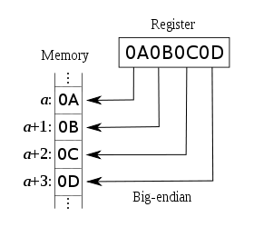

# Bitwise shift operators
按位移动操作符有两个操作数(operand)：要被移动的数字和移动的长度。
按位移动首先会将操作数转换为big-endian order的32位整数，然后返回与左操作数相同类型的结果。
- 右操作数应该小于32位，否则只有最低的5个字节会被使用

那么，什么是big-endian呢？
高位字节排放在内存的低地址端，低位字节排放在内存的高地址端，又称“高位编址”。
big-endian是最直观的字节序：
- 把内存地址从左到右按照由低到高的顺序写出
- 把值按照通常直观的高位到低位的顺序写出
- 两者对照，一个字节一个字节的填充进去

## `<<`(left shift)
将第一个操作数向左移动指定的位数。向左被移出的位被丢弃，右侧用0补充。

## `>>`(有符号右移)
将第一个操作数向右移动指定的位数。向右被移出的位被丢弃，复制最左侧的位来填充左侧。此时符号位不变。

## `>>>`(无符号右移)
和上面不同的是，左侧使用0填充。即使移动0位，结果也会变为非负的。