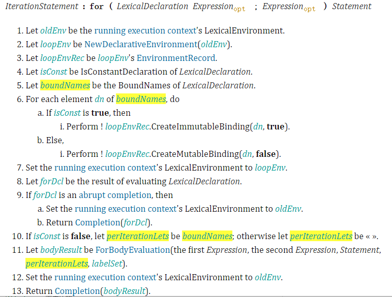
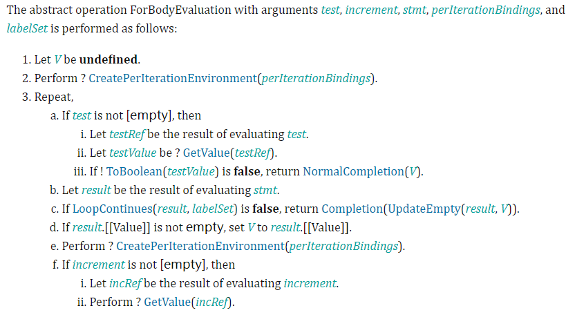

 
 
 
## 简介
本文档主要讲讲 ECMAScript 在 ES6 中引入的块级作用域的细节。

众所周知的原因，ECMAScript 在 ES6 之前是没有块级作用域的（但是一直存在块的概念，比如语句块，for 循环等）。那时候，最底层的作用域就是函数作用域。尽管没有块级作用域对于实现一段需求的功能没有影响，但是对于代码的结构比其他主流拥有块级作用域的语言有更高的要求（比如 C++、Java、Python等）。也给其他语言的开发者理解 JavaScript 带来了不便。

下面举两个没有块级作用域的问题：
1. 块内部变量覆盖外部变量
```javascript
var a = '123';
{
  var a = 2;
  console.log(a); // 2
}

console.log(a); // 2
```
2. for 循环问题：循环变量泄露为外层变量
```javascript
for(var i = 0; i < 3; i++) {
  console.log(i);
}

console.log(i); // 3
```

并且给异步和闭包的理解增加了难度：
```javascript
for(var i = 0; i < 3; i++) {
  setTimeout(function() {
    console.log(i);
  }, 0);
}

// 3, 3, 3
```

## 细节
下面我们通过 [ECMAScript 2020 the for statement](https://tc39.es/ecma262/#sec-for-statement) 是如何保证向后兼容的基础上加入块级作用域的。



下面，我们分析下上面这段过程：
1. JavaScript engine 遇到 for 循环时，如果发现第一个表达式是 [lexical delcaration](javascript-declaration.md)（具体可以看我的另一篇文档），也就是有通过`let` 或者 `const` 声明变量。engine 会生成一个新的 environment record（这里是 loopEnv） 指向旧的 environment record（这里是 oldEnv），然后将 lexical declaration 声明的变量全部绑定到 loopEnv 后将 loopEnv 绑定到当前的 execution context。
2. 绑定好新的 loopEnv，算法就进入了 `ForBodyEvaluation`，也就是我们的循环体。

那么在循环体里面，engine 会怎么做呢？规范写的一清二楚，如下图：


在这里，我只需要注意 `CreatePerIterationEnvironment` ，这个抽象操作是用来创建每次迭代的 environment record的。也就是说，每重新进入一次 for body，如果有 let declaration，就会重新生成一个 environment record（这也是为什么称boundNames 为 perIterationLets的原因）。

3. 执行完所有的for循环代码，重新将 oldEnv 绑定到当前的 execution context。


我们知道， execution context 通常有 3种：
- global execution context
- function execution context
- eval execution context

并不包含 block execution context。因此 ECMAScript 通过识别 let/const declaration 来创建新的Environment record，并以此达到块级作用域的目的。

在ECMAScript 规范中其他可能牵扯到块级作用域的地方同样是类似的算法逻辑。


## 了解这些有什么意义呢？
首先谈点虚的：
1. 了解语言底层的细节，可以帮助我们思考语言规范设计者在引入新的概念时是如何权衡的，有助于我们扩展思维。

我们再看段代码：
```javascript
for(let i = 0; i < 3; i++) {
  setTimeout(function() {
    console.log(i);
  });
}

// 这里会输出 1, 2, 3
```
如果我们不了解内部的细节，如何能够知道为什么会输出 `1,2,3` 呢？死记硬背然后靠自己联想吗？
看过规范的我们知道，JavaScript engine 在for 循环中遇到 let declaration 时，在每一个迭代过程都会新建一个 environment record，并且复制之前的 boundName。也就是说，每一次迭代过程中 setTimeout 方法里面绑定的 i 都是不同的 i。


