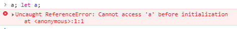

 
 
 
## 简介
本章主要从 ECMAScript 规范来分析 javascript 中的几种 declaration 方式。

对于任何一个前端从业者来讲，对于 declaration 知识点经常被问到下面几个问题：
1. let , const, var 的区别是什么？
2. javascript 中的 hoisting 是什么？ temporal dead zone 是什么？

而大家得到的答案都似是而非，来源估计都不知道经过了几手。

我们先看第一个现象：
纵观整个 ECMAScript 文档，并不能搜索到关于 hoisting 和 temporal dead zone 的专门定义。也就是说，这两个技术词汇可能只是被某个牛人发明出来描述 javascript 的某些现象，然后被广而传播了而已。因此对于这两个词汇的具体来源我们暂时不做深究。

## 细节
首先，我们先看 [ECMAScript 2020 13.3.1 Let and Const Declarations](https://tc39.es/ecma262/#sec-declarations-and-the-variable-statement):

> let and const declarations define variables that are scoped to the running execution context's LexicalEnvironment. The variables are created when their containing Lexical Environment is instantiated but may not be accessed in any way until the variable's LexicalBinding is evaluated. A variable defined by a LexicalBinding with an Initializer is assigned the value of its Initializer's AssignmentExpression when the LexicalBinding is evaluated, not when the variable is created. If a LexicalBinding in a let declaration does not have an Initializer the variable is assigned the value undefined when the LexicalBinding is evaluated.

这段话把 let 和 const 的功能描述的清清楚楚，下面我把它一一拆解：
1. let 和 const declaration 被用来定义变量。这些变量归属于 running execution context 的 LexicalEnvironment。running execution context 表示当前正在执行的上下文。 LexicalEnvironment（可以翻译为词法环境，尽管个人认为这些专业词汇保持原滋原味即可，毕竟英语和中文很多都不能直译）可以当做单链表的结点，结点里面有一个 environement record 和 “指针”。“指针”指向外层的 lexical environment， environment record 用来记录 identifier bindings(标识符绑定，比如 `var a;` a 就是一个标识符)。
2. javascript engine 在进入当前 execution context 时会先初始化包含的 lexical environment，而我们通过 let 和 const declaration 定义的变量就在这个时候被 created（创建）。**但是在这个阶段我们不能够通过任何方式来访问这些变量。**

1. 在 lexicalBinding 被执行的时候会对变量进行赋值操作。如果 let declaration 没有相应的 initializer，则该变量被赋值 undefined。
那么什么是 initializer? 看段代码：
`let a =  3 + 4;` 而 `3+4` 这个 expression 就是 initializer。
那么什么叫做没有 initializer ? 如
`let a; console.log(a);` 此时控制台输出 `undefined`。


**Static Semantics: Early Errors**
1. LexicalDeclaration : LetOrConst BindingList ;
    - It is a Syntax Error if the BoundNames of BindingList contains "let".
    - It is a Syntax Error if the BoundNames of BindingList contains any duplicate entries.
2. LexicalBinding : BindingIdentifier Initializeropt
    - It is a Syntax Error if Initializer is not present and IsConstantDeclaration of the LexicalDeclaration containing this production is true.

这段话告诉我们几个细节：
1. 通过 let 和 const 声明的 variables 不能够重复，否则报 `syntax error`
2. 通过 let 和 const 声明的 variables 不能是 `let` ，否则报 `syntax error`。这也很明显，因为这时候 let 是关键字。
3. 如果通过 const 声明，那么必须有 Initializer，否则会报 `syntax error`。规范这样做也非常正确，因为 const 不能够被重新赋值。

我们再看 **variable statement** 这一段:
> A var statement declares variables that are scoped to the running execution context's VariableEnvironment. Var variables are created when their containing Lexical Environment is instantiated and are initialized to undefined when created. Within the scope of any VariableEnvironment a common BindingIdentifier may appear in more than one VariableDeclaration but those declarations collectively define only one variable. A variable defined by a VariableDeclaration with an Initializer is assigned the value of its Initializer's AssignmentExpression when the VariableDeclaration is executed, not when the variable is created.

同样来一一分析下这段话：
1. var statement 同样被用作声明变量。当前的lexical environment 被初始化的时候，这些变量被 created，**并且直接被初始化为 undefined** （这是和 let、const 不同的地方）。
2. 在同一个作用域里面，通过var 声明的 binding indentifier （相同名称）可以出现不止一次，但是编译器只会定义一个（这里是历史问题）。initializer 的赋值表达式会在 executed 阶段被赋值给变量，而不是 created 阶段。

但是在 variable statement 关于 with 语句有一段对话：
>If a VariableDeclaration is nested within a with statement and the BindingIdentifier in the VariableDeclaration is the same as a property name of the binding object of the with statement's object Environment Record, then step 5 will assign value to the property instead of assigning to the VariableEnvironment binding of the Identifier.
```javascript
var c = {c: 2}; 
with(c) {
  console.log(c); // 输出 2，而不是对象
}
```
也就是说，通过 var 进行声明的变量，如果变量名和属性名一样，这个时候在 with 语句中使用变量，默认的是操作同名变量属性而不是变量。


**下面就是由上面的规范得出的图：**:


1. **同时回答问题1和问题二**：
- 相同点： var, let, const 都是 javascript 当中用来声明变量的。
- 不同点：
    - var statement的 created 阶段和 initialized 阶段是同时的，var statement在 created 阶段被初始化为 undefined。这也是我们所说的 var declaration hoisting。
    - let declaration 只有 created 阶段被 hoisting，但是 initial 和 assign阶段是同时的，并且是在引擎的执行阶段。因此，我们在 let declaration 之前使用变量会报 reference error，这意味着bound name 已经被分配了（created），但是我们还没有进行initialized，因此无法使用。并且该变量后面都无法使用，相当于该变量一直处于 created 阶段，形成类似于死锁的情形。
    - const declaration 的created 阶段同样会被hoisting。并且我们在声明 const variable 时必须跟上 initializer，也就是 assignment expression。这也是 const 和 let 的区别之一。const declaration 在被初始化后无法再次赋值。

那么什么是 temporal dead zone?
就是 let and const declaration 在 created 阶段后暂时无法使用，也就进入了暂时性死区。

**另外我们需要注意的是，在ECMAScript 文档当中， let 和 const 被称为 lexical declaration，而 var 被称为 variable declaration。**


最后，我们看[rwaldon 的一段话](https://gist.github.com/rwaldron/ca35924d59ddc60a6aa165e1e4a3acda)：
> In JavaScript, all binding declarations are instantiated when control flow enters the scope in which they appear. Legacy var and function declarations allow access to those bindings before the actual declaration, with a "value" of undefined. That legacy behavior is known as "hoisting". let and const binding declarations are also instantiated when control flow enters the scope in which they appear, with access prevented until the actual declaration is reached; this is called the Temporal Dead Zone. The TDZ exists to prevent the sort of bugs that legacy hoisting can create.