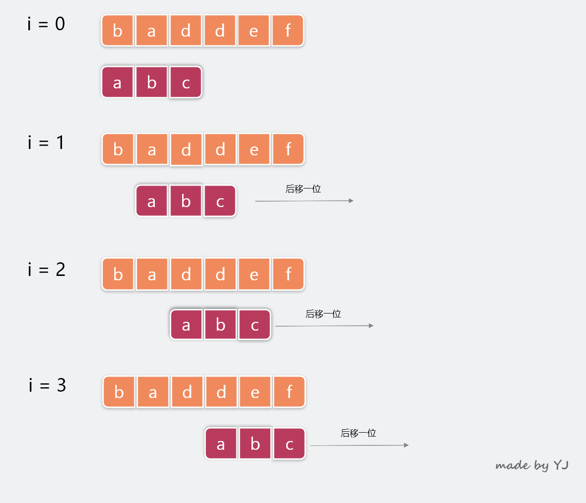

**文本更新于 2020年04月27日 11:05:21**
## 简介
本篇主要对单模式匹配算法中的 BF 算法和 RK 算法进行讲解。

## BF 算法
> BY： 万法皆起于此

BF 是 Brute Force 的缩写，中文叫做暴力匹配算法，也被称为朴素匹配算法。其相对于其他算法来讲，简单、易懂，却性能不高。

**首先，什么是单模式匹配？**
举个例子，我们有个需求，需要在字符串 A 中查找字符串 B，那么我们就将字符串 A 称为 **主串**，字符串 B 就被称为 **模式串**。而查找的字符串 B 只有一个，因此也就被称为单模式匹配。通常来讲，我们认为 A 的长度大于 B。

BF 算法作为最简单的字符串匹配算法，其思想概括起来就是：**枚举字符串 A 中所有可能的子字符串（子字符串的要求是和模式串长度相同），然后分别将这些子字符串和模式串 B 一一比对匹配**

BF 算法的时间复杂度理论上很高，在最坏情况下我们需要比对 $n-m+1$ 次，因此时间复杂度是 $O(n*m)$，这里 $n$ 和 $m$ 分别是 A 和 B 的长度。

**但是，我们要知道理论上和工程实践上是有区别的。在统计意义上来讲，最坏情况发生的次数是很少的。在实际开发过程中，很多需求都不复杂，此时代码实现简单就成了我们的首选**

## RK 算法
RK 算法全称叫做 Rabin-Karp 算法，由其发音者名字命名。