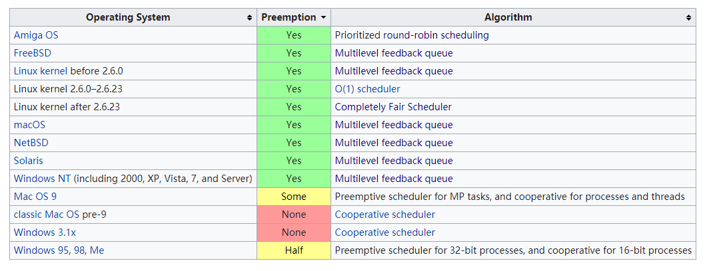

**文本更新于 2020年05月 9日 19:21:13**

## scheduling 的概念
在 CS 领域当中，scheduling 是用来决定分配资源给哪个任务（work）的方法。这里的 work 通常指的虚拟的计算元素，比如 process / thread / data flow，而资源通常指的硬件资源（比如 processors, network links, expansion cards）。

而用来执行 scheduling 活动的模块 scheduler。scheduling 使单CPU 执行多任务（multitasking）成为可能。

scheduler的目标有很多：
- 最大化吞吐量（throughput）,单位时间内能够完成的工作总量
- 最小化等待时间（wait time），从工作准备到开始执行的时间
- 最小化延迟或响应时间（latency or response time）
- 最大化公平（fairness），根据每个 process的优先级和工作量合理分配 CPU 时间

在实际当中，这些目标有些是相互冲突的，比如 latency 和 throughput，因此 scheduler 需要适当的妥协，根据实际的需求来决定偏向于哪个目标。

在这里，我们讲的 scheduler 指的是操作系统的模块，用来选择下一个要进入系统的作业或进程。相对于 OS 来讲，可能最多具有三种不同的调度器，根据被执行的频率区分：
- long-term scheduler，也被称为 admission scheduler 或者 high-level scheduler
- mid-term scheduler
- short-term scheduler

通常来讲，我们可以将任务分为 CPU 密集型和 I/O 密集型。long-term scheduler 的主要工作是决定哪些作业进入等待队列中（在 main memory 当中）。也就是说，该 scheduler 决定了哪些进程被执行在系统上，需要支持多大程度的并发，I/O 密集型 和 CPU 密集型的分配方式。long-term scheduler 负责控制 multiprogramming 的程度。

mid-term scheduler 的工作主要是暂时从 main memory 中删除某些进程，并将其放入辅助队列（比如hard disk drive 当中），或者反过来的过程。这两个过程被分为 swapping out 和 swapping in。mid-term scheduler 的主要依据是是否处于活动状态、优先级、是否占用大量资源、是否频繁出现错误，目的是平衡 main memory。

short-term scheduler,也被称为 CPU scheduler。其决定哪个 已准备好并且在内存中的 process 被分配使用 CPU，通常是在一个时钟中断（clock interrupt）、系统调用或者 signal 之后。因此，short-term scheduler 的被执行频率最高-在每个时间片后至少作出一个决定。具体的又分为 preemptive 和 cooperative 两种。
- 非抢占式指的是进程自己主动停止运行，让步给其他的进程使用资源，这一般出现在古老的 OS 当中，但是这在很多高级编程语言中很常见 - coroutine 的概念。
- preemptive 指的是根据由 scheduler 决定中断当前进程的执行并给下一个进程。如果不中断的话，当前正在执行的进程会一直占据资源，直到自己主动退出（这种行为 OS 也是会限制的）。

调度器中最重要的就是调度算法，其主要目的是最大程度地减少资源匮乏并确保使用资源的各方公平。在实际的 OS 当中有很多不同地调度算法。

1. round-robin scheduling。
这在 UNIX 系统当中，很常见，进程能够运行的时间是预先设置好的，被称为时间片。这个值设置的既不能太长，也不能太短。

## Thread.sleep
而 Thread.sleep 的作用就是沉睡一段时间，告诉操作系统在这段时间我不想使用 CPU 资源。
两个问题：
- Thread.sleep(1000) - 表示 1000 ms 之后我在加入 CPU 竞争
- Thread.sleep(0): 作用是触发操作系统立刻重新进行一次 CPU 竞争，当前进程或线程仍然可能获得控制权（看具体的调度算法实现）

[有意思的比喻例子](https://www.cnblogs.com/ILove/archive/2008/04/07/1140419.html)

## reference
1. [wiki, scheduling](https://en.wikipedia.org/wiki/Scheduling_(computing))