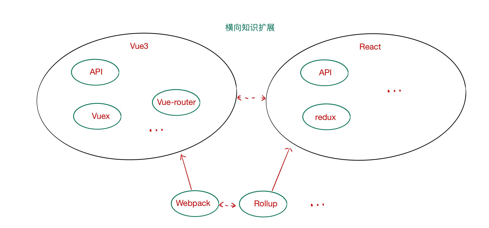
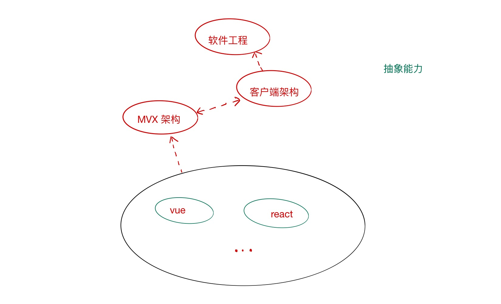
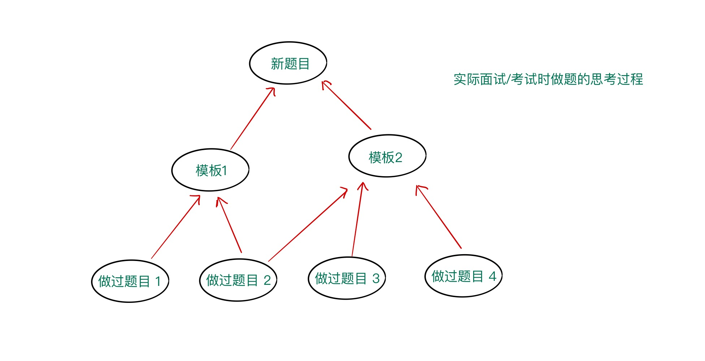
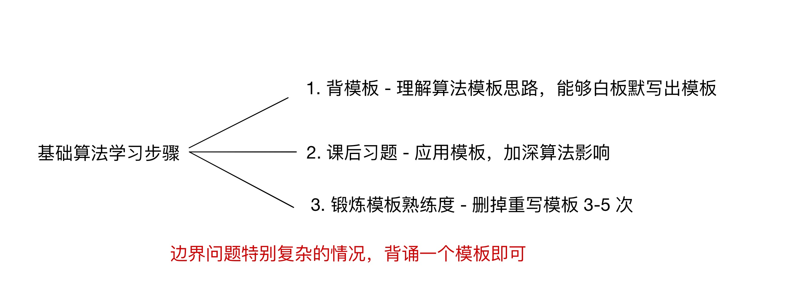

## 正文
> 注意，本篇为算法教程系列的开篇文章，属于大纲。

> 本大纲会不断更新，微信公众号以新篇章的方式发布（大版本添补），其他渠道以原文更新为主。


距离上一次发布文章已经 70 多天了，中间诸多事宜，故成了 “咕咕大虾”。但作为终身学习者来讲，学习就如吃饭一样不可废弃。今天我想和大家分享的是关于如何系统学习面试方向算法题的知识。对于任何一门知识，如果想要深入，“系统” 二字必不可免，算法同样如此。目前主流应对面试向的算法学习是直接刷题，或按流行度或按标签。个人认为这种方式某些时候算得上有效，但却不能称之为高效，问题就在于 “不系统”。

**那么什么叫做系统学习？什么叫做算法系统学习？**

我们知道，在学习任何新知识之前，得先有学习动机。而学习动机的培养则来自于平时零散的信息输入，比如公众号、技术会议、工作要求等等。而在有了学习动机之后，就需要进入系统学习或者叫做严肃学习阶段。在系统学习阶段，需要我们对权威的、一手的、体系化的知识进行高强度持续输入。

在这里我假设你已经有了足够的学习动机。我们只讲讲算法学习的系统性。
1. 将面试向算法当做一门计算机领域课程
2. 严肃学习中掌握该课程的主要基础知识点
3. ，最后通过超纲训练来巩固、发散学习成果

算法的基础知识点不算太多，国内学校一般 64 学时就搞定了。而从知识领域来讲，算法属于数学加上编码的交叉领域，平时面试主要考察你以下两点能力：
1. 数理逻辑思维能力（因此很多数学竞赛出身同学学算法优势很大）
2. 根据思路快速写出代码的能力

对于数学逻辑思维能力的考察通常远远低于数学竞赛或高等数学的难度，并且基本都处在离散数学的领域中，比如图论、集合论、代数系统、组合数学等等（在信息竞赛领域有一种说法，面试向算法题的数学思维难度接近小学奥数难度，因此很多比赛厉害的都是初中、高中同学）。因此，对于面试向的算法系统学习，无需过多担心自己数学能力不足。而对于第二种能力，是从事本行业的基本功，唯手熟尔。

下面，我们详细解释下该如何锻炼上述两种能力：
1. 基础学习过程中，自底向上进行抽象归纳
2. 进阶提高中，自顶向下进行举例/关联

拿前端知识学习举个例子：比如你是react 的用户，要学习 Vue。你首先会对两者进行横向的对比学习。然后自底向上抽象在两个框架之上的知识（相通的或者不同的），接着对比其他 MVX 框架，抽象到整个客户端的技术架构，最后回归到原始软件工程的概念。在上述整个学习中，我们就分别利用了抽象归纳和举例关联的能力。






回归到面试向算法领域，该怎么掌握自底向上抽象归纳之后的知识点？主要分为两点操作：
- 掌握算法课程当中的基础算法和模板
- 将各类算法题目分类，比如动态规划中的 背包DP（选择问题）；区间 DP（范围问题）等等

怎么锻炼自顶向下的举例/关联能力？
- 能够记住基础知识的常见考察题目类型，看到题目能够分析出要考察什么知识点，如下图所示：



> 在这里，作为日常的工作党，我不建议学院派学习思路：学完所有知识主题后再去做题。比如按照《算法 4》这类教科书先补完基础的算法和数据结构，然后再去做面试题。学院派方式适合于有大块时间和很好学习氛围的情况，比如在校 CS 专业学生。但对于跨专业党、工作党，由于生活中时间零散、诱惑较多，上述方式对于耐心是极大的考验。因此，我更推荐按主题分治学习，并且直接从面试算法题入手。

举个例子，如果我们想要学习二分法：
1. 掌握二分法的基础知识点和能够解决的问题领域
2. 掌握二分法的模板，并达到一定熟练度（熟练度特别重要）

关于第一点，在后面的文章、视频和直播中会详细讲解。对于第二点，我们仍然拿二分法做举例（下面两个模板可以解决 90% 的二分法考察）：
```javascript
function check(x) {} // 检查 x 是否满足某种性质

// 区间[l, r]被划分成[l, mid]和[mid + 1, r]时使用
function bsearch1(l, r) {
  while(l < r) {
    let mid = l + Math.floor((r-l)/2);
    if(check(mid)) r = mid; 
    else l = mid+1;
  }
  return l;
}

// 区间[l, r]被划分成[l, mid - 1]和[mid, r]时使用
function bsearch1(l, r) {
  while(l < r) {
    let mid = l + Math.ceil((r-l)/2);
    if(check(mid)) l = mid; 
    else r = mid-1;
  }
  return l;
}
```

对这类模版的掌握又具体分为三个步骤：
1. 背诵模版 - 在理解算法思路的基础上，能够白板默写出模版
2. 课后习题 - 应用模版，加强算法理解
3. 锻炼模版熟练度 - 能够在2-3分钟内写完模版，通过重复写的方式锻炼（3-5次，亲测有效）




其实，如果你有看过大神在比赛时的视频的话，你会发现大神写的速度非常的快（我看过 Aoxiang Cui 、tourist等大佬的比赛视频，思路和代码速度都非常快，十几分钟就能做完所有题目，很多人这时候连题目都没读完）。你是不是很想要有大神的快速拥有思路的能力和代码速度。而提升代码速度的能力其中一个训练方式就是**锻炼模版的熟练度**。我们可不能只在大神背后喊 666。

> **最后干货来啦**

基于大部分计算机行业从业者都没有信息竞赛学的经验，比如 NOIP、NOI、ACM 之类的，而目前国内外的大厂算法题、系统设计题之类的考察却又必不可少（这里不会去论证面试进行算法考察的优缺点，只从适应规则的角度来讲），以至于大家看到算法面试题都会慌。

故决定出一个面试向算法题教程系列，整个系列包含文章、B 站直播和视频教程三种媒体形式（视频和文章为主，直播写算法代码有点慌，卡住就 GG 了，虽然经常被卡），全部免费（可以点赞、打赏、一键三连开心下^<>^）。

既然是教程，就需要难度循序渐进。因此本教程按照内容大概分成两块：
1. 基础：系统讲解基础算法与数据结构原理，给出对应算法模板
2. 进阶：基础算法应用，比如各种题目变形

而具体题目的来源主要有（若读者有相关优秀题目，可以私信推荐）：
1. LeetCode
2. Acwing
3. CodeForces
4. 牛客
5. Google kickstart 等优秀比赛


本教程适合于初、中级别面试向读者（ACM、NOI等大佬直接跳过）。

### 教程安排（未完待续）
1. 基础
   - 算法学习与复杂度分析
   - 排序算法与应用：归并、快排与快速选择
   - 二分算法
   - 双指针算法
   - 位运算
   - 常用技巧之前缀和与差分
   - 常用技巧之离散化
   - 常用技巧之模拟高精度
2. 数据结构 
   - 链表与数组、树与图的存储
   - 栈与队列
   - 并查集
   - 堆
   - hash table
   - Trie
   - 树状数组
   - 线段树
   - AC 自动机
3. 搜索 
   - DFS、BFS 与回溯
   - 多源 BFS
   - 双端队列 BFS
4. 图论 
   - 树与图的遍历
   - 拓扑排序
   - 求最短路
   - 最小生成树
   - 欧拉回路与欧拉路径
5. 数论 
   - 质数与约数
   - 快速幂
   - 高斯消元
   - 容斥原理
   - 组合计数
   - 博弈论
6. 动态规划
   - 记忆化搜索
   - 背包系列问题模型
   - 最长上升子序列模型
   - 数字三角形模型
   - 状态机模型
   - 线性 DP
   - 区间 DP
   - 状态压缩 DP
   - 计数 DP
   - 树形 DP
   - 数位 DP
   - 单调队列优化DP
   - 斜率优化DP
7. 常见贪心