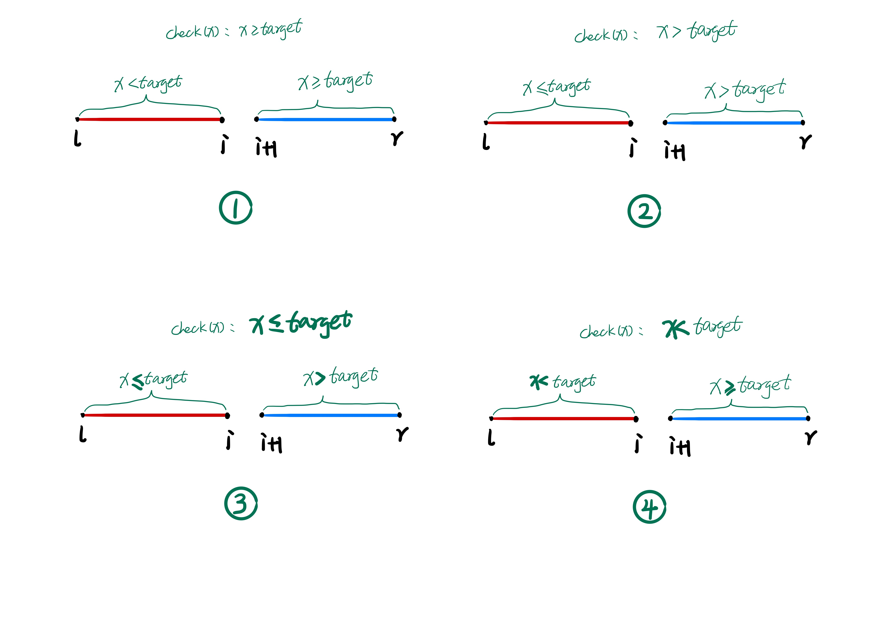
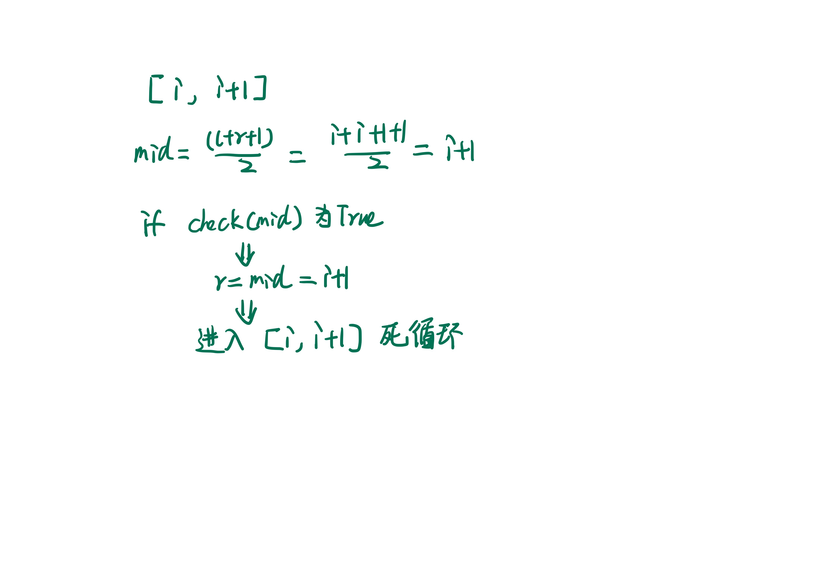
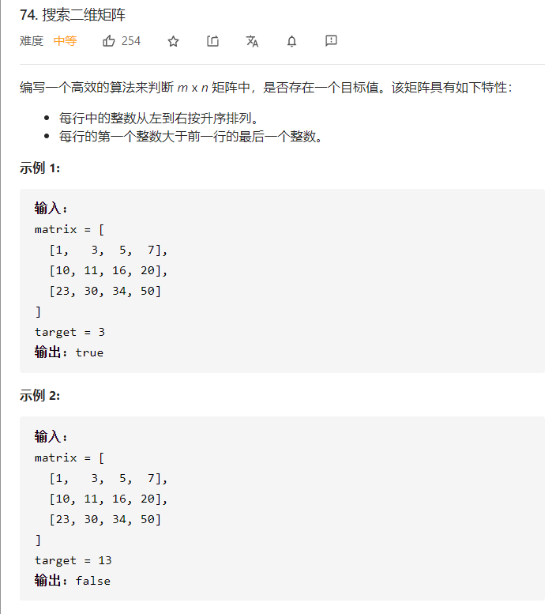
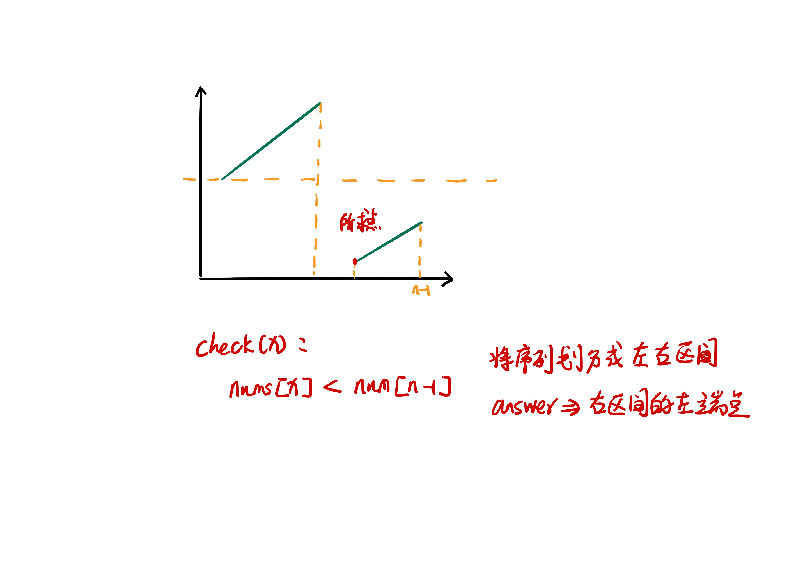

## 前言
> 在我看来，大部分面试的算法题从来都不是难在思维，而是缺乏系统的教学。它不像数学属于普及的基础教育，算法题目的大部分知识、技巧往往都局限于 competitive programming 当中 (比如各种 OI 竞赛、 ACM 竞赛等)，这些都是大部分计算机行业从业者接触不到的。它就像一个大群体中一个半封闭的小群体一样，系统的知识就在那里，只是我们很少会主动走进去。因此，我期望将这些知识给带出来，就引申出了本系列文章和视频。

二分法是一种随处可见却又非常精妙的算法，我们最熟知的用法是在一个有序数组中查找某个 target 是否存在。初学二分法的同学可能会被各种边界情况、不同写法、是开区间还是闭区间等细节弄糊涂，以至于舍本逐末。其实并不需要如此，我们只需要记住一种最方便的写法并理解它即可。


> 二分法主题分为两篇，本篇为第一篇。共涉及到 **60 道** 题目，以 LeetCode 难度划分属于 **hard** 和 **medium** 偏上的题目。

> 注意：**搭配 B 站视频更香奥！**
## 正文
通常我们将二分法分为整数域上的二分和实数域上的二分。
- 整数二分的细节在于**终止边界、左右区间取舍时的开闭情况**，来避免**漏掉答案或者造成死循环**。
- 实数二分的细节在于**精度问题**

因此，本文会分别给出 **整数二分** 和 **实数二分** 的模板，来帮助大家解决 90% 以上的广泛二分问题。广泛二分问题指的是如下几种类型：
1. 明显二分问题（题面上能一下看出二分的）
2. 对结果进行二分（值域上二分）
3. min(max()) 和 max(min())
4. 最大/最小平均值(max/min average)
5. 特殊第 K 小问题

理解了这几种题型，也就能够理解接近 100 道的算法题，基本都是 leetcode hard/medium 级别的。

在给出模板之前，**我们得先理解什么是二分？**

二分不等价于序列上的单调性。它的本质是：
> 如果我们能够通过某种特性将一个区间划分成两个区间，左边区间满足某种特性；右边区间不满足某种特性。那么我们就能够通过二分法来寻找左区间的右端点或者右区间的左端点。换句话讲，**有单调性一定可以二分，但是二分不一定要有单调性**。

> *更多细节可以在 B 站搜索 《百学原理》 up主，面试向算法系列 - 1.4 二分法的经典应用*


（图 4-1）

### 整数二分模板

```python
def binary_search(l , r): # 模板一：寻找右区间的左端点(上图红色部分)

    while l < r:
        mid = (l+r)//2 # 注意 l+r

        if check(mid): r = mid
        else: l = mid+1
```

```python
def binary_search(l , r): # 模板二：寻找左区间的右端点（上图蓝色部分）

    while l < r:
        mid = (l+r+1)//2 # 注意 l+r+1

        if check(mid): l = mid
        else: r = mid-1
```

**整数二分为什么会有两个模板？**

这是为了方便构造 `check()` 方法和对答案的求解。

我们来看 [leetcode: 34. 在排序数组中查找元素的第一个和最后一个位置（题目视频中有详细讲解）](https://leetcode-cn.com/problems/find-first-and-last-position-of-element-in-sorted-array/)。

> 给定一个按照升序排列的整数数组 nums，和一个目标值 target。找出给定目标值在数组中的开始位置和结束位置。你的算法时间复杂度必须是 O(log n) 级别。  
如果数组中不存在目标值，返回 [-1, -1]。  
示例 1:   
输入: nums = [5,7,7,8,8,10], target = 8   
输出: [3,4]   
示例 2:   
输入: nums = [5,7,7,8,8,10], target = 6   
输出: [-1,-1]   

**如何寻找 target 在数组中的开始位置呢？**

很明显，由于从 **开始位置往后** 所有的值都是 $\geq target$ 的直接构造性质，如下所示：
```python
def check(x):
    return x >= target
```
也就是我们通过上述 `check()` 方法将数组划分为两个区间，**开始位置**就是右区间的左端点(也就是模板一)，如下图 4-2。

（图 4-2）

那么，我们是否可以用 **模板二** 求解开始位置呢？很显然也是可以的，只是会麻烦一些，如图 4-2 中的 4。我们可以通过 `x < target` 求得左区间的右端点，也就是最后一个 `< target` 的位置，假设为 `i`，那么 `i+1` 显然就是 `target` 的起始位置(这里不考虑不存在情况)。

因此，我们可以得出一个结论：**模板一** 和 **模板二** 都可以得出具体解，只是在面对不同问题时哪个更加方便而已。

**那么该如何求解结束位置呢？**

这个时候使用 **模板二** 就更加方便了，如图 4-2 中的 3 所示，我们只要构造 `check()` 为 `x <= target` 即可。

下面我们来看模板的细节，一个很重要的点是：
- 模板一： `mid = (l+r)//2`; `r = mid`; `l = mid+1`
- 模板二：`mid = (l+r+1)//2`; `l = mid`; `r = mid+1`

**为什么要这样写呢？**   
这两种写法都是在解决同一个问题 - **避免范围缩小到 2 时，产生死循环**

**为什么改变写法就有可能产生死循环呢？** 其实举个反例即可。   
本身 **模板一就是为了获得右区间的左端点**，所以  `r = mid` 和 `l = mid+1`是肯定的，大家记住即可。那么如果模板一变成 `mid = (l+r+1)//2`，也就是在 `[i, i+1]` 时， `mid = i+1`. 可能会产生如下图所示的情况：


模板二的证明和模板一类似。

**下面我们来看下模板一和模板二是如何运用在基础题目里面的（以下所有题目在 B站 1.4.1 和 1.4.2 中都有详细讲解）**
1. [leetcode: 74. 搜索二维矩阵](https://leetcode-cn.com/problems/search-a-2d-matrix/)


题目问的是 - 是否存在目标值，所以套用模板一和模板二都可以。稍微有点变形的是题目给出的序列是二维的，因此我们需要通过简单的变形将二维转为一维。
```python
l = 0
r = m * n - 1

while l < r:
    mid = (l+r)//2
    row = mid // n
    col = mid % n 
    if matrix[row][col] >= target: r = mid
    else: l = mid+1

if matrix[l//n][l%n] == target: return True
else: return False
```

1. [leetcode: 153. 寻找旋转排序数组中的最小值](https://leetcode-cn.com/problems/find-minimum-in-rotated-sorted-array)
> 假设按照升序排序的数组在预先未知的某个点上进行了旋转。( 例如，数组 [0,1,2,4,5,6,7] 可能变为 [4,5,6,7,0,1,2] )。请找出其中最小的元素。你可以假设数组中不存在重复元素。


如上图所示，可以直接根据模板一构造出 `check()` 方法（代码就不给了）。

**如果允许重复值呢？比如** [leetcode: 154. 寻找旋转排序数组中的最小值 II](https://leetcode-cn.com/problems/find-minimum-in-rotated-sorted-array-ii/)

其实重复值只是迷惑了我们的眼睛，尽管在判断到重复时（出现 `check(mid) == nums[r]`），我们无法划分区间。但是很显然，去掉其中一个不会对我们最终的结果产生影响，所以我们只需要 `r--` 即可。
```python
l = 0
r = n-1

while l < r:
    mid = (l+r)//2

    if nums[mid] == nums[r]:
        r -= 1
    elif nums[mid] > nums[r]:
        l = mid + 1
    else:
        r = mid

return nums[l]
```

按照这种做法，[leetcode: 81. 搜索旋转排序数组 II](https://leetcode-cn.com/problems/search-in-rotated-sorted-array-ii/) 的解法也就显而易见了。


**除了完成上述题目，还有一些其他题目大家可以尝试：**
1. [leetcode: 162. 寻找峰值](https://leetcode-cn.com/problems/find-peak-element/)
2. [leetcode: 275. H 指数 II](https://leetcode-cn.com/problems/h-index-ii/)
3. [codeforces edu 4 道题目](https://codeforces.com/edu/course/2/lesson/6/1/practice)

### 实数二分模板
```
binary_search(l , r): // 寻找结果

    eps = 1e-6
    while r - l >= eps:
        mid = (l+r) / 2

        if check(mid): r = mid
        else: l = mid
```
实数二分不会存在整数二分的细节问题，只需要注意精度问题即可。至于具体原因，大家简单画个图即可，或者类比于微积分，当两个点无限接近时，我们就认为其在无限小时是一个点。

实数二分最常见的例子就是：
- 二分法求 `sqrt(x)`
- 二分法求三次方根 [acwing: 790. 数的三次方根](https://www.acwing.com/problem/content/792/)

具体代码我就不给了，想要更详细的过程可以看 **B 站视频 1.4.1 和 1.4.2**


**课后习题**
1. [acwing: 696. 哈默队长(Google Kickstart2013 Practice Round Problem B)](https://www.acwing.com/problem/content/description/698/)


## 总结
1. 整数二分的两个模板
2. 实数二分的模板
3. 二分法的经典应用一


剩下的 4 种经典应用请看下篇。


