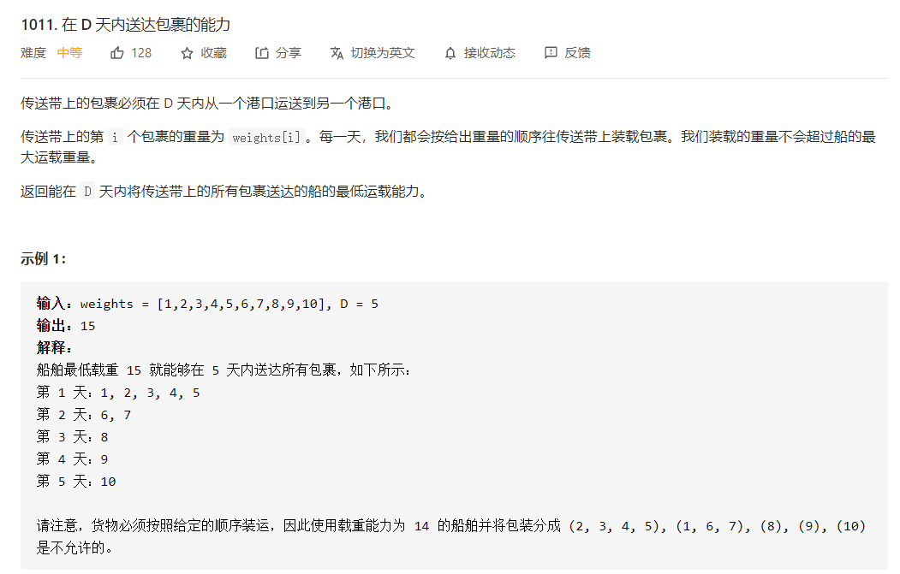
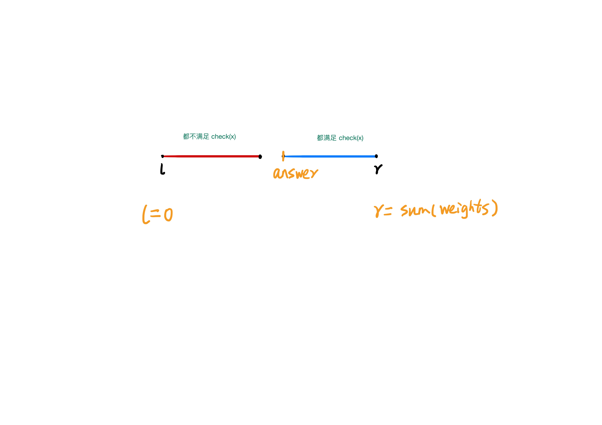
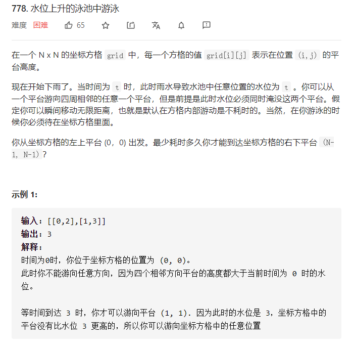
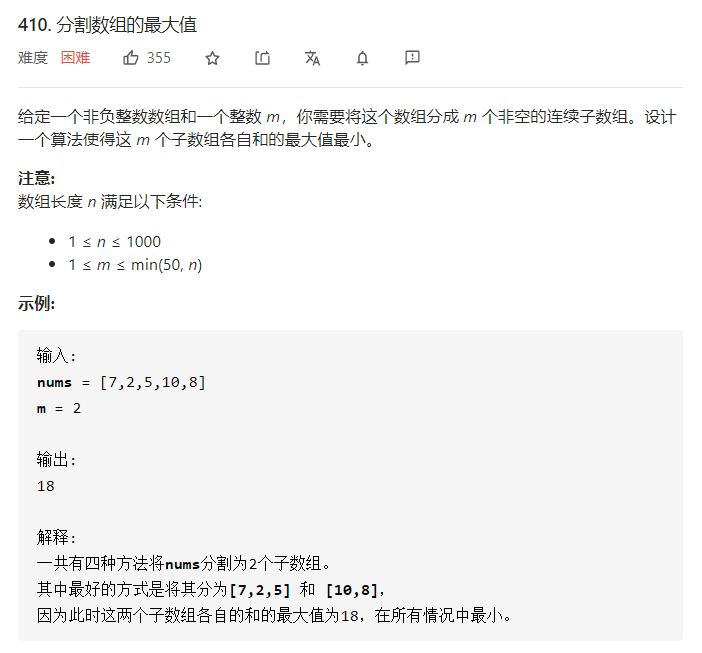

## 前言
> 在我看来，大部分面试的算法题从来都不是难在思维，而是缺乏系统的教学。它不像数学属于普及的基础教育，算法题目的大部分知识、技巧往往都局限于 competitive programming 当中 (比如各种 OI 竞赛、 ACM 竞赛等)，这些都是大部分计算机行业从业者接触不到的。它就像一个大群体中一个半封闭的小群体一样，系统的知识就在那里，只是我们很少会主动走进去。因此，我期望将这些知识给带出来，就引申出了本系列文章和视频。 

在 《二分法（一）》当中我们已经分别讲解了：
- 整数域二分的两种模板
- 实数域二分的模板
- 二分算法的一种实际应用

那么，本篇的主要内容即是对剩下的四种应用进行深入分析。
1. 对结果进行二分（值域上二分）
2. min(max()) 和 max(min())
3. 最大/最小平均值(max/min average)
4. 特殊第 K 小问题

## 正文

### 类型二：对结果进行二分
这类问题仍然属于最优化问题，该问题的所有方案组成问题的 **值域**，需要求所有方案中的最优方案。

而上述通过二分法能够处理的最优化问题需要满足：**值域** 满足某种特殊的单调性。用更加详细的话讲，就是**能够通过题目特性将值域分成两个区间，一个区间满足特性，另外一个区间不满足特性**
$$
f(x) = 
\begin{cases}
true, x - 属于区间1 \\
false,x - 属于区间2
\end{cases}
$$

我们来看具体的例子： [leetcode: 1011. 在 D 天内送达包裹的能力](https://leetcode-cn.com/problems/capacity-to-ship-packages-within-d-days/)

(图 5.1)

题目需要求 **D 天内能够传送所有包裹的最低运载能力**，假设这个 **最低运载能力** 为 `x`。那么很显然 `x+1` 也能够在 D 天内运完所有包裹。因此本题的 `check 特性` 就是 **能在 D 天内运完所有包裹**。我们可以根据该特性将值域分为两个区间：

(图 5.2)

**那么值域的范围是多少呢？**
左边界肯定不能 $\leq 0$; 右边界最快可以一次运完所有的包裹，也就是 $sum(weights)$。所以值域是 $[0, sum(weights)]$。

**这里值得注意的是，有些题目不会给出右边界，因此我们需要根据经验写出右边界，比如 $10^{18}$ 等**。

分析到这里，算法思路就结束了。最后结果 $x$ 是 **右区间的左端点**，可以通过模板一来写。而 `check()` 方法可以很容易根据定义用贪心写出来。
```python
def check(x):
    cnt = 0 # 统计传输天数
    curr = 0 # 当前的重量，不能超过 x

    for t in weights:
        if t > x: return False # 如果单个物品超过 x, 很明显表示该运载能力不够
        
        curr += t  # 加上当前物品，看看是否会超重，超重的部分下一次再运
        if curr == x:
            cnt += 1
            curr = 0
        elif curr > x:
            cnt += 1
            curr = t
    
    if curr > 0: cnt += 1 # 最后还剩余 curr(不超过运载能力)，只能放在下一次再运 
    return cnt <= D # 根据判断总运输天数是否超过 D，来判断该 x 能够满足要求
```

本算法的时间复杂度为 $O(nlog(ans))$, 而 $log(ans)$ 一般都不会很大(比如 $log(10^{10}) \approx 30$)。

**有同学可能会问，该题的暴力朴素解法是什么？**
- 其实也很简单，组合数学。将数组切分成 D 个区间，不同的切分方式为不同的方案。最优方案是 $min(max(切分区间))$，复杂度为 $C(n-1, D)$, 阶乘级别。

而我们根据题目中隐含的单调性将复杂度极大地降低，下面我们来看看同类型的其他题目，首先给出个定义。

**在值域上二分的这类题目，其代码区别主要在 check 方法，不同的题目会结合其他算法来进行考察。**
比如 [leetcode: 778. 水位上升的泳池中游泳](https://leetcode-cn.com/problems/swim-in-rising-water/)

(图 5-3)

本题看似是个 hard 级别难度，如果你理解上上述的思路后，本题就变成了一个 easy 级别的。

同样来分析题目，假设最少耗时为 `t`, 很明显 `t+1` 也能够到达右下角，而 `t-1` 不能。所以本题 **值域是满足单调性的。**
$$
f(x) = 
\begin{cases}
true, x - 属于区间1 \\
false,x - 属于区间2
\end{cases}
$$
所以我们可以二分值域，答案就是**右区间的左端点**。而本题不一样的是 `check()` 方法，我们需要通过 **dfs** 来判断值域中的值是否满足题目要求。
```python
l = 0 # 二分部分
r = 2500
while l < r:
    mid = (l+r)//2

    if check(mid): r = mid
    else: l = mid+1

return l
```
```python
def check(t):
    if t < grid[0][0]: return False # 特判 (0, 0) 点

    vis = [[False]*n for i in range(n)] # 保存当前节点是否被访问过
    dx = [1, -1, 0, 0] # 常见 dfs 写法
    dy = [0, 0, 1, -1]

    vis[0][0] = True

    def dfs(x, y): # dfs 过程
        if x == n-1 and y == n-1: # 到达右下角
            return True
        
        for i in range(4):
            x1 = dx[i] + x
            y1 = dy[i] + y

            if x1 >= 0 and x1 < n and y1 >= 0 and y1 < n and not vis[x1][y1] and grid[x1][y1] <= t:
                vis[x1][y1] = True
                if(dfs(x1, y1)): return True

        return False
    
    if dfs(0, 0): return True # 调用 dfs
    else: return False
```

由于到目前为止，**dfs** 我们还没有讲过，所以这里就不详解介绍了，后续课程再说。

**理解了本类题型，下面 8 道题目就很简单了，作为课后习题给大家。**

1. [leetcode: 1482. 制作 m 束花所需的最少天数](https://leetcode-cn.com/problems/minimum-number-of-days-to-make-m-bouquets/)
2. [leetcode: 1292. 元素和小于等于阈值的正方形的最大边长](https://leetcode-cn.com/problems/maximum-side-length-of-a-square-with-sum-less-than-or-equal-to-threshold/)
3. [leetcode: 875. 爱吃香蕉的珂珂](https://leetcode-cn.com/problems/koko-eating-bananas/)
4. [leetcode: 287. 寻找重复数](https://leetcode-cn.com/problems/find-the-duplicate-number/)
5. [acwing(头条 2019 笔试):680. 剪绳子](https://www.acwing.com/problem/content/682/)
6. [acwing(第八届蓝桥杯): 1227. 分巧克力](https://www.acwing.com/problem/content/description/1229/)
7. [acwing(头条 2019 笔试): 730. 机器人跳跃问题](https://www.acwing.com/problem/content/description/732/)
8.  [acwing: 1028. 复制书稿](https://www.acwing.com/problem/content/description/1030/)
   
### 类型三： $min(max()) / max(min())$
另一类可以被单独拿出来的问题被称为求 $min(max())/ max(min())$ 。这类问题的出现频率很高且可以通过二分法来解决。

我们先通过一道简单的题目来看看为什么被称为 $min(max()) / max(min())$ -  [leetcode: 410. 分割数组的最大值](https://leetcode-cn.com/problems/split-array-largest-sum/)。

   
（图 5-4）

本题虽然标为 hard 级别，但仍然属于入门的难度。根据题意，需要**设计一个算法，使 m 个子数组各自和的最大值最小**，转换为更简单的公式就是：
$min(max(sum([l_i, r_i])))$，这里假设最终结果为 `t`，那么一定存在一种切割方式使得 $max(sum([l_i, r_i])) \leq t$。切割方式可以很容易通过贪心来获取（具体后面再讲）。

这里，我们会发现，如果 $max(sum([l_i, r_i])) \leq t$, 那么 $t+1$ 仍然满足这个不等式，$t-1$ 不满足不等式。因此，$t$ 的**值域范围**是存在单调性的。

$$
f(x) =
\begin{cases} 
1, x \geq t \\ 
0, x < t\end{cases}
$$

而我们求的 $t$ 是**右区间的左端点**，用**整数域二分模板一**就在合适不过了。

而具体的**值域**为 $[max(nums), sum(nums)]$。

代码的主要区别仍然是在 `check()` 方法的实现上。前面我们有讲过，可以通过贪心来实现。具体为什么呢？尽管贪心的数学证明一直是个不太好处理的事（一般通过反证法或者构造法来证明）。我们仍然可以构造出贪心策略来 - **每次切割时使切割开的区间和尽可能靠近传入的 $x$**。如下代码所示：
```python
def check(x: int) -> bool:
    total, cnt = 0, 1 # cnt 为 1 是由于剩下最后的部分没有处理
    for num in nums:
        if total + num > x:
            cnt += 1
            total = num
        else:
            total += num
    return cnt <= m
```


2. [acwing: 519. 跳石头](https://www.acwing.com/problem/content/521/)
3. [leetcode plus: 774. minimize-max-distance-to-gas-station](https://leetcode-cn.com/problems/minimize-max-distance-to-gas-station/)
4. [acwing: 2436. 串分割](https://www.acwing.com/problem/content/description/2438/)

### 3. 求最大平均值 / 最小平均值
1. [acwing: 02. 最佳牛围栏](https://www.acwing.com/problem/content/description/104/)
2. [luogu: 1404. 求平均值(poj2018)](https://www.luogu.com.cn/problem/P1404)
3. [acwing: 2430. 送礼物](https://www.acwing.com/problem/content/description/2432/)
  
笔试题：https://www.acwing.com/community/content/537/

**进阶难度**：

3. [acwing: 361. 观光奶牛(图+二分)](https://www.acwing.com/problem/content/description/363/)

### 4. 求某种特殊的第 k 大 / 小
1. [leetcode: 668. 乘法表中第k小的数](https://leetcode-cn.com/problems/kth-smallest-number-in-multiplication-table/)
2. [leetcode: 878. 第 N 个神奇数字](https://leetcode-cn.com/problems/nth-magical-number/)
3. [leetcode: 786. 第 K 个最小的素数分数](https://leetcode-cn.com/problems/k-th-smallest-prime-fraction/)
4. [acwing: 1236. 递增三元组](https://www.acwing.com/problem/content/description/1238/)

## 其他二分变形的题目
1. [leetcode: 793. 阶乘函数后K个零](https://leetcode-cn.com/problems/preimage-size-of-factorial-zeroes-function/)
2. [leetcode: 719. 找出第 k 小的距离对](https://leetcode-cn.com/problems/find-k-th-smallest-pair-distance/)
3. [leetcode: 483. 最小好进制](https://leetcode-cn.com/problems/smallest-good-base/) 
    4. google kickstart 2016 round E problem B [628. 美丽的数](https://www.acwing.com/problem/content/description/630/)
5. [acwing: 120. 防线](https://www.acwing.com/problem/content/description/122/)

**二分+dp：**

6. [acwing: 472. 跳房子](https://www.acwing.com/problem/content/description/474/)

**二分+差分**

7. [acwing: 503. 借教室](https://www.acwing.com/problem/content/description/505/)

8. LIS 问题可以通过： 贪心+二分 优化 动态规划的解法，并引申出一系列题目，后面再讲


### 额外拓展
**强烈推荐：codeforces edu binary search 22 道题目**