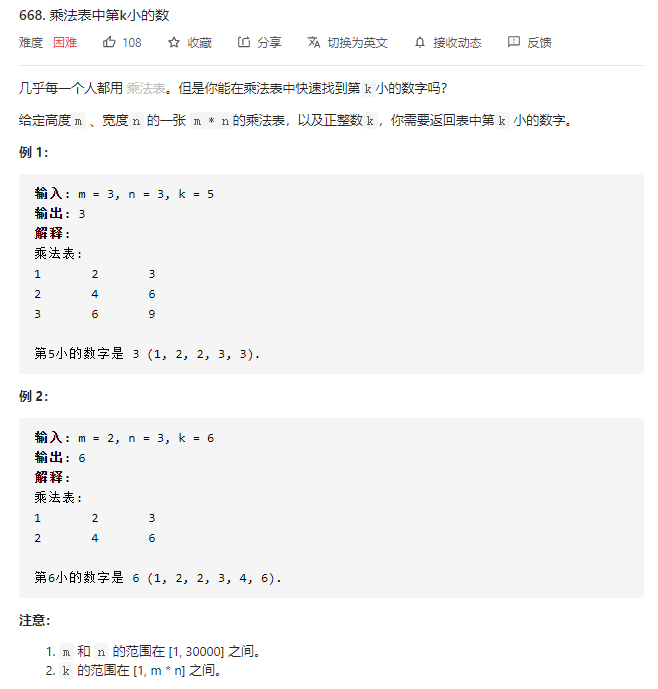

## 前言
> 在我看来，大部分面试的算法题从来都不是难在思维，而是缺乏系统的教学。它不像数学属于普及的基础教育，算法题目的大部分知识、技巧往往都局限于 competitive programming 当中 (比如各种 OI 竞赛、 ACM 竞赛等)，这些都是大部分计算机行业从业者接触不到的。它就像一个大群体中一个半封闭的小群体一样，系统的知识就在那里，只是我们很少会主动走进去。因此，我期望将这些知识给带出来，就引申出了本系列文章和视频。 

在 《二分法（一）》当中我们已经分别讲解了：
- 整数域二分的两种模板
- 实数域二分的模板
- 二分算法的一种实际应用

那么，本篇的主要内容即是对剩下的四种应用进行深入分析。
1. 对结果进行二分（值域上二分）
2. min(max()) 和 max(min())
3. 最大/最小平均值(max/min average)
4. 特殊第 K 小问题

## 正文

### 类型二：对结果进行二分
这类问题仍然属于最优化问题，该问题的所有方案组成问题的 **值域**，需要求所有方案中的最优方案。

而上述通过二分法能够处理的最优化问题需要满足：**值域** 满足某种特殊的单调性。用更加详细的话讲，就是**能够通过题目特性将值域分成两个区间，一个区间满足特性，另外一个区间不满足特性**
$$
f(x) = 
\begin{cases}
true, x - 属于区间1 \\
false,x - 属于区间2
\end{cases}
$$

我们来看具体的例子： [leetcode: 1011. 在 D 天内送达包裹的能力](https://leetcode-cn.com/problems/capacity-to-ship-packages-within-d-days/)

(图 5.1)

题目需要求 **D 天内能够传送所有包裹的最低运载能力**，假设这个 **最低运载能力** 为 `x`。那么很显然 `x+1` 也能够在 D 天内运完所有包裹。因此本题的 `check 特性` 就是 **能在 D 天内运完所有包裹**。我们可以根据该特性将值域分为两个区间：

(图 5.2)

**那么值域的范围是多少呢？**
左边界肯定不能 $\leq 0$; 右边界最快可以一次运完所有的包裹，也就是 $sum(weights)$。所以值域是 $[0, sum(weights)]$。

**这里值得注意的是，有些题目不会给出右边界，因此我们需要根据经验写出右边界，比如 $10^{18}$ 等**。

分析到这里，算法思路就结束了。最后结果 $x$ 是 **右区间的左端点**，可以通过模板一来写。而 `check()` 方法可以很容易根据定义用贪心写出来。
```python
def check(x):
    cnt = 0 # 统计传输天数
    curr = 0 # 当前的重量，不能超过 x

    for t in weights:
        if t > x: return False # 如果单个物品超过 x, 很明显表示该运载能力不够
        
        curr += t  # 加上当前物品，看看是否会超重，超重的部分下一次再运
        if curr == x:
            cnt += 1
            curr = 0
        elif curr > x:
            cnt += 1
            curr = t
    
    if curr > 0: cnt += 1 # 最后还剩余 curr(不超过运载能力)，只能放在下一次再运 
    return cnt <= D # 根据判断总运输天数是否超过 D，来判断该 x 能够满足要求
```

本算法的时间复杂度为 $O(nlog(ans))$, 而 $log(ans)$ 一般都不会很大(比如 $log(10^{10}) \approx 30$)。

**有同学可能会问，该题的暴力朴素解法是什么？**
- 其实也很简单，组合数学。将数组切分成 D 个区间，不同的切分方式为不同的方案。最优方案是 $min(max(切分区间))$，复杂度为 $C(n-1, D)$, 阶乘级别。

而我们根据题目中隐含的单调性将复杂度极大地降低，下面我们来看看同类型的其他题目，首先给出个定义。

**在值域上二分的这类题目，其代码区别主要在 check 方法，不同的题目会结合其他算法来进行考察。**
比如 [leetcode: 778. 水位上升的泳池中游泳](https://leetcode-cn.com/problems/swim-in-rising-water/)

(图 5-3)

本题看似是个 hard 级别难度，如果你理解上上述的思路后，本题就变成了一个 easy 级别的。

同样来分析题目，假设最少耗时为 `t`, 很明显 `t+1` 也能够到达右下角，而 `t-1` 不能。所以本题 **值域是满足单调性的。**
$$
f(x) = 
\begin{cases}
true, x - 属于区间1 \\
false,x - 属于区间2
\end{cases}
$$
所以我们可以二分值域，答案就是**右区间的左端点**。而本题不一样的是 `check()` 方法，我们需要通过 **dfs** 来判断值域中的值是否满足题目要求。
```python
l = 0 # 二分部分
r = 2500
while l < r:
    mid = (l+r)//2

    if check(mid): r = mid
    else: l = mid+1

return l
```
```python
def check(t):
    if t < grid[0][0]: return False # 特判 (0, 0) 点

    vis = [[False]*n for i in range(n)] # 保存当前节点是否被访问过
    dx = [1, -1, 0, 0] # 常见 dfs 写法
    dy = [0, 0, 1, -1]

    vis[0][0] = True

    def dfs(x, y): # dfs 过程
        if x == n-1 and y == n-1: # 到达右下角
            return True
        
        for i in range(4):
            x1 = dx[i] + x
            y1 = dy[i] + y

            if x1 >= 0 and x1 < n and y1 >= 0 and y1 < n and not vis[x1][y1] and grid[x1][y1] <= t:
                vis[x1][y1] = True
                if(dfs(x1, y1)): return True

        return False
    
    if dfs(0, 0): return True # 调用 dfs
    else: return False
```

由于到目前为止，**dfs** 我们还没有讲过，所以这里就不详解介绍了，后续课程再说。

**理解了本类题型，下面 18 道题目就很简单了，作为课后习题留给大家。**

1. [leetcode: 1482. 制作 m 束花所需的最少天数](https://leetcode-cn.com/problems/minimum-number-of-days-to-make-m-bouquets/)
2. [leetcode: 1292. 元素和小于等于阈值的正方形的最大边长](https://leetcode-cn.com/problems/maximum-side-length-of-a-square-with-sum-less-than-or-equal-to-threshold/)
3. [leetcode: 875. 爱吃香蕉的珂珂](https://leetcode-cn.com/problems/koko-eating-bananas/)
4. [leetcode: 287. 寻找重复数](https://leetcode-cn.com/problems/find-the-duplicate-number/)
5. [acwing(头条 2019 笔试):680. 剪绳子](https://www.acwing.com/problem/content/682/)
6. [acwing(第八届蓝桥杯): 1227. 分巧克力](https://www.acwing.com/problem/content/description/1229/)
7. [acwing(头条 2019 笔试): 730. 机器人跳跃问题](https://www.acwing.com/problem/content/description/732/)
8. [acwing: 1028. 复制书稿](https://www.acwing.com/problem/content/description/1030/)
9. [codeforces edu 8 道题目](https://codeforces.com/edu/course/2/lesson/6/2/practice)   
10. [leetcode: 793. 阶乘函数后K个零](https://leetcode-cn.com/problems/preimage-size-of-factorial-zeroes-function/)
11. [leetcode: 719. 找出第 k 小的距离对](https://leetcode-cn.com/problems/find-k-th-smallest-pair-distance/)

### 类型三： $min(max()) / max(min())$
另一类可以被单独拿出来的问题被称为求 $min(max())/ max(min())$ 。这类问题的出现频率很高且可以通过二分法来解决。

我们先通过一道简单的题目来看看为什么被称为 $min(max()) / max(min())$ -  [leetcode: 410. 分割数组的最大值](https://leetcode-cn.com/problems/split-array-largest-sum/)。

   
（图 5-4）

本题虽然标为 hard 级别，但仍然属于入门的难度。根据题意，需要**设计一个算法，使 m 个子数组各自和的最大值最小**，转换为更简单的公式就是：
$min(max(sum([l_i, r_i])))$，这里假设最终结果为 `t`，可以直接得出下面三个推论：
- 一定存在一种切割方式使得 $max(sum([l_i, r_i])) = t$，该切割方式可以很容易通过贪心来获取（具体后面再讲）。
- 一定存在切割方式使得满足 $max(sum([l_i, r_i])) = (t+x), x > 0$，
- 一定不存在切割范式使得 $max(sum([l_i, r_i])) = t-x$ （这里 $x$ 为正数且合法），因为 $t$ 已经是可切割中方式的最小了。
 
所以，$t$ 的**值域范围**是存在单调性的。

$$
f(x) =
\begin{cases} 
1, x \geq t, 存在切割方式 \\ 
0, x < t, 不存在切割方式
\end{cases}
$$

而我们求的 $t$ 是**右区间的左端点**，用**整数域二分模板一**就在合适不过了。

而具体的**值域**为 $[max(nums), sum(nums)]$。

代码的主要区别仍然是在 `check()` 方法的实现上。前面我们有讲过，可以通过贪心来实现。具体为什么呢？尽管贪心的数学证明一直是个不太好处理的事（一般通过反证法或者构造法来证明）。我们仍然可以构造出贪心策略来 - **每次切割时使切割开的区间和尽可能靠近传入的 $x$**。如下代码所示：
```python
def check(x: int) -> bool:
    total, cnt = 0, 1 # cnt 为 1 是由于剩下最后的部分没有处理
    for num in nums:
        if total + num > x:
            cnt += 1
            total = num
        else:
            total += num
    return cnt <= m
```

下面我们看一道 **NOIP 2015 提高组** 的一道题 - [acwing: 519. 跳石头](https://www.acwing.com/problem/content/521/)。

（图 5-5）

题目要求给出 **最多移走 M 块石头之后，最短跳跃距离的最大值**，转换成公式就是 $max(min(d_1, d_2, ..., d_i))$。

假设该值为 **$t$**，同样可以得出 3 个推论：
- 存在一种或多种移动方法使得 $min(d_1, d_2, ..., d_i) = t$。
- 一定不存在移动方法使得 $min(d_1, d_2, ..., d_i) = t+x, x > 0$
- 一定存在某种移动方式使得 $min(d_1, ..., d_i) = t-x, x > 0$

**值域**满足单调性，可以根据是否存在移动方法将 $t$ 的**值域范围**分为两个区间。
$$
f(x) =
\begin{cases}
1, x <= t, 存在移动方法 \\
0, x > t, 不存在移动方法
\end{cases}
$$

很明显，这是求**左区间的右端点**，用**模板二**的代码即可。稍微变化的仍然是 $check()$ 方法，贪心即可。
```python
def check(x):
    
    cnt = 0 # 统计需要移动的石头数量
    last = 0 # 上一个未移动的石头位置
    for i in range(1, n+1):
        if d[i] - last < x: # 如果当前石头到上一个未移动石头距离不足 x，则当前石头需要被移走
            cnt += 1
        else:
            last = d[i]
    
    return cnt <= m
```

是不是很简单就解决了看似 hard 级别的题目，如果题目想出的更加复杂一点，可以将**二分和图论**结合，比如课后习题中的一道，这里就不讲了（如果不会，可以在答疑群里面提出）

**课后习题（6 道）**
1. [leetcode plus: 774. minimize-max-distance-to-gas-station](https://leetcode-cn.com/problems/minimize-max-distance-to-gas-station/)
2. [acwing: 2436. 串分割](https://www.acwing.com/problem/content/description/2438/)
3. [codeforces 4 道经典题目](https://codeforces.com/edu/course/2/lesson/6/3/practice)


### 类型四 - 求最大平均值 / 最小平均值
第四类可以通过**二分法**可以解决的有趣问题就是 **最大平均值/最小平均值**。举个抽象的例子，假设存在一个数组 $a = [a_0, a_1, ... , a_{n-1}]$，我们期望找到一个连续区间 $[l, r]$，该区间的大小至少是 $m$，需要求所有可能区间的最大平均值。这也是 [luogu: 1404. 求平均值(poj2018)](https://www.luogu.com.cn/problem/P1404) 的题意。


题意告诉我们每个可能方案需要满足 **区间大小 $\geq m$**，那么暴力朴素的思路是什么？

**枚举所有可能的方案，而方案数为 $n-m + n-m-1 + ... + 1 = \frac{(n-m)*(n-m+1)}{2}$**, 而判断单个方案的时间复杂度是多少呢？

朴素做法是 $O(m)$, 使用**前缀和技巧** 达到 $O(1)$。尽管前缀和又花了单个方案判断，但是总方案数仍然能够达到 $10^{10}$ 级别(比如 $n = 10^5, m = 1$)，肯定会超时的。

我们将上述题意用公式表示出来就是： $max(\frac{sum(a_{i+1}, ... , a_j)}{j-i})$，假设结果为 $t$，得到三个推论：
- 一定存在一种方案满足 $\frac{sum(a_{i+1}, ... , a_j)}{j-i} \geq t$
- 一定不存在方案满足 $\frac{sum(a_{i+1}, ... , a_j)}{j-i} \geq t+y, y > 0$
- 一定存在方案满足 $\frac{sum(a_{i+1}, ... , a_j)}{j-i} \geq t-y, y > 0$

很显然，$t$ 的**值域** 具有单调性，可以划分为两个区间：（这里使用 $\geq$ 是因为本题值域不会覆盖整个实数域，只是实数域上的某些点，所以用更加宽松的判断）
$$
f(x) = 
\begin{cases}
1, x <= t, 一定存在方案 \\
0, x > t, 一定不存在方案
\end{cases}
$$

由于 $t$ 的 **值域** 是实数域，所以我们可以直接套用 **实数二分模板即可**。

那么该**如何判断某个值 $x$ 是否存在方案呢？** - 也就是 $check()$ 方法该如何实现？

对于所有 **最大平均值/最小平均值** 的思路是类似的（大家多手推几遍就有感觉了，算是通用思路），需要进行如下图 5-7 所示的变形即可：

（图 5-7）

在这里，我们运用了简单的 **一维前缀和** 和 **贪心** 的优化（具体技巧在后续课程会详细讲解），将 $check()$ 的时间复杂度降低到 $O(m)$，总的时间复杂度为 $O(mlog(ans))$。
```python
def check(x):
    s = [0] * (n+1)
    minV = [0] * (n+1)
    for i in range(1, n+1):
        s[i] = s[i-1] + a[i] - x
        minV[i] = min(minV[i-1], s[i])
    
    for i in range(m, n+1):
        if s[i] - minV[i-m] >= -1e-6: # 值得注意，由于是浮点数，所以在一定范围保证精确即可
            return True
    
    return False
```

最后由于我们要取下底取整，需要 `math.floor(r*1000)`。

题目 [acwing: 02. 最佳牛围栏](https://www.acwing.com/problem/content/description/104/) 就是直接对上题进行了描述的替换，思路和分析模型完全一模一样，这里就不再重复了。

> **本题除了二分，还有通过斜率求解的 $O(n)$ 的解法**

**同样，如果我们想要稍微增加本类题目的难度，可以将其与其他基础算法结合，比如图论，同样的课后习题中 codeforces edu 中有一题即使如此。**

**课后习题（共 6 题）**：
1. [acwing: 2430. 送礼物](https://www.acwing.com/problem/content/description/2432/)
2. [某公司笔试题](https://www.acwing.com/community/content/537/)
3. [acwing: 361. 观光奶牛(图+二分)](https://www.acwing.com/problem/content/description/363/)
4. [codeforces 3 道经典题目](https://codeforces.com/edu/course/2/lesson/6/4/practice)

### 类型四 - 求某种特殊的第 k 大 / 小
最后一类要介绍的是在一个或多个有序数组中寻找合并后的第 $K$ 大或第 $K$ 小。通常求第 $K$ 小我们会立刻想到前面讲的 **快速选择算法** 或者还未讲到的 **堆** 来实现，
但是下面要讲的题目无法非常方便的通过这两种算法来求解（要么时间复杂度过大、要么代码实现过于复杂）。

我们先来看 [leetcode: 668. 乘法表中第k小的数](https://leetcode-cn.com/problems/kth-smallest-number-in-multiplication-table/)：


朴素方式是先将所有序列合并然后直接得出 **第 k 小数**，如果合并方式是 **堆** 的方式，那么时间复杂度为 $O(klogk)$，显然会超时，另外申请过大的内存同样是个问题。

根据题意，第 $k$ 小数的值域范围是 $[1, m*n]$(范围内的所有整数值都可能成为答案)

假设第 $k$ 小数为 $t$，可以得出两个结论：
- 对于任意的 $t+x, x > 0$，那么其在整个序列中 $\leq t+x$ 的元素个数大于 $k$ 个
- 对于任意的 $t-x, x > 0$，那么其在整个序列中 $\leq t+x$ 的元素个数小于 $k$ 个 

所以，上面两个结论对于整个值域是具有单调性的，比如我们可以构造：
$check(x) >= k$ 将值域划分成两个区间，$check(x)$ 统计序列中 $\leq x$ 的元素个数。而最终结果就是 **右区间的左端点**（构造左区间右端点也同样的思路）。 

那么如何快速求得 $check(x)$ 呢？

**本类题目的第二个特性就是有序序列符合某种连续性。**

比如乘法表：
- 第一行有序序列：$[1, n]$ 中的所有整数。
- 第二行有序序列：$2 * [1, n]$ 中的所有整数。
- 第 $i$ 行有序序列：$i * [1, n]$ 中的所有整数。

因此，我们可以在 $O(1)$ 求得每一行符合要求的元素个数，最终 $check(x)$ 的时间复杂度就是 $O(m)$，**那么算法总体的时间复杂度就是 $O(mlogk)$**

```python
def check(x):
    cnt = 0

    for i in range(1, m+1):
        cnt += min(x // i, n) 
    
    return cnt >= k
```

非常容易的就通过二分思路解决看似 **hard** 级别的题目。

下面我们来看一道稍微变化的题目，[leetcode: 878. 第 N 个神奇数字](https://leetcode-cn.com/problems/nth-magical-number/)，虽然是 **hard** 级别，但是难度仍然不高：


朴素做法是在 $[1, N*min(A, B)]$ 范围内一个个判断元素是否满足 **神奇的** 特性，统计的策略是：
- 统计能被 $A$ 整除的
- 统计能被 $B$ 整除的
- 去掉能同时被 $A$ 和 $B$ 整除的（两者的最小公倍数）

但是该时间复杂度达到 $O(N*min(A, B))$, 肯定会超时。

那么题意是否有什么特性来降低复杂度呢？假设第 $N$ 个神奇数字为 $t$。那么可以得到：
- $\leq t+x, x > 0$ 的神奇数字个数一定 $\geq N$
- $\leq t-x, x > 0$ 的数字数字个数一定 $< N$

那么根据上面的特性将 $t$ 所在的值域划分为两个区间，也就是符合单调性。
因此我们可以构造 $check()$ 方法为 $cnt(x) >= N$，这样最终答案就是 **右区间的左端点**，使用**模板一**代码即可。
```python
def gcd(a, b):
    return gcd(b, a % b) if b else a 

def check(x):
    cnt = x // A + x // B  - x // LCM

    return cnt >= N

l = 1
r = N * min(A, B)

LCM = A // gcd(A,B) * B 
```
求**最小公倍数**，我们就直接通过**欧几里得算法**求出**最大公约数**来得到了。

**课后习题（共 5 题）**：
1. [leetcode: 786. 第 K 个最小的素数分数](https://leetcode-cn.com/problems/k-th-smallest-prime-fraction/)
2. [acwing: 1236. 递增三元组](https://www.acwing.com/problem/content/description/1238/)
4. [codeforces 3 道经典题目](https://codeforces.com/edu/course/2/lesson/6/5/practice)


### 其他涉及题目
在算法题目中结合多种技巧解决一道题目是很常见的事，下面就给大家列举一些**二分法**结合其他算法的题目，这些题目就不讲解了，有问题可以在答疑群里面提出来。

**数学+二分**：
1. [leetcode: 483. 最小好进制](https://leetcode-cn.com/problems/smallest-good-base/) 
2. [628. 美丽的数（google kickstart 2016 round E problem B）](https://www.acwing.com/problem/content/description/630/)

**二分+dp：** [acwing: 472. 跳房子](https://www.acwing.com/problem/content/description/474/)

**二分+差分：**[acwing: 503. 借教室](https://www.acwing.com/problem/content/description/505/)

**贪心+二分：**  LIS 问题（动态规划专题讲解）

## 总结
二分法专题到这里就基本结束了，本专题总共涉及到 **60 道** 题目，以 LeetCode 难度划分基本属于 **hard** 和 **medium** 偏上的题目，类似的题目还有很多，但是基本都大同小异。掌握了本篇的这几种主要题型，相信大家以后再面对二分类题目时就可以信手拈来了。

最后我们再回顾下我们的内容：
通常我们将二分法分为整数域上的二分和实数域上的二分。
- 整数二分的细节在于**终止边界、左右区间取舍时的开闭情况**，来避免**漏掉答案或者造成死循环**。**模板一** 和 **模板二**
- 实数二分的细节在于**精度问题**

通用 5 种二分类型题目为：
1. 明显二分问题（题面上能一下看出二分的）
2. 对结果进行二分（值域上二分）
3. min(max()) 和 max(min())
4. 最大/最小平均值(max/min average)
5. 特殊第 K 小问题