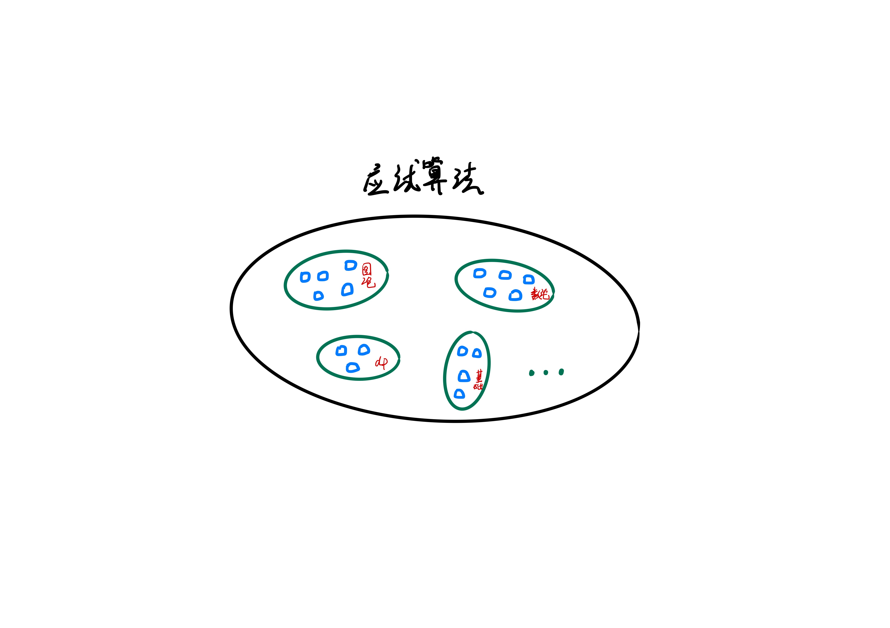
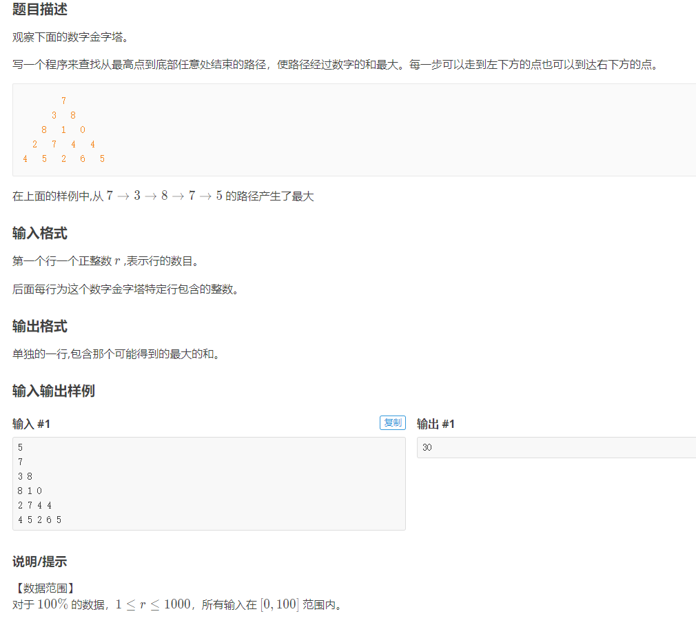
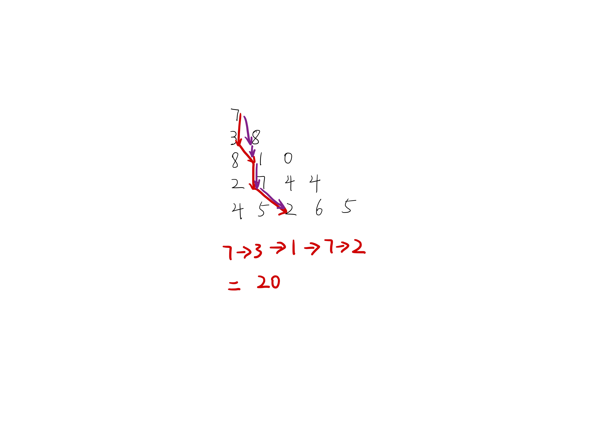

## 前言
> 在我看来，大部分面试的算法题从来都不是难在思维，而是缺乏系统的教学。它不像数学属于普及的基础教育，算法题目的大部分知识、技巧往往都局限于 competitive programming 当中 (比如各种 OI 竞赛、 ACM 竞赛等)，这些都是大部分计算机行业从业者接触不到的。它就像一个大群体中一个半封闭的小群体一样，系统的知识就在那里，只是我们很少会主动走进去。因此，我期望将这些知识给带出来，就引申出了本系列文章和视频。

动态规划不是指的某种具体算法（比如 dijkstra 单源最短路），而是属于一种经典的思考方式，在算法竞赛和面试/笔试中其一向是宠儿。追溯其本源，是由著名数学家 R.Bellman 等人在研究 **多阶段决策过程** 的优化问题而创立的，当前属于 **运筹学** 的分支之一。

而回归到算法问题当中，动态规划受宠的原因之一就是它不存在统一的处理方法，而需要我们根据具体的问题性质加上一些技巧结合来处理。这样能够让企业/竞赛方更加真实的考察应试者的思维能力。不过这点变化仍然挡不住经历过高考洗礼的我们，毕竟应试、刷题已经融入到大部分同学的血液里了。

在实际做题过程中，通常会遇到以下几个问题：
1. 阅读完题目后，无法想出具体的思路，比如无法将题意和动态规划思路联系起来。
2. 有了思路，无法写出具体代码或者迷失在各种边界细节当中

对于问题 1，我们可以和另外一个常见现象联系起来：每次看完别人题解后总会有恍然大悟之感（尤其对于已经刷了小几百道题目的同学），但是下次题意一变化，却又不会做了。这种现象非常类似于“老师一讲就懂，自己一做就不会”。该现象的本质原因如下：**题解** 或者 **老师的讲解** 属于在多种知识点之间建立了明确的连接，学生只需理解知识点与知识点之间的跳跃即可。而当自己去做的时候，则需要我们先在非常繁杂的知识点海洋当中根据题意线索抽丝剥茧，寻找到初始考察的知识点，然后再根据个人经验（前期系统学习加上个人总结）寻找到整道题目的知识脉络来得到答案。

那么对于问题 1，我们是否能够解决或者能否通过某种**刻意地训练**来改善呢？

> 在这里，我们暂且不把范围扩大到**更广义地知识学习**，就将范围约束在应试算法领域当中。


(图 6-1)


1. 攻克问题 1 的第一步就是，分别单独理解**应试算法**领域中的所有知识点，比如图论中的**单源最短路**。而由于**应试算法**的范围限定较多，考察也更多偏向于实现而非证明，所以这块内容难度并不会很大（相比于数学等纯粹学科来讲）
2. 第二步，通过每个知识点的经典例题加深知识点理解。这块在基础竞赛教育中已经非常系统了。
3. 第三步，也是最难的一步。我们知道在规模为 $n$ 的点之间建立两两关联，就已经达到了 $O(n^2)$ 级别的计算量，更何况还存在更加复杂的关系。很少有人能够完全覆盖所有的知识点关联（题目也在每年不断扩展中）。在此时，我们应该停下脚步思考下我们学习算法的目的究竟是什么？**只是为了应对面试**？**为了挑战自己的极限**？目的不同你所花的精力也应该有所侧重，毕竟算法只是多个知识领域中的一个而已。而本课程的基调主要在于前者，稍微带点后者。因此，类似于**后缀数组**、**后缀自动机**这类较偏、较进阶的知识点我们就不会讲了。 

回归到 **动态规划**，我不想一下子给大家抛出太多的概念性术语，具体的概念我们会在总结的时候再讲解。但是，提前把名称给出来还是有必要的。

动态规划中常用的术语有如下几个：
- 阶段
- 状态
- 状态转移方程
- 无后效性
- 决策
- 重叠子问题
- 最优子结构性质

尽管如上文所说，动态规划非常的灵活，没有特别固定的套路。但随着多年的信息竞赛发展，众多前辈仍然将很多经典例题进行了归类，并总结出不少的模板。而这些经典例题以及类别也是我们动态规划章节的主题。具体细分如下：

1. 线性 DP
    - 数字三角形模型
    - 最长上升子序列模型
    - 背包模型
    - 状态机模型
2. 区间 DP
3. 数位 DP
4. 状态压缩 DP
5. 树形 DP
6. DAG 上的 DP
7. DP 优化
    - 单调队列优化
    - 斜率优化
    - 四边形不等式优化

> 而这里，更稀少的 **插头DP**、**基环树DP**、**概率DP**、**动态DP**我们就不讲解了

## 正文
遍寻多本竞赛参考书，对于线性 DP 的定义并不具体，原因可能在于不理解该特性并不会影响我们完成题目。而本文的线性 DP 的概念来自于《算法竞赛进阶指南》一书：
> 线性 DP：指的是具有线性 “阶段” 划分的动态规划算法被统称为线性 DP。因此线性 DP 并不局限于 “线性时间复杂度” 的一维动态规划，如果一个动态规划算法的“状态”包含多个维度，但在每个维度都具有“线性”变化的“阶段”，仍然可以被称为“线性 DP”。

理论性概念暂不多说，我们直接通过题目来加深对动态规划的理解。

第一个要讲解的内容是：**数字三角形模型**

该模型起源于 **IOI 1994**，由于其考察内容之经典，在如今已经成为了动态规划的经典入门题目，并且不断变形出现在不同的赛场之上。


(图 6-2)

在看到题目的时候，我们暂且不要先入为主，直接进入动态规划的思路（避免虚假的理解）。我们先抽取出题意来：
1. 在所有合法的路径中获取路径和最大的路径
2. 路径和为路径中所有数字的和
3. 合法路径指的是不会越界，并且每步决策只能往左下或右下走

面对这样的题意，我们最朴素的想法就是**枚举所有的可能路径，在枚举过程中计算路径和，比较得出最大和**

代码也很容易得到：
```python
import sys
input = sys.stdin.readline

def dfs(i,j):
    if i == r-1:
        return a[i][j]
    
    res = 0
    res = max(dfs(i+1, j), dfs(i+1, j+1)) + a[i][j]
    
    return res


if __name__ == "__main__":
    r = int(input())

    a = [[] for i in range(r)]
    ans = 0

    for i in range(r):
        a[i] = list(map(int, input().split()))
    
    ans = dfs(0, 0)
    print(ans)
```

整体代码的思路和题意的思路是一致的，就是直接**模拟路径行走的过程**，从第一行开始，到最后一行结束，在每个点有两种可能决策：**向左下或者右下**。

假设共有 $n$ 行，每行有两种决策，每次决策时间复杂度为 $O(1)$, 因此时间复杂度为 $O(2^n)$。

上述代码稍微学过一点 **dfs** 的同学就能直接写出来，但是这里面仍然隐含另外一重深意：**阶段** - 我们理所当然的将每一行当作了一个阶段的划分依据，这是我们大脑直接模拟给出的，因为符合我们的日常生活场景。但是，很多时候题目给出的模型是抽象的，且很难映射联想，此时就需要多加注意了。

仔细模拟下我们会发现，在整个 **dfs** 的过程中会产生大量如下图所示的重复计算。


(图 6-4)

减少重复计算的方法之一就是用内存将其存储起来，也就是**空间换时间**。
```python
import sys
input = sys.stdin.readline
sys.setrecursionlimit(1500)

def dfs(i,j):
    if i == r-1:
        dp[i][j] = a[i][j]
        return dp[i][j]

    if dp[i][j] != -1: return dp[i][j]    

    dp[i][j] = max(dfs(i+1, j), dfs(i+1, j+1)) + a[i][j]
    
    return dp[i][j]


if __name__ == "__main__":
    r = int(input())

    a = [[] for i in range(r)]
    dp = [[-1] * (i+1) for i in range(r)]
    ans = 0

    for i in range(r):
        a[i] = list(map(int, input().split()))
    
    ans = dfs(0, 0)
    print(ans)
```

这也是我们所说的 **记忆化递归**，或者叫做 **从上到下的 DP**。这种微小的变化直接将时间复杂度降低到 $O(n^2)$ 级别。

在这里，计算时间复杂度的技巧是直接统计**可能状态**的数量。

> 注意： 这里 `sys.setrecursionlimit(1500)` 避免递归过深报 Runtime Error 错误

从这里，我们更加深入的思考 `dp[i][j]` 是否有更多意义？

从上述代码来看，`dp[i][j]` 其实存储的是：**从坐标(i, j) 开始走到最后一行的最大值**


## 其他例题
https://www.acwing.com/problem/content/1017/
https://www.acwing.com/problem/content/1020/
https://www.acwing.com/activity/content/problem/content/1258/1/
https://www.acwing.com/problem/content/description/277/

https://leetcode-cn.com/problems/unique-paths/
https://leetcode-cn.com/problems/minimum-path-sum/

