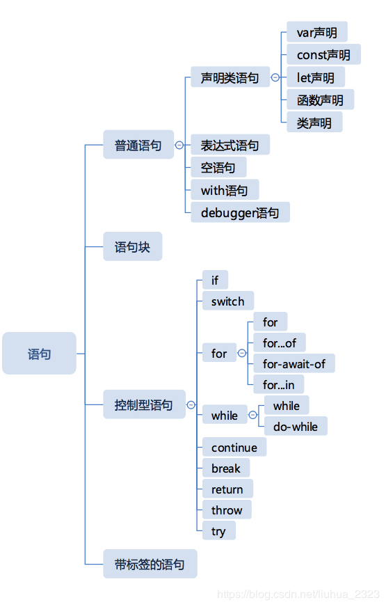

---
title: 如何理解 ECMAScript 中的 completion record
autoPrev: README
--- 
 
## 简介
本篇主要理解 ECMAScript 文档的 specification type - completion record。

**前置思考的问题：**
1. completion record 在规范中的细节是什么？
2. 为什么我们需要理解这种 specification type 呢？

completion record 在不同版本的 ECMAScript 文档的叫法会稍有变化，但是其含义是稳定的。
- [ECMAscript 5.1](http://www.ecma-international.org/ecma-262/5.1/#sec-8.9): 被称为 completion，内容介绍也很简洁
- [ECMAscript 6 及以后](http://www.ecma-international.org/ecma-262/6.0/#sec-completion-record-specification-type): 被称为 completion record。从ES2015 开始规范文档越来越庞大，添加了 record type，而 completion 在之前的文档中其实数据结构就是 record type 的形式。这也是为什么说不同版本规范的定义是一致的。

## 细节
>The Completion type is a Record used to explain the runtime propagation of values and control flow such as the behaviour of statements (break, continue, return and throw) that perform nonlocal transfers of control.

**从规范中可以看出来：**
1. completion type 是 record type，被内部用来解释 control flow 和 value 的 runtime 传递的。
2. 每一个 statement 被引擎执行后都会产生一个 completion record。

首先来看 completion record 具体允许哪些值：
| Field | Value | Meaning |
|----|----|---|
|[[type]] | normal, break, throw, continue, return | 发生的 completion 类型|
|[[value]]|any ECMAScript language value or empty|产生的值|
|[[target]]|string or empty|the target label for directed control transfer|

该表格对所有类型的 statement 生成的 completion record 都进行了描述。

**到目前为止(ES6)，ECMAScript 定义了哪些 statement呢？**：
在这里我直接引用 winter 的图：


- 普通语句： 产生 `[[type]]` 为 normal 的 completion record。JavaScript 引擎在遇到此类型的completion，会继续执行下一个语句。这些语句中，只有 expression statement 会产生 非 empty 的 `[[value]]`。chrome console 每次执行完一个 statement 显示的值就是 `[[value]]`。
- 语句块：多个 statement 组成，返回的 completion record 取决于内部是否有 abrupt completion，如果存在 abrupt completion，会该语句块的 completion record 就是 该 abrupt completion。而这种内部逻辑也是符合我们的正常观感的。
```javascript
{ 
  var i = 1; // normal, empty, empty 
  return i; // return, 1, empty 
  i ++; 
  console.log(i)
} // return, 1, empty


{
  var i = 1; // normal, empty, empty
  i ++; // normal, 1, empty
  console.log(i) //normal, undefined, empty
} // normal, undefined, empty

```

- 其他语句：直接看 ES6 规范即可

## 有趣的题目
代码一：
```javascript

function foo(){
  try{
    return 0;
  } catch(err) {

  } finally {
    console.log("a")
  }
}

console.log(foo());
```

代码二：
```javascript

function foo(){
  try{
    return 0;
  } catch(err) {

  } finally {
    return 1;
  }
}

console.log(foo());
```

- 代码一的打印： `a` 和 `0`
- 代码二的打印： `1`

这种怪异的表现，其实直接去规范中看算法步骤一目了然：
> The production TryStatement : try Block Catch Finally is evaluated as follows:
1. Let B be the result of evaluating Block.
2. If B.type is throw, then
    - Let C be the result of evaluating Catch with parameter B.value.
3. Else, B.type is not throw,
    - Let C be B.
4. Let F be the result of evaluating Finally.
5. If F.type is normal, return C.
6. Return F.

从规范的步骤 5 和 6 可以看出来 如果 finally 产生的 completion record 的 `[[type]]` 不是 normal 的话，直接返回 finally 执行的结果。


**下面来回答前置问题2**：
1. 理解 completion record 有助于加深我们对 JavaScript 内部细节的理解，也有助于我们以后对引擎本身的理解
2. 有助于我们对一些逻辑产生的怪异结果更好地分析

综上，花一点点时间，来理解 completion record 还是有必要的。