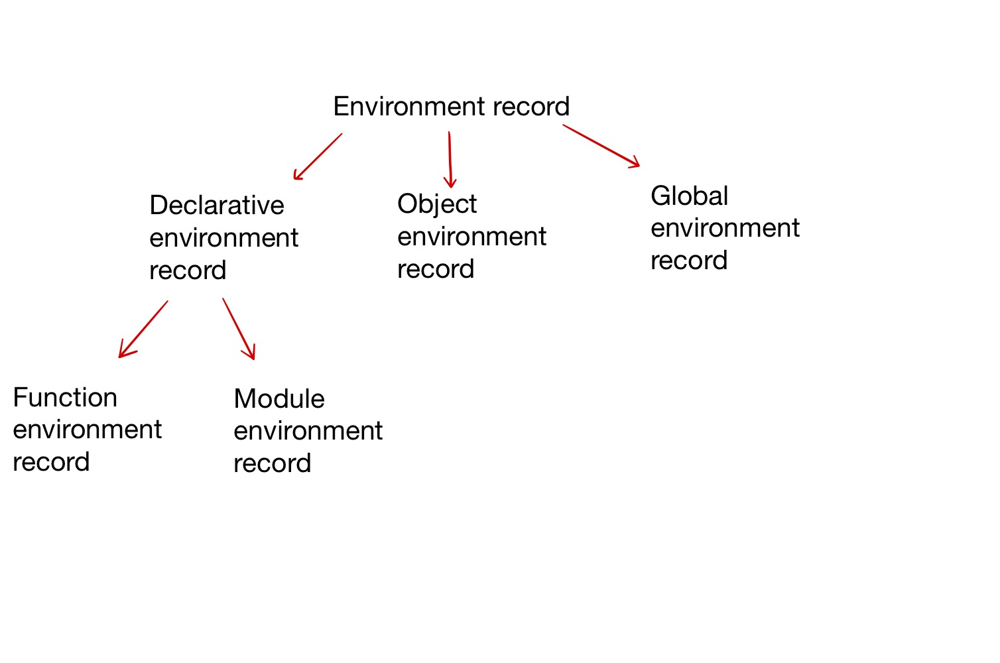

---
title: ECMAScript 中是如何讲解 environment record 和 executing context 的
autoPrev: README
---  
 
 
## 简介
本篇主要通过 ECMAScript 中的 environment record 概念来深入理解 JavaScript 中的困惑与细节。

首先，对自己提出几个疑问：
1. environment record 究竟是什么？
2. 它和 running execution context 有怎样的联系？
3. 对于 JavaScript 使用者来讲，理解这些概念的意义在于哪里？
4. 我们能够应用它吗？

## 细节
ECMAScript 在 2015 版本以后花了整整一个大章节来描述 environment record 究竟是个什么东东（[8. executable code and execution contexts](http://www.ecma-international.org/ecma-262/10.0/index.html#sec-executable-code-and-execution-contexts)）。

我们知道，根据 ECMAScript 文档规范写的代码是一种语法嵌套结构。全局环境里面嵌套着代码块和各种方法，方法里面又有着各种语法结构，比如条件语句块、循环语句块等等。这些加起来形成一种嵌套结构，并且在这些结构里面，我们会有指定的 variables 和 functions。通过这些结构才形成一整套完整的程序逻辑。

 lexical environment 就是 ECMAScript 文档内部用来定义 identifier（标识符）和具体的 variables、functions 之间关系的一种规范类型。

**那么哪些语法结构被执行时会产生新的 lexical environment?**
在 ECMAScript 中，下面结构被执行的时候：
- FunctionDeclaration code
- Block statement code
- Try statement 中的 catch clause

lexical environment 里面包含一个 environment record 和一个指向外部 lexical environment 的 reference。这种指向是多对一的关系，比如一个 Function declaration 当中包含两个内部的 function declaration。

**从全局来看，这种结构可以和数据结构中的有向无环图联系起来。并且这样设计也是非常合理的。**

**那么在ECMAScript 当中有哪几种 lexical environment 呢？**

1. global environment - 是最外层的 lexical environment，该 environment 会和一个 global object 相互关联（具体到环境当中就是，浏览器环境中的window 对象 和 Nodejs 当中的 global 对象）。
2. module environment - 由 module 产生，包含该 Module 里面所有顶层的声明，同时还包含通过import语法显式引入的 bindings。它的外层 lexical environment 是 global environment。
3. function environment - 由 ECMAScript function object 触发生成。对于 function environment 而言，有两个比较重要的概念， this binding 的创建和 super method相关状态的捕获。

由上面可知，Environment record 在 lexical environment 中占据中重要的成分。而在 ECMAScript 规范当中有两种基本 Environment record 值，record 是 specification type，可以类比于键值对这种数据格式：
- declarative environment record：用来记录 类似 Function declaration， variable declaration 和 catch clause 这些语法元素，这些语法元素的特点是将 identifier 和 ECMAScript language value 直接关联。
- object environment record：用来记录类似 withstatement 这种 ECMAScript element，特点是会将 identifier 和 一些 object 的 property 进行关联。

首先，我们来看看 ECMAScript 中提到的各种 environment record 之间的关系（类比于OOP中的类）：

1. Declarative environment record: 每一个 Declarative environment record 会关联和程序中对应的作用域。具体该如何关联呢？该 record 通过绑定该作用域中的 declarations 和 identifiers。这些 declarations 包括 variable, constant, let, class ,function , module ,import。

2. Object environment records: 每一个 object environment record 会和一个 object 进行关联（我们称这个 object 为 binding object）。object environment record 绑定的 string identifiers 和 binding object 的 property name 是一致的（但是 binding object 的 非 string 类型 key 的 property name 不被包含），并且这些 property 包含 own 和 inherited properties（不需要[[Enumerable]] attribute 为 true）。我们知道， object 可以被动态的 add/delete/modify property，这也就意味着需要同样对 object environment record 执行同样的操作（如果不进行同样的修改，那么environment record 和 binding object 就不一致了）（并且这些被操作的 binding 全部是 mutable 的，无论 [[writable]] 的值是什么）。
   - 对于 with statement 产生的 object environment record，默认会将 binding object 作为 隐式的 this 值传递给 function call。

3. 我们知道，function environment records 是 declarative environment record 的一个特例，被用来表示一个 function 的 top-level scope。
   - 如果该 function 不是 arrow function，会提供 this binding。
   - 如果该 function 不是 arrow function，并且 reference super，那么该 function environment record 同样包含被用于执行 super method 的一些状态。
   -  funciton environment record 中有意思的一些额外属性：
      - [[ThisValue]]: 指代 function 里面的 this value
      - [[ThisBingdStatus]]: 可能是 lexical/initialized/uninitialized 这三种值，如果该值时 lexical， 表示是 arrow function, 并且没有本地的 this value。

4. global environment record: 每个 global environment record 表示最外层的 scope，该 scope 被一个 realm 中的所有 script elements 共享。一个 global environment record 中 bindings 有 3 个来源：built-in globals; global object 中的 properties; top-level declarations。global environment record 在逻辑上被看成是一个 record，但是在具体实现上包含一个 declarative environment record 和一个 object environment record。  
   - 该 object environment record 的binding object 是对应 realm 中的 global object（并且该 global object 是 global environment record 中 GetThisBinding method的返回值，这里是为什么我们在全局环境下访问 this 返回 global object的原因）。
   - 该 object environment record 包含的bindings 包括：
      - 所有的 built-in globals
      - global code 中的 FunctionDeclaration, GeneratorDeclaration, AsyncFuctionDeclaration, AsyncGeneratorDeclaration, VariableStatement 引入的binding
   - 其他的 global code 中的 bindings 被包含在 declarative environment record 当中，比如 lexical declaration。

5. module environment records: module environment record 被用来表示 ECMASCript Module 中的顶层 scope。module environment record 提供了通过 import 语法引入的 immutable import bindings（这些 bindings 存在于另外的 environment record 当中）。

### ECMAScript 中的 executing context 是什么？
要知道，在很多的现代编程语言当中，都会有类似的 executing context 概念（比如Python/Java/etc.）。executing context 被操作在 stack 上面，栈顶元素就是当前的 running executing context。

本身来讲，javascript 是单线程的，也就是说，在任意时刻只有一个 executing cotext 正在执行代码。在每个 executing context 中会有几种状态： perform; suspend; resume（这和操作系统中切片来模拟并发思路是一致的）。由此引出的问题是，我们通常编写的异步代码对于浏览器内部来讲究竟是怎么运行的呢？这里我准备另开一篇文档来讲。

对于每一个 executing context，包含两个 statement component:
- lexicalEnvironment: 指向当前 executing context 中的 lexical environment
- variableEnvironment: 指向当前 executing context 中的 lexical environment，这个 environment 里面的 bindings 是通过 variable statement 创建的。

### 理解这些概念的意义
1. 和其他语言范式中的语言相互印证，获得对语言设计原则的理解，提升自己的水平
2. 对于 JavaScript 当中的一些奇怪现象能够有更加深入的理解：
    - 在浏览器环境中，比如 lexical declaration 中的 identifiers 会出现在 window 对象吗？

