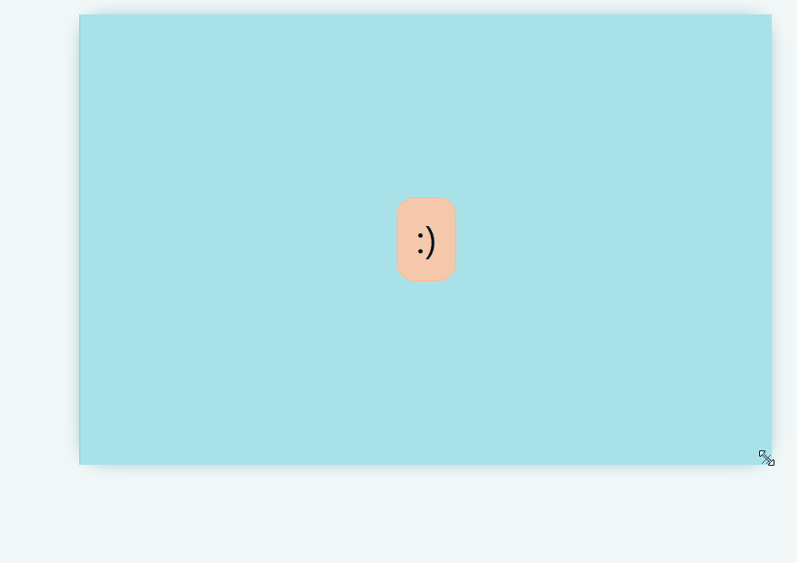
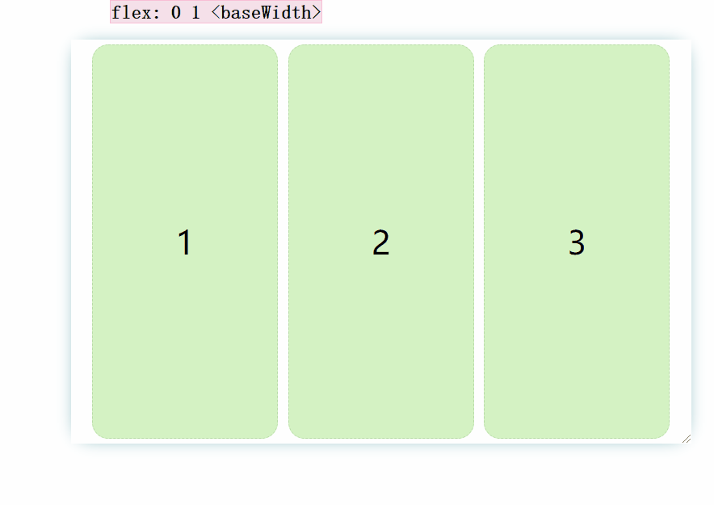
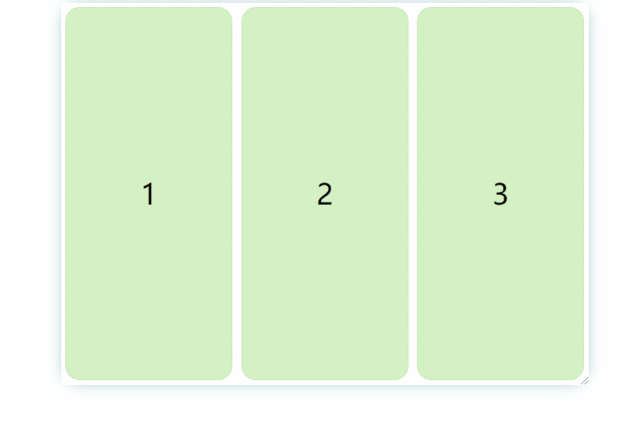
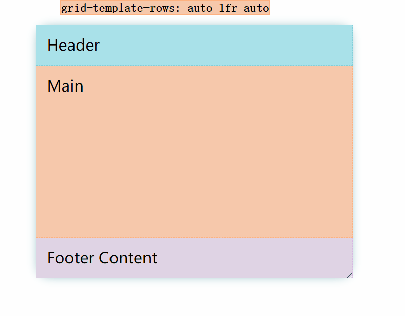

> Mom, I Can't Learn Anymore(《妈妈，我学不动了！》) 是一系列关于计算机领域程序最新时事的文章(偏向于前端领域)，在该系列会从不同的角度讨论领域内的实践和进展。

## 前言
周日在家看 web.dev 的 2020 三天 live，发现不少有意思的东西，其中有一项是关于 CSS 的，主播是 Una Kravets（chrome team 成员）。虽然我已经好几个月没有深入研究 CSS 的东西了，不过以前的底子还在（有兴趣的可以看我一年前发布的关于 CSS 的东西，虽然由于太过底层没啥人愿意看, sad）。

## 正文

### 1. 超级居中
在没有 flex 和 grid 之前，垂直居中一直不能很优雅的实现。而现在，我们可以结合 `grid` 和 `place-items` 优雅的同时实现**水平居中**和**垂直居中**。
```html
  <div class="parent blue" >
  <div class="box coral" contenteditable>
    :)
  </div>
```
```css
  .ex1 .parent {
    display: grid;
    place-items: center;
  }
```


[MDN, place-items 属性详解](https://developer.mozilla.org/en-US/docs/Web/CSS/place-items)

[codepen 地址](https://codepen.io/una/pen/YzyYbBx)

## 2. 可解构的 自适应布局(The Deconstructed Pancake)
`flex: 0 1 <baseWidth>`

这种布局经常出现在电商网站：
1. 在 viewport 足够的时候，三个 box 固定宽度横放
2. 在 viewport 不够的时候（比如在 mobile 上面），宽度仍然固定，但是自动解构，不在同一水平面上

```html
  <div class="parent white">
    <div class="box green">1</div>
    <div class="box green">2</div>
    <div class="box green">3</div>
  </div>
```
```css
  .ex2 .parent {
    display: flex;
    flex-wrap: wrap;
    justify-content: center;
  }

  .ex2 .box {
    flex: 1 1 150px; /*  flex-grow: 1 ，表示自动延展到最大宽度 */
    flex: 0 1 150px; /*  No stretching: */
    margin: 5px;
  }
```


当我们设置 `flex: 1 1 150px;` 时候：


[codepen 地址](https://codepen.io/una/pen/WNQdBza)


## 3. 经典的 sidebar
`grid-template-columns: minmax(<min>, <max>) ...`

同样使用 `grid` layout，可以结合 `minmax()` 实现弹性的 sidebar。`minmax(<min>, <max>)` 就是字面意思。在结合 `<flex>` 单位，完美，避免了数学计算宽度等不灵活的手段（比如我们设置 gap 的时候）。

```html
  <div class="parent">
    <div class="section yellow" contenteditable>
    Min: 150px / Max: 25%
    </div>
    <div class="section purple" contenteditable>
      This element takes the second grid position (1fr), meaning
      it takes up the rest of the remaining space.
    </div>
  </div>
```
```css
  .ex3 .parent {
    display: grid;
    grid-template-columns: minmax(150px, 25%) 1fr;
  }
```


[codepen 地址](https://codepen.io/una/pen/gOaNeWL)

## 04. 固定的 header 和 footer
`grid-template-rows: auto 1fr auto`

固定高度的 header 和 footer，占据剩余空间的 body 是经常使用的布局，我们可以利用 `grid` 和 `fr` 单位完美实现。

```html
  <div class="parent">
    <header class="blue section" contenteditable>Header</header>
    <main class="coral section" contenteditable>Main</main>
    <footer class="purple section" contenteditable>Footer Content</footer>
  </div>
```

```css
  .ex4 .parent {
    display: grid;
    grid-template-rows: auto 1fr auto;
  }
```


[codepen 地址](https://codepen.io/una/pen/bGVXPWB)

## 05. 经典的圣杯布局(classical holy Grail layout)
`grid-template: auto 1fr auto / auto 1fr auto`

我们可以轻松的使用 Grid 布局来实现圣杯布局，并且是弹性的。

```html
  <div class="parent">
    <header class="pink section">Header</header>
    <div class="left-side blue section" contenteditable>Left Sidebar</div>
    <main class="section coral" contenteditable> Main Content</main>
    <div class="right-side yellow section" contenteditable>Right Sidebar</div>
    <footer class="green section">Footer</footer>
  </div>
```

```css
  .ex5 .parent {
    display: grid;
    grid-template: auto 1fr auto / auto 1fr auto;
  }
  
  .ex5 header {
    padding: 2rem;
    grid-column: 1 / 4;
  }

  .ex5 .left-side {
    grid-column: 1 / 2;
  }

  .ex5 main {
    grid-column: 2 / 3;
  }

  .ex5 .right-side {
    grid-column: 3 / 4;
  }

  .ex5 footer {
    grid-column: 1 / 4;
  }
```


[codepen 地址](https://codepen.io/una/pen/mdVbdBy)


## 06. 有意思的叠块
使用 `grid-template-columns` 和 `grid-column` 可以实现如下图所示的布局。


[codepen 地址](https://codepen.io/una/pen/eYJOYjj)


------
> 遵循 MIT 协议，转载请联系作者。更多文章请关注公众号（点击下方链接）或者 Star GitHub repo.

[更多文章](https://www.bruceyj.com/front-end-interview-summary/info/)