> Mom, I Can't Learn Anymore(《妈妈，我学不动了！》) 是一系列关于计算机领域程序最新时事的文章(偏向于前端领域)，在该系列会从不同的角度讨论领域内的实践和进展。

## 前言
> 注意，我期望你带着问题看全文，我们是如何定量分析构建工具？衍生的问题是，学习这类知识的核心是什么？

周日在家看 web.dev 的 2020 三天 live，发现不少有意思的东西，其中有一项是关于 building tool 的，也就是我们常说的前端构建工具，当天的主播是 Jake Archibald（chrome team 成员，个人非常喜欢的技术专家）。

其实，刚开始了解到 **tooling.report** 来自于我非常喜欢的一位开源作者 Evan You（Vuejs 的作者）的推特：

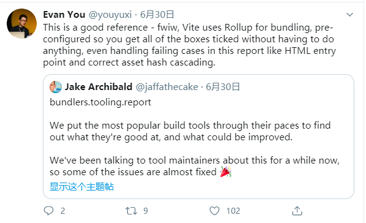

这篇简单的推文引起了我的兴趣，尽管业内存在各种分析前端构建工具的文章，但这些文章往往质量参差不齐，大部分分析不够全面，偏向于定性分析，有些甚至加入了个人的主观臆想。

因此，为什么不对各大主流的构建工具进行定量分析它们呢（利用类似于 benchmark 的测试）？

这很明显是一个对普通开发者非常有用的需求，但到现在还缺乏相对应权威的东西可能是因为：
1. 前端发展到现在，各大构建工具已经非常的复杂，业界之前有一句笑话，“现在是面向 webpack 配置编程”。同时精通所有的构建工具是需要很大的耐心和技术水平的，并且相应的 ROI 也不够明确，所以甚少有人做。
2. 这类构建工具进化的非常快，目前的前端有种现象，“每 6 个月就会出现一批新的技术”，所以要保证这些构建工具的定量分析的时效性需要耗费很大的精力和团队协作。

很显然，Jake Archibald 同样也是这样想的，Jake Archibald 在我看来是一个非常有 **技术激情** 的人（Jake 和 Surma 的 HTTP 203 演播室就可以看出来，他精通的东西非常多）。因此其和 surma，una krats, Jason Miller, Adam Argyle, Mariko Kosaka（以上基本都属于 chrome team 成员） 组成了小组，来定量分析流行的构建工具好在哪里？如何达到最佳实践？以及哪些需要被改进？

## 正文
**tooling.report** 是一个开源的项目，它期望给开发者在选择构建工具时一些权威性的参考。

这些参考在开发者进行一些构建工具相关的决策时非常有用，比如：
- 在开始下一个项目时该如何选择构建工具？
- 用来抉择是否从一个构建工具迁移到另外一个构建工具？
- 在使用构建工具时如何得到最佳实践？

各个不同的构建工具有不同的专注领域，因此会满足不同的需求，这也就意味着我们在选择和配置 building tools 时需要进行 tradeoffs。而如果有一个网站能够最新的和你解释这些 tradeoffs，并且告诉你该如何一步步来达到最佳实践，是不是听起来很棒？


**为什么选择合适的构建工具对于我们如此的重要呢？**

在开发一个现代 web 项目时，我们会先从讨论项目的基础设施开发，比如宿主环境(host environment)如何？选用什么框架？选用什么构建工具？

随着项目的进展，这些基础设施可能会被更新，比如需要添加新的、定制的 plugin 来满足框架或技术的需求。而往往会忽略的一点是，我们组织代码的方式可能会因为构建工具的不同而发生对应的变化（为了让构建工具能够更好地理解我们正在做什么）。在整个开发的过程中，我们经常会发现，构建工具会成为项目的障碍。

对于专注于给用户提供最佳浏览体验的团队来讲，会经常微调前端资源的组合和分发的方式。
举个例子，如果一个主线程脚本（main thread script）和一个 web worker script 有共同依赖的资源，我们会更加期望该依赖资源只会被下载一次，而不是在两个 script 都分别打包一次。
一些构建工具对于上述的需求支持开箱即用，有些需要进行特殊的定制化来覆盖默认的行为，而有些则是完全不支持。

**这种体验或者需求会促使我们去研究各种构建工具能做什么？不能做什么？如果此时有一个 features checklist，我们选择时候是不是会更加简单一些？**

**那么该如何在一个地方评估和比较不同的构建工具呢？** 编写 test cases 不失为一个很好的方法。

Jake 的团队讨论并设计了测试标准，他们更加关注于是否能够提供给用户更加 fast, responsive, smooth 的体验（甲方是老大）。值得注意的是，这些 test case 并没有过多考虑开发者的使用体验，目的是为了避免可能产生冲突的结果（因为有些目标本身就是矛盾的）。

tooling.report 在建立完 test list 之后，会编写构建脚本来检查每个构建工具是否能够满足测试标准。目前 tooling.report 构建工具列表如下：
- webpack v4
- rollup v2
- Parcel v2
- Browserify + Gulp （因为仍然有很多项目在依赖与它）


**在编写完测试用例后，该如何确保测试用例使用构建工具的方式是正确的？又是如何确保尽量在比较的时候公平？**
tooling.report 目前是直接和构建工具的作者进行沟通来保证上述的问题，并且通过开源来集合社区的力量。

**此时有同学可能会问，“对于只使用构建工具，而不会进行决策使用哪个的开发人员来讲，tooling.reports 是否仍然有意义？”**

我们知道，在很多团队中，有专门的人员来致力于基础设施的维护，而团队的其他人员只需要直接使用就好。但是在这里我需要强调的是 tooling.reports 对于这列开发者仍然是有意义的。因为对于每一项测试，tooling.reports 都会详细解释为什么这些测试是重要的，各个构建工具该是如何满足这些测试的，并且在 github 提供了这些测试的最佳配置方案。

**听到这里，大家是不是都已经兴奋了起来 ^<>^**

下面我们来看看各大构建工具的测试通过率：
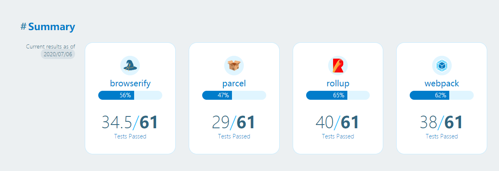
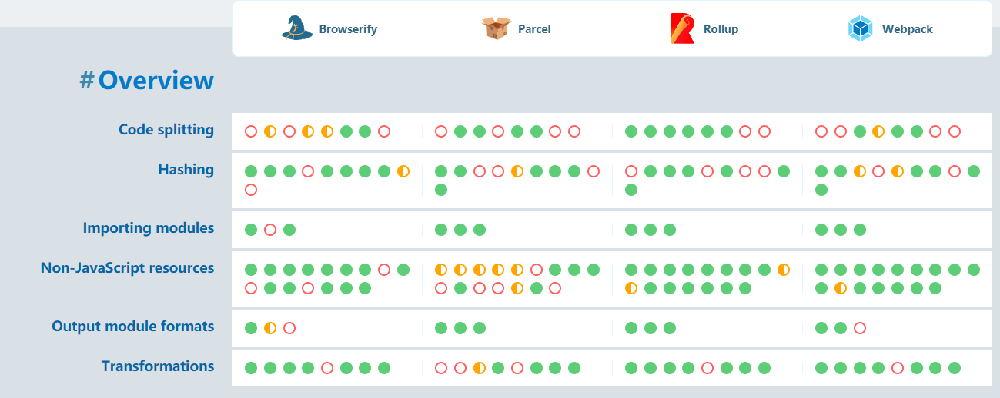


**到这里，都是表层的东西。我不禁思考起来，构建工具的哪些特性对于开发者是值得关注的？换种说法，tooling.reports 究竟是怎么选择这些测试特性的？**


目前 tooling.reports 主要测试的特性有 6 大种类：
1. code splitting。导出公共的依赖来避免重复打包
2. Hashing。给长期缓存(long-term caching) 生成散列 URL
3. Importing Modules。是否支持不同的模块格式导入
4. Non-JavaScript Resources。是否支持在 JavaScript 中导入 CSS 和其他类型文件
5. Output Module Formats。是否支持不同的模块格式导出
6. Transformations。是否支持对代码和其他资源的转换，比如`.vue` 文件的转换处理

下面我们来一一分析这些特性。

### code splitting

code splitting 在构建现代高性能 JavaScript 应用非常重要，其可以避免多余的下载。从高维度来讲，code splitting 指的是将代码分割成更小的 bundles，然后这些 bundles 可以被分别单独加载。

而对于 code splitting，在实际使用过程中又有很多不同的功能分支。在 tooling.reports 中总共提供了 7 种相关的 test case，下面一一介绍：

1. **Between New Worker Type: can entry bundles be created for other contexts ?（是否能对不同的 JavaScript context 的共用部分单独打包）**

在项目中，我们有很多不同的场景需要给不同的 Javascript context 分别打包一些代码，而 **web workers** 可能是最常见的情况，我们期望构建工具的特性同样对 **service workder**, **module workers** 和 **worklets** 适用。目前很多构建工具只是专门对 web workers 进行了特殊处理，而对新的 worker 变种进行适配仍然需要时间。

我们在设计测试用例时，期望该测试用例能够检查构建工具是否对新的或自定义的 context 类型进行代码分割。具体测试用例如下：
```javascript
// index.js
import workerURL from 'get-worker-url-somehow';
import { logCaps } from './utils.js';

new InterestingNewWorkerType(workerURL);
logCaps('This is index');
```
```javascript
// worker.js
import { logCaps } from './utils.js';
logCaps('This is worker');
```
```javascript
// utils.js
export function logCaps(msg) {
  console.log(msg.toUpperCase());
}
```
测试用例期望将上面的 modules 能够打包成 2-3 个文件。一个用来存放主线程代码，一个存放 worker thread 代码，更加理想的 utils 中的 logCaps(被另外两个共享的)能够单独打包成一个 shared bundle。

结论是：
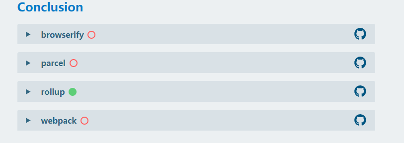
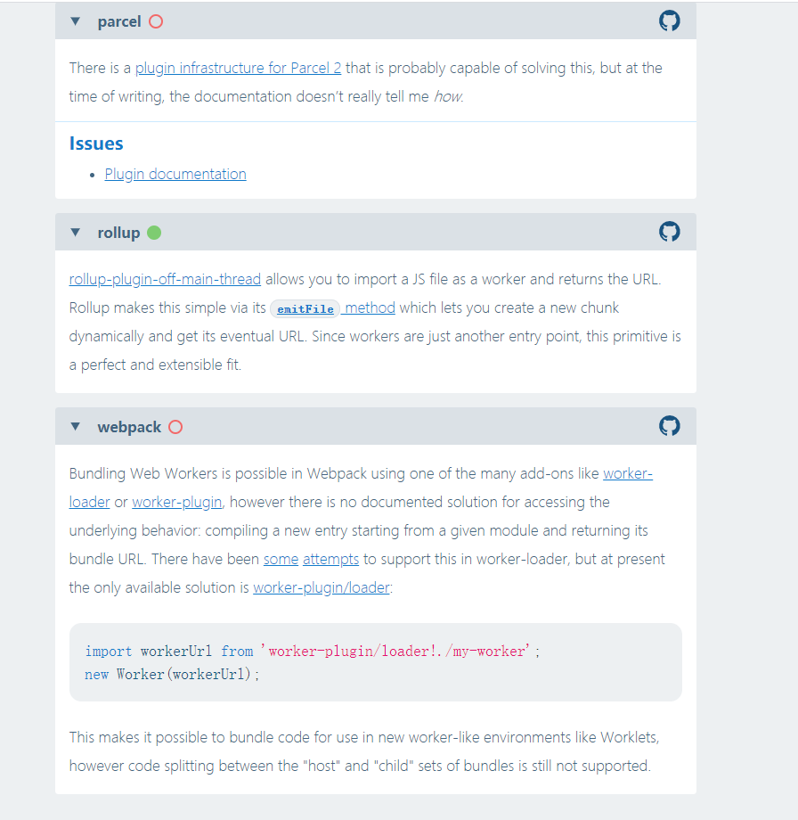


2. **between workers: can bundles be shared between the main thread and workers?(是否能对主线程和 web workers 公用的部分单独打包)**

该测试用例是对测试 1 的特异化，用来查看各大构建工具是否有对 web workers 有支持。

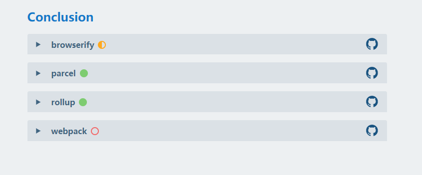

3. **是否支持通过 dynamic import 进行分割代码**

首先，我们得普及专业名词 - `split point` 的定义。
在 code splitting 当中，一个 "split point" 指的是异步的模块边界，其允许依赖能够从父模块中被分割出来，进行单独地打包和加载。

建立 split point 让 JavaScript 按需加载应用不同的部分成为可能（这在首屏加载非常有用）。

最常见的实现 split point 的语法就是 dynamic import。

测试用例如下：
```javascript
// index.js
(async function() {
  const {logCaps} = await import('./utils.js');
  logCaps('This is index');
})();
```
```javascript
// utils.js
export function logCaps(msg) {
  console.log(msg.toUpperCase());
}

```
期望结果是产生两个脚本文件，一个是 `index` 模块，一个是 `utils` 模块。并且可以在 utils 模块被加载前执行 index 模块。

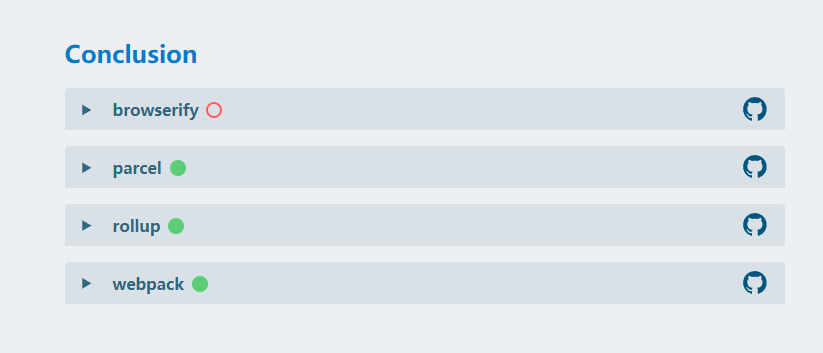


4. **Multiple Entry Points Per Page: Can multiple entry points be used without duplicating modules?（当一个页面有多个入口时，多个入口是否会重复生成共用的 bundles）**

通常来讲，一个页面只有一个入口，但有些时候会有一个页面多个入口的需求。比如，你期望在主入口旁边有个辅助入口，该入口用来分析。
根据构建工具的配置，多个入口依赖的公用模块可以被提取出来，成为多个页面公用的包。另外有时候也会出现另外一种情况，该公用模块只有很少的页面使用，以至于没有太多的理由将其抽取到公用包，而构建工具会将其分别内联到每个入口 bundle 里面。

但无论是**提取**出来还是**内联**，一个模块都不能被多次实例化。因为 ECMAScript module 和 CommonJS 都指定了一个 module 在每个 JavaScript 上下文只能被实例化一次。这种保证允许将模块的状态共享，很多库都是依赖这种假设来实现重要的跨领域问题(cross-cutting concerns)，比如 memorization， queues 和 plugin 注册。如果打破这个假设，会导致错误和低效。

```html
<!DOCTYPE html>
<script src="component-1.js"></script>
<script src="component-2.js"></script>
```

```javascript
// component-1.js
import obj from './obj.js';
obj.count++;
console.log('component-1', obj.count);
```
```javascript
// component-2.js
import obj from './obj.js';
obj.count++;
console.log('component-2', obj.count);
```
```javascript
// obj.js
export default { count: 0 };
```
我们期望构建工具构建后的代码能够输出：
```
component-1 1
component-2 2
```
下面是各大构建工具的测试情况（配置详情和最佳实践去官网查看）：
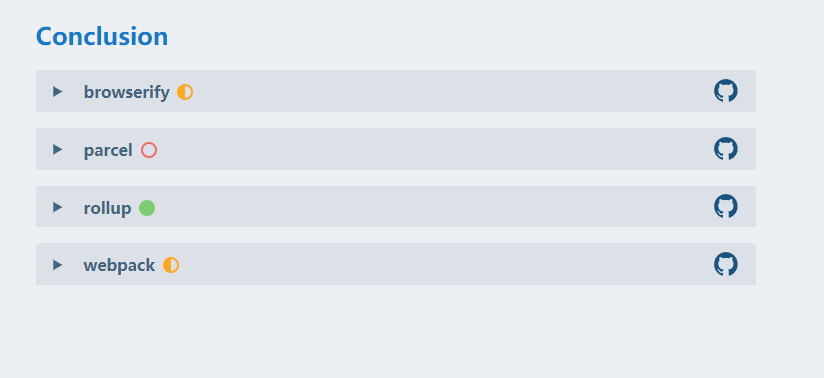

5. **One Entry Point Per Page: Are common entry denpendencies extracted into a shared bundle?（页面单入口时，公共依赖是否会被抽取出来？）**

这个应该算是最通用的需求了。举个例子，现在有两个页面，`index` 和 `profile` ，每个页面有各自的入口，但是这两个入口依赖一个共同的第三方库。那么构建工具是否会将这个共用库抽取出来成为 shared bundle, 而不是分别打包一个?

```javascript
// index.js
import { logCaps } from './utils.js';
import { exclaim } from './exclaim.js';
logCaps(exclaim('This is index'));
```
```javascript
// profile.js
import { logCaps } from './utils.js';
logCaps('This is profile');
```
```javascript
// utils.js
export function logCaps(msg) {
  console.log(msg.toUpperCase());
}
```
```javascript
// exclaim.js
export function exclaim(msg) {
  return msg + '!';
}
```
我们期望构建工具能生成三个单独的 bundle：
- 一个给 `index` page
- 一个给 `profile` page
- 一个包含 `logCaps()` 

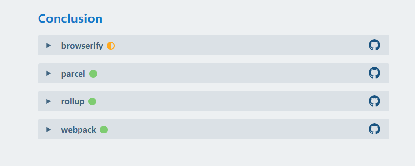

6. **shared References Between Chunks: Are module exports between bundles live bindlings?(ES moudle 的导出是否是 live binding？)**

这里的 living bindings 是 ES Module 的重点之一（也是面试常问的）。举个例子，如果被依赖的 module 中的值发生了变化，那么该变化会映射到所有依赖该值的模块中。
```javascript
// index.js
import { num, incrementNum } from './num.js';
incrementNum();
console.log(num);
import('./lazy.js');
```
```javascript
// lazy.js
import { num, incrementNum } from './num.js';
incrementNum();
console.log(num);
```
```javascript
// num.js
export let num = 0;
export function incrementNum() {
  num++;
}
```
我们期望输出结果为 `1` 和 `2`。

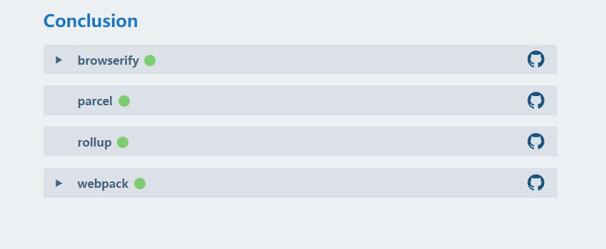

### importing Modules
这里 `importing modules` 指的是是否支持各种不同的模块语法。很明显的是，各大构建工具对该特性的支持都不错。这里我们就不像 code split 一样一个个分析了（不然文章太长，写的也很累）：

tooling.report 提供了 3 个测试用例：
1. 是否支持 commonJS？
2. 是否支持 ES module？
3. 是否支持从 `node_modules` 导入依赖？

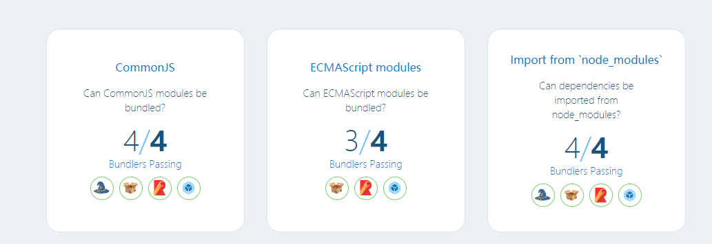

### output Modules format
是否支持不同的模块格式的导出。

很明显，这种功能是非常必要的。首先在 Node 12 之前，Nodejs 只支持 CommonJS；如果你的生产环境是现代浏览器，那么 ES module 肯定是最适合的；但是如果浏览器是老版本的，那么就需要相应的兼容。

另外还有一些情况，我们需要定制特殊的 module format。比如 web workers 的模块目前只能在 chrome 中使用，还没有浏览器支持 service worker 的模块化使用。

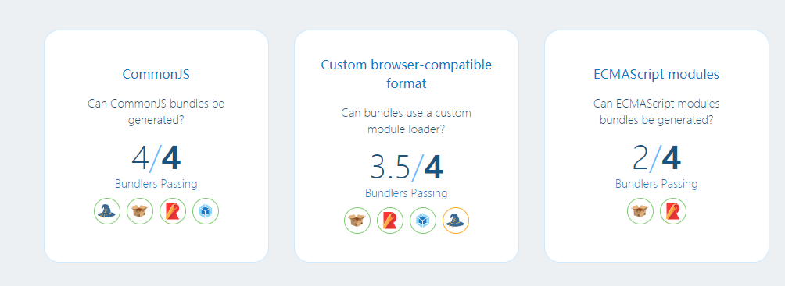

### Non-JavaScript Resources
构建工具支持我们在 JavaScript 导入其他类型的资源是非常重要的功能。

**为什么呢？**
一个基本的 web 应用，会有如下的资源类型：
- HTML 文档
- CSS 样式表
- JSON 或者 XML 
- 其他资源，比如图片、字体

**如果我们不能够很好地定义这些资源的关系，那么带来的问题是 - 单独处理这类类型的资源会很困难。比如我们对 URL 进行哈希处理时，各个资源的引用可能会产生不同步。并且资源的上下文处理也非常的困难甚至不可能。**

流行的解决方案是将应用表示成资源图(graph of resources)，这种方式非常类似于 module graph 的概念。资源图可以保存每个资源的信息，包括它所依赖的资源。比如 CSS 样式表依赖于其他通过 `@import` 引用的样式表；`@font-face` 引入的字体。更加有用的是，这些信息可以用来修改甚至内联资源的 URLs，或者应用 transformations（比如 namespacing CSS).

目前来讲，JavaScript 本身不支持在 module graph 中包含非 JS 资源，因此我们需要构建工具进行处理（在这里我们没有考虑最新的 TC39 提案 - **Import Attribute proposal**，支持安全引入 Non-JavaScript 资源）。

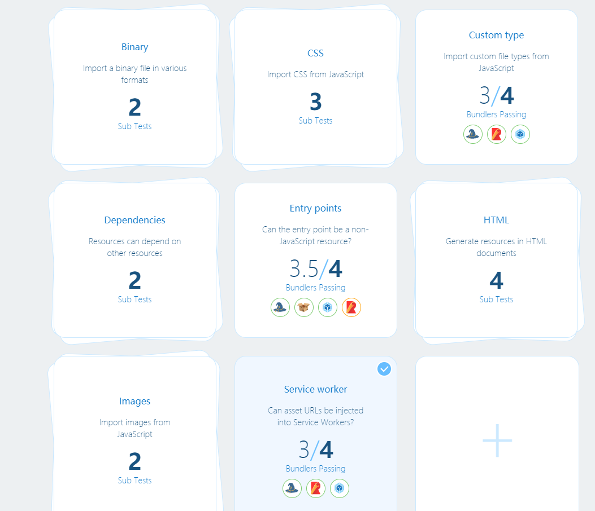

> 受篇幅限制，更加详细的测试信息去官方查询


### Hashing
对于现代的高性能 web 应用来讲，有效的缓存策略非常重要。但是我们该如何实现呢？理想的情况下，脚本和样式之类的资源如果没有被更新的话应该只会下载一次。如果我们的资源文件名称都是没有变化的，那么我们不得不重复请求这些同样的资源（因为我们没法分清楚该资源有没有被更新）或者使用陈旧的旧版本。这甚至会导致新版本的代码和某些陈旧代码意外组合，造成线上的错误（这就很严重了）。

解决上面问题的最佳方法之一就是将**版本信息包含在资源的 URL 中**。构建工具可以根据资源的内容生成相应的版本标识符，而这个过程就被我们称为 “hashing”（使用摘要算法的缘故）。当文件发生变动时，对应的哈希值也会发生变化，这样就能确保正确的缓存策略了。

但是这需要构建工具很好的实现，因为各个资源之间可能是相互依赖的，一个资源的变动，意味着会导致关联资源的变动（这个时候资源图就很重要了）。
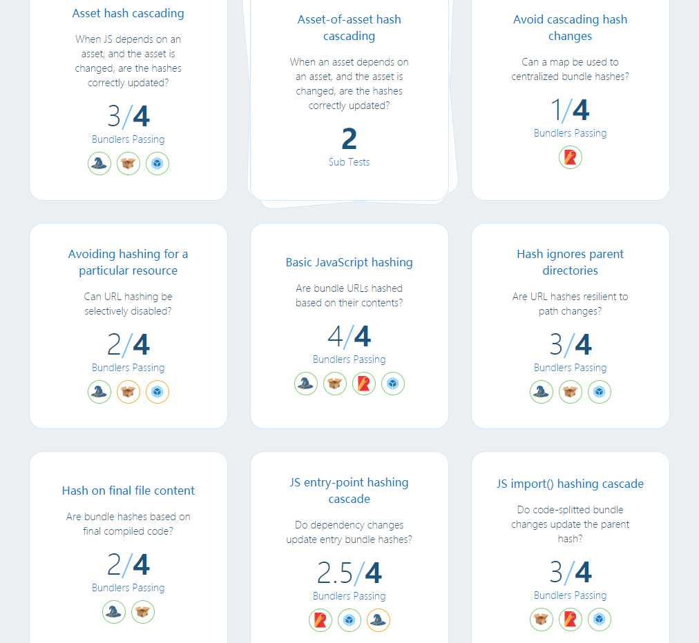

> 受篇幅限制，更加详细的测试信息和最佳实践去官方查询

### transformations
我们期望构建工具能够支持对代码或其他资源的某些转换。这些转换有些是通用的优化，比如压缩或者 minify；有些则是关于上下文的，比如内联图片或提取关键的 CSS；有些是则是特定应用的直接转换，比如
本地化或者提前编译。

当应用的所有资源通过依赖图表示的时候，转换可以通过资源类型来适用。

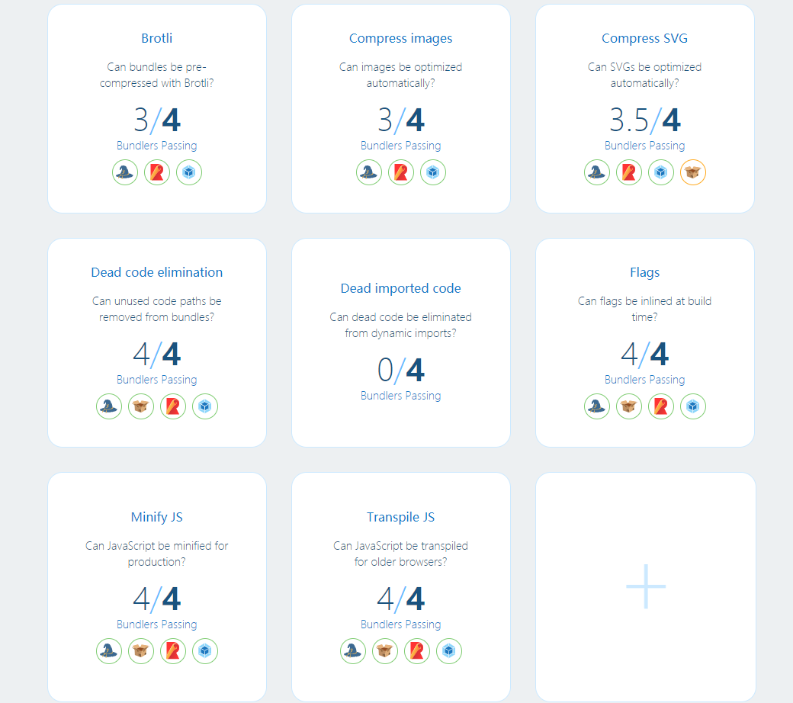


## 总结
到这里，我们已经定量分析了 4 种主流的构建工具。**值得注意的是，这些测试每天都在完善着，也期望着看文章的你能够到 github 上贡献一份力量。**

下面我们仔细思考另外一个问题，“除了帮助我们做 tradeoffs，定量分析不同的构建工具能够带给我们什么？”

其实这里面包含着所有学习的一个核心：**“当你如果只在一个东西里面，你永远无法完全理解这个东西”**。这句话可能有点哲学，用另外一个不太恰当的比喻来看，**“如果你是一只井底的蛙，那么你对这个世界的理解就只有井口那么大，你所能够理解的东西都在这个井里面”**。

我更加期望你能够从这篇文章里面得到两层含义：
1. 站在更高维度去思考各个构建工具的优缺点，以及它们各自的意义，而不是得到类似面向 Webpack 编程这类的称号。
2. 站在更高维度去思考永远在变化的行业（比如前端），去抓住哪些不变的东西，而具体哪些才能称得上不变的东西，有空在另起一篇文章。


- [tooling.report github](https://github.com/GoogleChromeLabs/tooling.report)
- [tooling.report 官网](https://bundlers.tooling.report/)

------
> 遵循 MIT 协议，转载请联系作者。更多文章请关注公众号（点击下方链接）或者 Star GitHub repo.

[更多文章](https://www.bruceyj.com/front-end-interview-summary/info/)