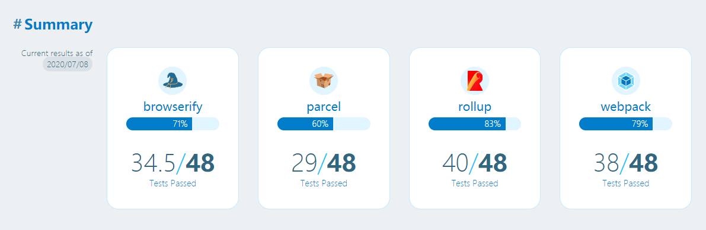
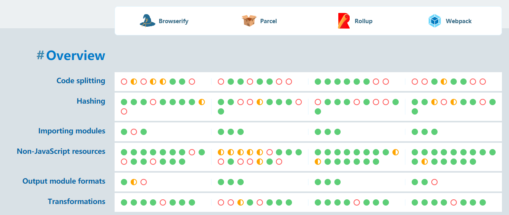

> Mom, I Can't Learn Anymore(《妈妈，我学不动了！》) 是一系列关于计算机领域程序最新时事的文章(偏向于前端领域)，在该系列会从不同的角度讨论领域内的实践和进展。

## 前言
周日在家看 web.dev 的 2020 三天 live，发现不少有意思的东西，其中有一项是关于 building tool 的，主播是 Jake Archibald（chrome team 成员，个人非常喜欢的技术专家）。

其实，刚开始了解到 **tooling.report** 来自于我非常喜欢的一位开源作者 Evan You（Vuejs 的作者）的推特：

这篇简单的推文引发了我的思考，尽管业内存在各种分析前端 build tool 的文章，质量参差不齐是是一说，另外一方面则是更加偏向于定性分析，甚至是个人主观臆想。

因此，为什么对于各大主流的构建工具，没有类似于整合的 benchmark 之类的东西能够定量分析它们呢？

很显然，Jake Archibald 同样是这样想的。因此其和 surma（和 Jake 组成了 Google 的 HTTP 203 演播室技术相声组合），una krats(CSS 专家，chrome 成员), Jason Miller, Adam Argyle, Mariko Kosaka 组成了小组，来定量分析流行的构建工具好在哪里？哪些需要被改进？

## 正文
tooling.report 是一个开源的项目，它期望给开发者在选择构建工具时一些参考。

比如在开始下一个项目时该如何选择构建工具？
在是否从一个构建工具迁移到另外一个构建工具时如何抉择？
在使用构建工具时如何得到最佳实践？

各个不同的构建工具有不同的专注领域，因此会满足不同的需求，这也就意味着我们在选择和配置 building tools 时需要进行 tradeoffs。

而如果有一个网站能够最新的和你解释这些 tradeorfs，并且告诉你该如何一步步来达到最佳实践，是不是听起来很棒？

在开发一个现代 web 项目时，我们会先从讨论项目的基础设施开发，比如宿主环境(host environment)如何？选用什么框架？选用什么构建工具？

随着项目的进展，这些基础设施可能会被更新。比如需要添加新的 plugin 来满足框架或技术的需求，我们编写代码的方式也可能发生对应的变化（为了让构建工具能够更好地理解我们正在做什么）。在整个开发的过程中，我们经常会发现，构建工具会成为项目的障碍。

对于专注于给用户提供最佳浏览体验的团队来讲，会经常微调前端资源的组合和分发的方式。
举个例子，如果一个主线程脚本（main thread script）和一个 web worker script 有共同依赖的资源，我们会更加期望该资源只会被下载一次，而不是在两个 script 都分别打包一次。
一些构建工具对于上述需求支持开箱即用，有些需要进行特殊的定制化来覆盖默认的行为，而有些则是完全不支持。

这种体验或者需求会促使我们去研究各种构建工具能做什么？不能做什么？如果此时有一个 features checklist，我们选择时候是不是会更加简单一些？

那么该如何在一个地方评估和比较不同的构建工具呢？编写 test cases 不失为一个很好的方法。

Jake 的团队讨论并设计了测试标准，他们更加关注于是否能够提供给用户更加 fast, responsive, smooth 的体验。值得注意的是，这些 test case 并没有考虑开发者的使用体验，目的是为了避免可能产生冲突的结果（因为有些目标本身就是矛盾的）。

report.tool 在建立完 test list 之后，会编写构建脚本来检查每个构建工具是否能够满足测试标准。目前 report.tool 构建工具列表有如下：
- webpack v4
- rollup v2
- Parcel v2
- Browserify + Gulp （因为仍然有很多项目在依赖与它）

在编写完测试用例后，该如何确保测试用例使用构建工具的方式是正确的？又是如何确保尽量在比较的时候公平？
report.tool 目前是直接和构建工具的作者进行沟通。

那么对于只使用构建工具，而不会进行决策使用哪个的开发人员来讲，report.tools 是否仍然有意义？
在很多团队中，有专门的人员来致力于基础设施的维护，而团队的其他人员只需要直接使用就好。但是对于这类开发者 report.tools 仍然是有意义的。因为对于每一项测试，report.tools 都会详细解释为什么这些测试是重要的，并且提供了一些额外的资源。并且在 gtihub 提供了这些测试的最佳配置方案。

下面我们来看看各大构建工具的测试通过率：

目前 report.tools 主要分析了六大特性。

1. code splitting。导出公共的依赖来避免重复打包
code splitting 在构建现代高性能 JavaScript 应用非常重要，其可以避免多余的下载。在高维度来讲，code splitting 指的是将代码分割成更小的 bundles，这些 bundles 可以被单独加载。

对于该特性 report.tools 提供了 7 种相关的 test case。

------
> 遵循 MIT 协议，转载请联系作者。更多文章请关注公众号（点击下方链接）或者 Star GitHub repo.

[更多文章](https://www.bruceyj.com/front-end-interview-summary/info/)