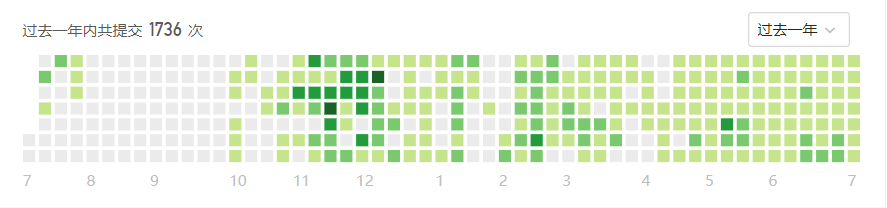
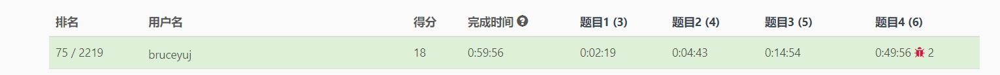
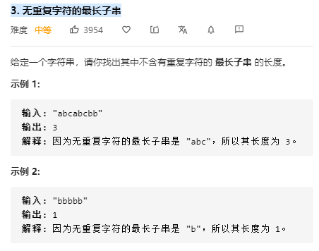
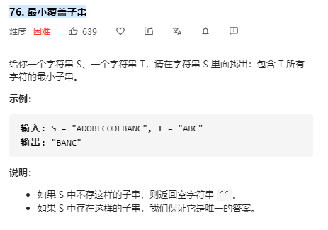
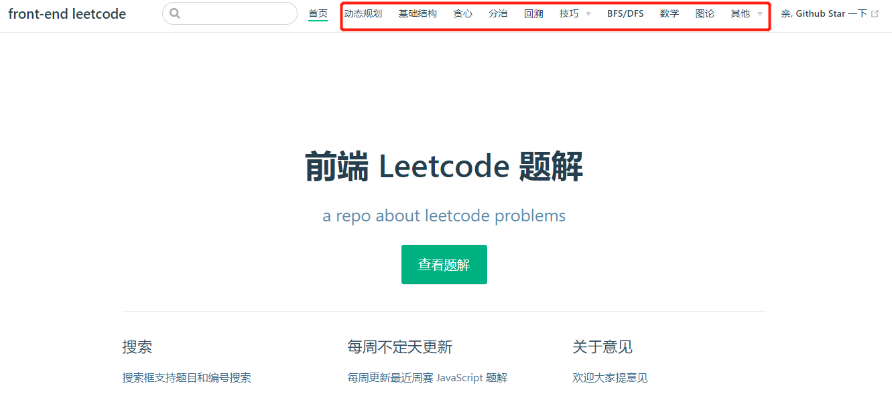

> Front-End Thinking series（《前端思考录》）主要包含对于前端学习各个阶段的思考

## 前言
最近看到晨曦在掘金的那篇爆文，脑海中也突然有了想写一篇关于 LeetCode 相关的文章。

我是从 2019 年 10 月开始固定刷题的，目前已经完成 **464/1715** 题目了，大部分题目的所有可能解法都一一仔细研究了下，所以你看我的提交量达到了 **1285/1871**。首先，99% 的题目我都用 JavaScript 写了一遍，其他有些偷懒的就用 Python 或 Java 写了。 



目前已完成题目的比例是 easy/medium/hard 是 **30%/55%/15%** 左右：


**另外我最近的 LeetCode 比赛的成绩是：**



鉴于此，个人觉得有必要和大家分享下关于用 JavaScript 在 LeetCode 中比赛的经验。

目前来讲，大部分前端一直对基础的算法或者其他计算机科学知识处于冷落状态，原因可能有很多，但本质原因还是不能立刻获得回馈而已（也就是我花那么多时间学这些基础的东西，但是却不能立刻得到好处）。但我认为这些东西你迟早得补回来，就像现在的前端方向一直在补原来的课一样。


回归到主题，我是从瀑布流那篇文章了解到晨曦的，当时觉得他非常有想法，学习算法的思路也很高效(理论与实践相结合，其实也算是费曼学习法的运用)。很多人学习算法会进入过于理论的地步，这个时候你会学得很沮丧，后面就会进入放弃和自我怀疑的阶段。我因为那篇文章加了晨曦的微信和 LeetCode 好友，简单聊了下关于 LeetCode 的事。在我看来，光从 LeetCode 的时间线上就可以知道晨曦是个非常坚持的人。

最开始，大家就按照晨曦的提纲进行刷题学习就好了。那么本篇文章的目的是什么呢？
主要是提供一些经验来帮助你加深对于 LeetCode学习(类似于初级到中级)。


## 正文
首先，目前国内大厂已经开始趋向于国外大厂，在面试中算法的比重越来越大。尽管历来这些计算机科学的基础在前端中考察会比较少(校招和社招都比较少，但由于校招大家实际项目经验普遍不太丰富，所以校招这些基础又会相对社招多一些)。

对于大部分都有志于进入国内大厂(国外大厂算法无论前后端都是必考项)，算法一定是会成为你的木板的。

首先，我得申明 $LeetCode \neq ACM \neq OI \neq codeforces$。

上面的公式是什么意思呢？LeetCode 中大部分题目都是可以在训练后做出来的，难度其实并不算很大，尽管这段时间有几场比赛开始有出 acm 原题的趋势，但是相比于原题，题目的数据规模都要小很多，这也就是意味着我们可以用更加低效、简单的解法来解决。这也就意味着你没有必要产生畏难心理，你换个思路思考下，又不需要你去发明一个算法，只是要你用别人发明的算法解题而已。在我看来，大部分人可以在规律的 3-6 个月训练达到不错的水平（每天抽出1-2小时）。

### 刷算法的好处
1. 个人认为算法是程序的基石，是所有开发者都得掌握的东西，因为无论是前端工程师还是后端工程师，你都首先得是一个工程师。

2. 当然是立刻能得到好处的，也就是面试向，就像小厂的想去国内大厂，国内大厂的想去国外大厂。而算法题算是第一个敲门砖。

3. 这一点是我个人最喜欢的，锻炼我们的思维能力。每一场周赛的1个半小时，都是你大脑高速运转的时候，你需要在这段时间里面想出解题思路，并且能够考虑所有的边界情况，写出 bug free 的代码（facebook 的题目需要你的代码直接 bug free）。每次比赛时都是高度集中的状态，比完赛后感觉特别的爽。

4. 让你更加谦虚。在你翘尾巴的时候给你一巴掌，让你继续学习。每次看到比赛后前十名的比赛完成时间，我就会知道距离这群人差的还远呢。

**下面给出我解题的一般步骤，该步骤基本通用于面试和比赛。**
### 做题第一步: 读题
做一道 LeetCode 题目的第一步就是阅读题目内容和数据规模，这里的数据规模有点类似于数学题中的前提条件。通常来讲，题目的数据规模基本就可以告诉你算法时间复杂度的可选范围，也就意味着你大概可以用哪种解法。

通常来讲，我们会把  1GHZ cpu 1s 作为基准值，这一般表示着 cpu 每秒钟可以进行 10 的 9 次方浮点数运算，而你的算法每个 test 运算时间理论上最好不要超过 1 秒。如果你的估算超过了 1 秒，这往往意味着会超时(但是需要注意的是，我们在面试时这种解法仍然需要向面试官表达出来，因为尽管不是最优的解法，但是至少我是解答出来了，10 分至少要给我 5 分吧，另外一点好处是你先说出效率较低写法，再循序渐进给出优秀写法，可以给面试官你的罗辑思维能力，另外也会缩短算法考察的时长).

举个例子来讲，如果你的数据规模能够达到 $10^5$，那么很明显 $O(n^2)$ 的算法就不太适合本题了。

下面给出一个大概的数据规模和算法可接受的时间复杂度的对应表（记住，这里这是大致范围，算是经验之谈）：
| 数据规模 | 算法时间复杂度|
|--|--|
| $\leq 10$| $O(n!)$|
| $\leq 25$| $O(2^n)$|
| $\leq 100$| $O(n^4)$|
| $\leq 500$| $O(n^3)$|
| $\leq 2500$| $O(n^2)$|
| $\leq 10^6$| $O(nlogn)$|
| $\leq 10^7$| $O(n)$|
| $\leq 10^14$| $O(\sqrt{n})$|
| - | $O(logn)$|

### 做题第二步：识别问题类型
我们在训练的初期，需要熟练各种解题模板。在熟练了解题的模板之后，我们才能够从题目内容倒退出题目的类型。

这也是为什么很多人推荐第一次要按照 tag 来进行刷题的原因，按照 tag 刷题也就意味着你可以对这种类型题目进行多方面强化，能够帮助你思考、总结、抽象到后面的举一反三。

按照 tag 刷题后，一般你会总结出常见的数据结构、思想以及算法，比如如下：
1. **必须掌握的数据结构：数组、链表、栈、队列、堆、树、散列表、图、并查集**
2. **必须掌握的算法：递归、DFS 和 BFS、排序、二分法、双指针、滑动窗口**
3. **常用思想：分治、贪心、回溯、动态规划和分支界限**
4. **常见技巧：位运算、双指针、滑动窗口**

在总结出这些常用抽象特征之后，往往你已经在 LeetCode 中已经过关斩将至少 100 题了。这也就意味着你已经进入了可以举一反三、联想关联的时候了。

但很多人在看到新题的时候还是不知道该如何联想到具体的解法，这通常意味着两点：
1. 你对真正的解法理解的不够透，联想关联不够强
2. 你对题目的抽象能力不够，也就是如何去除掉题目无关信息，提取出关键东西来

那么，这时候该怎么办。一个是在平时训练，尽量自己先想解法。如果实在想不出来（比如已经卡了一个小时了），就直接看答案，然后记录这道题目，过半个月在重新做一遍。

> 这里看答案也是有技巧的，你是怎么看答案的？
你看答案的时候一定不能直接 copy 代码，而是先尽量理解答案的算法思路，然后用笔在纸上画出逻辑流程，如果不懂，再根据答案的示例代码脑袋里走一遍。最后关闭答案，自己写题目。

另外，我们可以通过**题目关键字**来帮助解题，我们在联想题解模板的时候，可以通过这些关键字来猜测。
1. 如果题目中出现 **连续子串**， **连续子数组** 这类的字眼，然后要求时间复杂度 $O(n)$，那么你可以尝试用滑动窗口的思路解决。

举几个例子，比如 leetcode 中的 [3. 无重复字符的最长子串](https://leetcode-cn.com/problems/longest-substring-without-repeating-characters/)


这道题目就是求最长的连续不含重复字符的子串，经典的滑动窗口题目。

[76. 最小覆盖子串](https://leetcode-cn.com/problems/minimum-window-substring/)



同样可以抽取出来关键字 最小连续子串，而覆盖 T 中所有字符只是其中的制约条件而已，经典的滑动窗口题目。

### 解题第三步：草稿上写出算法思路
做算法题最忌讳的就是一看到题目，还没有想清楚思路和边界情况，就直接动手写代码。

能够直接动手写代码大概有几种情况：
1. 你是超级大佬，比如楼教主这种
2. 接近原题，或者这类题目你已经熟透了
3. 题目太简单

但是，作为一般开发者，我还是推荐先写出算法思路。

举个例子，[55. 跳跃游戏](https://leetcode-cn.com/problems/jump-game/)

我更加期望你能够这么在稿纸上写（当然你没有必要写这么多的字）：
```
我们从开头开始遍历整个数组，并且维持一个最远距离值 max, 在遍历过程过，我们需要不断更新目前可以跳到最远的位置，也就是 max。
在遍历过程中，我们需要判断看当前位置是否小于等于 max:

- 如果是，继续下一个位置
- 如果大于 max，则表示无法到达最后一个位置
遍历结束可以在访问到最后一个元素或者通过判断 max 是否大于最后位置。
```

有了思路，我们写代码的时候往 bug free 就更进一步了

### 解题第四步：考虑边界情况
在有了思路之后，还需要提前考虑所有的边界情况以及初始情况。
就拿上面的 **55. 跳跃游戏** 来讲，边界情况就是数组为空的时候：
`if(!nums.length) return true;`

初始情况就是下标为 0 的时候：
`let max = nums[0] + 0;`

最后代码就出来了：
```javascript
/**
 * @param {number[]} nums
 * @return {boolean}
 */
var canJump = function(nums) {
  if(!nums.length) return true;

  let max = nums[0];

  for(let i = 1; i < nums.length; i++) {
    if(max >= nums.length - 1) return true;
    if(i > max) return false;

    max = Math.max(max, i+nums[i]);
  }
  return true;
}
```

整个解题过程快的话不会超过 5 分钟，后面我们可以在不断优化我们的解法，比如：
```javascript
var canJump = function(nums) {
    if(!nums.length) return true;

    let len = nums[0];
    for(let i = 0; i <= len; i++) {
        len = Math.max(len, nums[i] + i);
        if(len >= nums.length-1) return true; 
    }

    return false;
};
```

### JavaScript 刷算法题的劣势
用 JavaScript 做 leetcode 算法题或比赛的劣势是有不少的，基本处于所有语言的底层。效率比不过 java， c++ 这类静态语言（这意味着同样的测试集可能 C++ 可以通过，但是 JavaScript 通过不了），库函数的丰富性比不上 Python 这类动态语言（意味着我们需要自己编写很多功能函数）。下面我需要列举下在 JavaScript 比赛中的劣势:

#### 1. 申请大容量的数组
在 JavaScript 中，由于 Array 可以存储任何类型数据，所以其开销往往会比静态语言大些。如果你申请的容量过大，很容易超出 v8 的最大可分配空间，我们此时又不能用 node 手段 hack。

此时我推荐各种 typedArray，比如`Uint32Array`,这样可以尽量控制数组的开销。

#### 2. 库函数的缺少
很多时候题目的解答需要很多已经封装好的数据结构，比如红黑树和堆。对于 JavaScript 我们只能自己去提前封装好。
看到 Python 留下了泪水，`import heapq` 多么强大。

在这里我会推荐两种写法:
1. 遇到这类问题，直接用 Python 之类语言写，我更加推荐用 Python, 因为库函数非常丰富，好学和编码简洁。

2. 提前写好所有的库函数，要用到手动复制

### 3. 多维数组的申请
在 JavaScript 中写多维数组需要多写一些代码，也会带来比赛时间的劣势：
```javascript
let dp = new Array(n);

for(let i = 0; i < n; i++) dp[i] = new Array(n).fill(0);
```
不过一般问题不大，目前我最多用到了 4 维数组，而且这个 4 维数组还可以通过优化来降低到 3 维。


### 其他技巧
比赛前，大家最好提前准备好本地的 bebug 环境，随便用 node 或 browser 的 debug 就可以了。

### 推荐资料
1. 《算法 4》和 standford 的相关 coursera 课程（B 站有视频）。

《算法 4》相比于《算法导论》（这本书只看了一点）这种更加偏向于工程一点，没有很多的推导，更加适合非算法方向的开发者。

2. 清华大学邓俊辉的《数据结构与算法》，C++ 版本的，比较推荐。能够循序渐进

3. 极客时间的 《数据结构与算法之美》，算法和工程实践的结合


## 总结
在这里，由于篇幅原因和个人水平，只写了一点点很浅显的东西，希望大家多多指教。也希望前端圈子能够浮躁少一些。

另外，我在 github page 上面也搭建了 [前端 LeetCode 题解](https://www.bruceyj.com/frontend-leetcode/)



在里面，我也按照 tag 写了很多 JavaScript 版本的题解，并且会定期更新周赛的题解。


----
> 我是 BY，一个有趣的人，以后会带来更多的原创文章。
> 
> 本文章遵循 MIT 协议，转载请联系作者。
> 
> 有兴趣可以关注公众号（点击下方链接）或者 Star GitHub repo.

[公众号，更多文章](https://www.bruceyj.com/front-end-interview-summary/info/)

