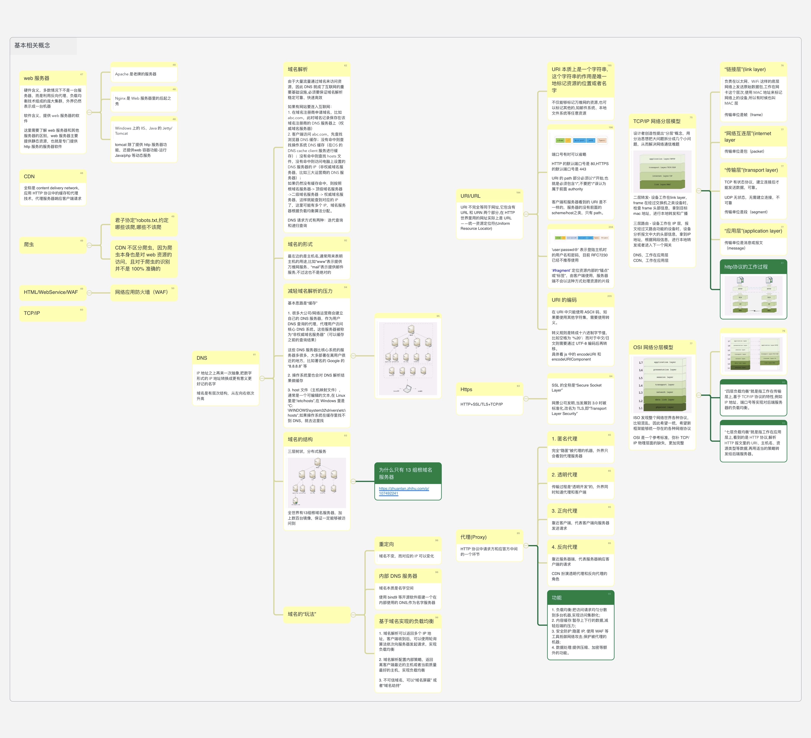
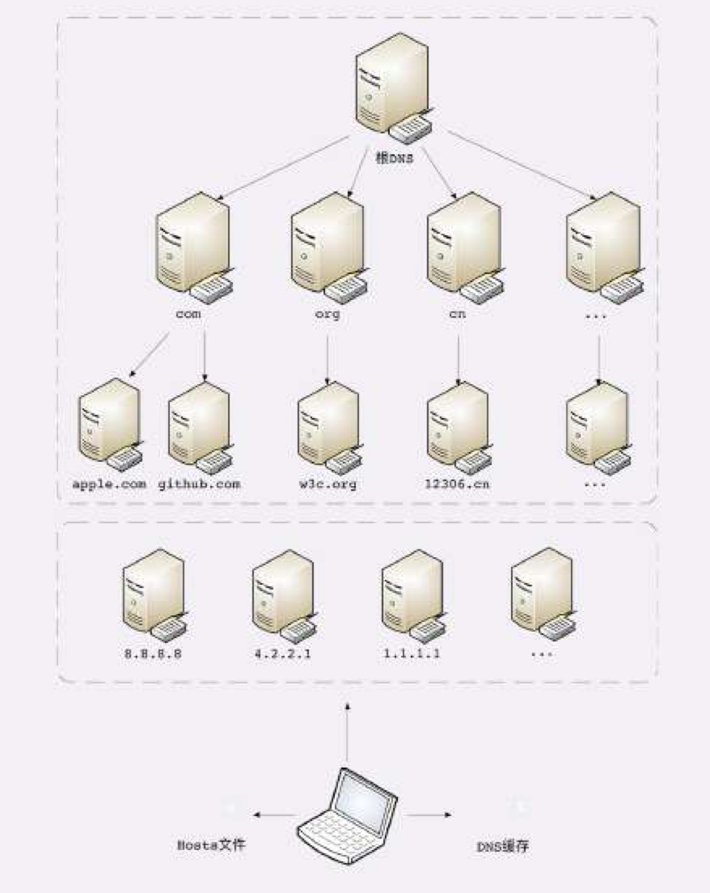
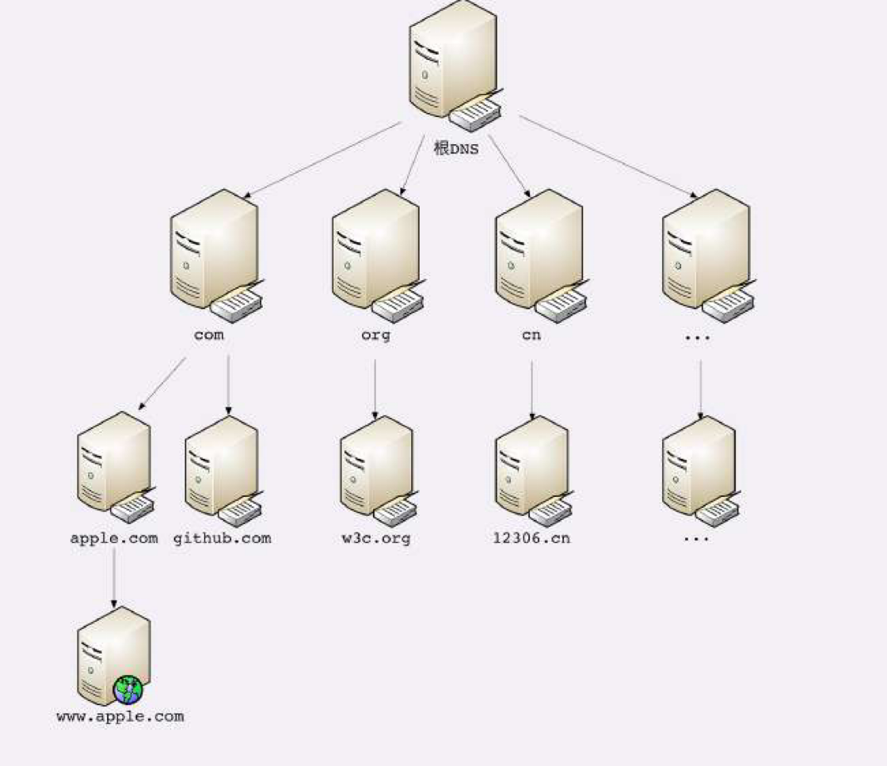
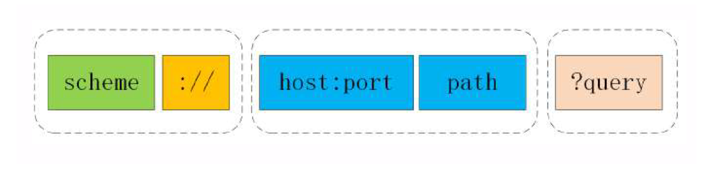
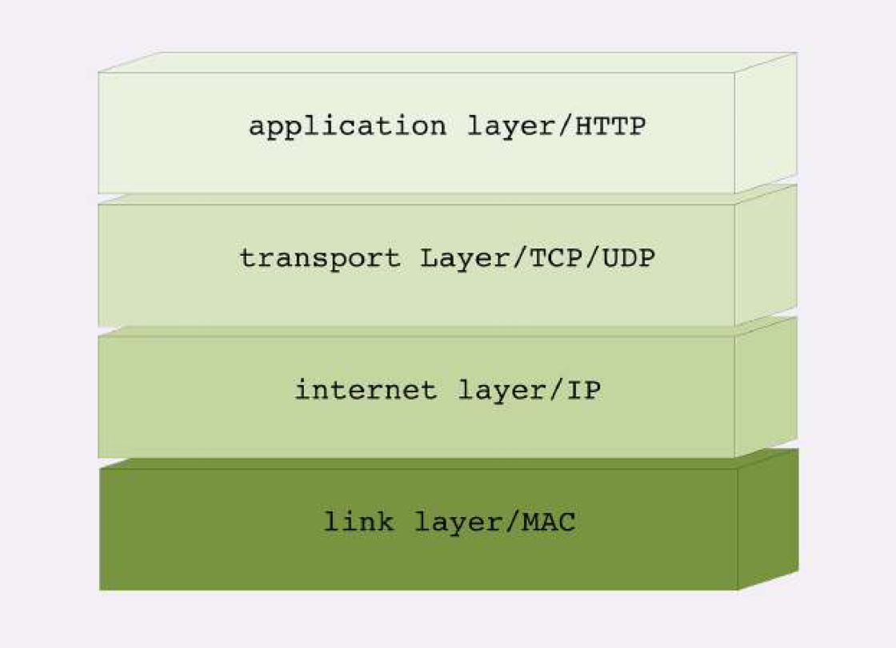
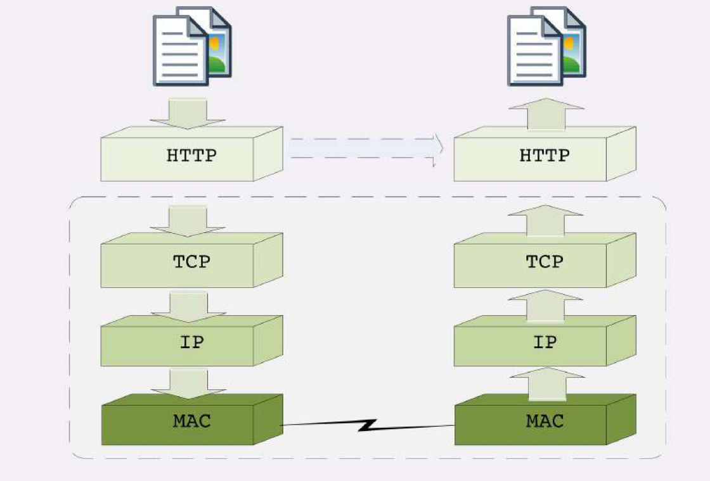
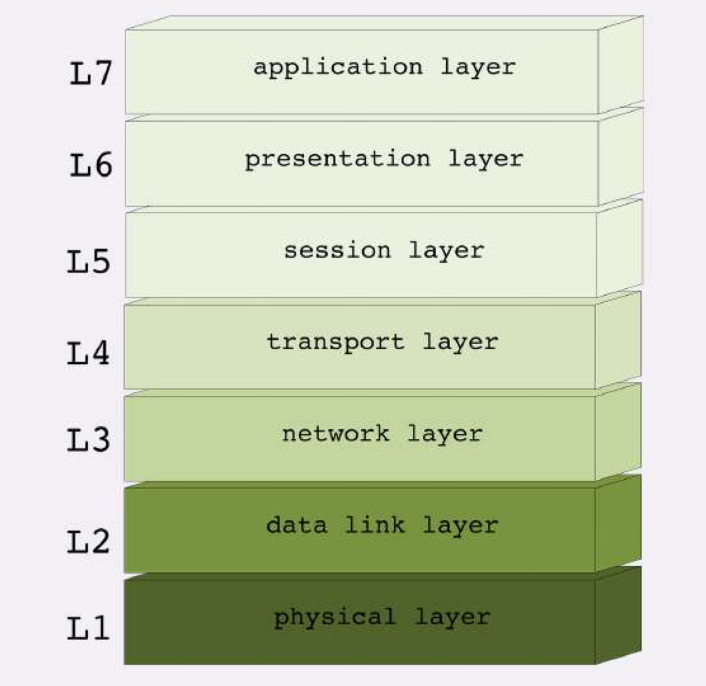
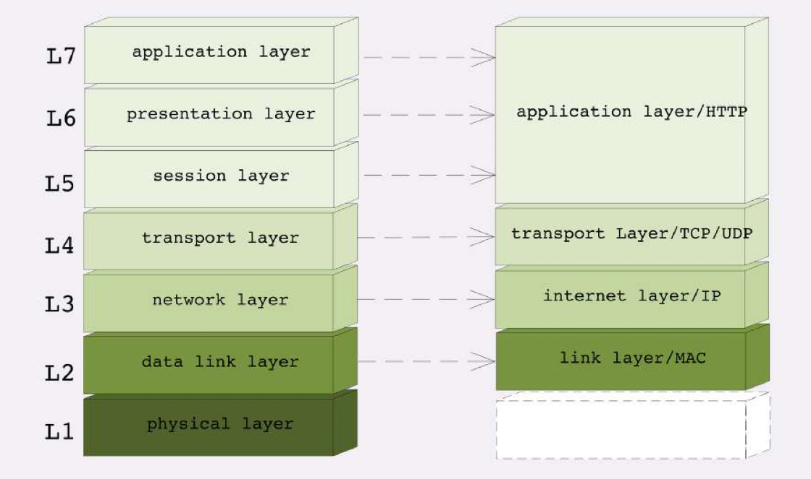

## 脑图

## 什么是 web 服务器 
1. 硬件含义，多数情况下不是一台服务器，而是利用反向代理、负载均衡技术组成的庞大集群，外界看来仍然表示成一台机器
2. 软件含义，提供 web 服务器的软件
，这里需要了解 web 服务器和其他服务器的区别，web 服务器主要提供静态资源，也就是专门提供 http 服务的服务器软件

### 常用 web 服务器
1. Apache 是老牌的服务器 
2. Nginx 是 Web 服务器里的后起之秀 
3. Windows 上的 IIS、Java 的 Jetty/Tomcat ，tomcat 除了提供 http 服务器功能，还提供web 容器功能-运行 Java/php 等动态服务

## CDN 
全称是 content delivery network，应用 HTTP 协议中的缓存和代理技术，代理服务器响应客户端请求

## 爬虫 
1. 君子协定”robots.txt,约定哪些该爬,哪些不该爬 
2. CDN 不区分爬虫，因为爬虫本身也是对 web 资源的访问，且对于爬虫的识别并不是 100% 准确的 

## HTML/WebService/WAF 
1. WAF 指的网络应用防火墙

## TCP/IP 

## DNS 
IP 地址之上再来一次抽象,把数字形式的 IP 地址转换成更有意义更好记的名字。域名是有层次结构，从左向右依次升高

### 域名解析过程
由于大量流量通过域名来访问资源，因此 DNS 就成了互联网的重要基础设施,必须要保证域名解析稳定可靠、快速高效。

如果有网站要连入互联网：
1. 在域名注册商申请域名，比如 abc.com，此时域名记录保存在该域名注册商的 DNS 服务器上（权威域名服务器）
   - 客户端访问 abc.com，先查找浏览器 DNS 缓存；
   - 没有命中则查找操作系统 DNS 缓存（在OS 的 DNS cache client 服务进行缓存）；
   - 没有命中则查找 hosts 文件，没有命中则访问电脑上设置的 DNS 服务器的 IP（非权威域名服务器，比如三大运营商的 DNS 服务器）；
   - 如果仍然没有缓存命中，则按照 根域名服务器-> 顶级域名服务器 ->二级域名服务器 -> 权威域名服务器，这样就能查到对应的 IP 了，这里可能有多个 IP，域名服务器根据负载均衡算法分配。

DNS 请求方式有两种：迭代查询和递归查询

2. 域名的形式

最左边的是主机名,通常用来表明主机的用途,比如“www”表示提供万维网服务、“mail”表示提供邮件服务,不过这也不是绝对的

**如何减轻域名解析的压力？** 
基本思路是“缓存”

1. 很多大公司/网络运营商会建立自己的 DNS 服务器，作为用户 DNS 查询的代理，代理用户访问核心 DNS 系统。这些服务器被称为“非权威域名服务器”（可以缓存之前的查询结果）。
这些 DNS 服务器比核心系统的服务器多很多，大多部署在离用户很近的地方，比如著名的 Google 的 “8.8.8.8” 等
2. 操作系统里也会对 DNS 解析结果做缓存
3. host 文件（主机映射文件），通常是一个可编辑的文本,在 Linux 里是“/etc/hosts”,在 Windows 里是“C:\WINDOWS\system32\drivers\etc\hosts”,如果操作系统在缓存里找不到 DNS，就去这里找

**域名的结构是怎样的？** 
三层树状，分布式服务

**全世界有13组根域名服务器，加上数百台镜像，保证一定能够被访问到**

> 为什么只有 13 组根域名服务器 ?
[答案](https://zhuanlan.zhihu.com/p/107492241)

> 我们可以通过域名来干什么？
1. 重定向 ：域名不变，而对应的 IP 可以变化
2. 内部 DNS 服务器 ，域名本质是名字空间。可以使用 bind9 等开源软件搭建一个在内部使用的 DNS,作为名字服务器

3. 基于域名实现的负载均衡 
   - 域名解析可以返回多个 IP 地址，客户端收到后，可以使用轮询算法依次向服务器发起请求，实现负载均衡

   - 域名解析配置内部策略，返回离客户端最近的主机或者当前质量最好的主机，实现负载均衡

4. 不可信域名，可以“域名屏蔽” 或者“域名劫持”

## URI/URL 
URI 不完全等同于网址,它包含有 URL 和 URN 两个部分,在 HTTP 世界里用的网址实际上是 URL——统一资源定位符(Uniform Resource Locator)。

1. URI 本质上是一个字符串,这个字符串的作用是唯一地标记资源的位置或者名字 
不仅能够标记万维网的资源,也可以标记其他的,如邮件系统、本地文件系统等任意资源

2. 端口号有时可以省略,HTTP 的默认端口号是 80, HTTPS 的默认端口号是 443。
URI 的 path 部分必须以“/”开始,也就是必须包含“/”,不要把“/”误认为属于前面 authority。

客户端和服务器看到的 URI 是不一样的，服务器的没有前面的 scheme/host之类，只有 path。

3. 'user:passwd@' 表示登陆主机时的用户名和密码，目前 RFC7230 已经不推荐使用

4. ‘#fragment’ 定位资源内部的“锚点”或“标签”，由客户端使用，服务器端不会以这种方式处理资源的片段

5. URI 的编码 
在 URI 中只能使用 ASCII 码，如果要使用其他字符集，需要使用转义。
转义规则是转成十六进制字节值，比如空格为 ‘%20’；而对于中文/日文则需要通过 UTF-8 编码后再转移。
具体看 js 中的 encodeURI 和 encodeURIComponent

## Https 
HTTP+SSL/TLS+TCP/IP

SSL 的全称是“Secure Socket Layer”，网景公司发明,当发展到 3.0 时被标准化,改名为 TLS,即“Transport Layer Security”

## 代理(Proxy) 
HTTP 协议中请求方和应答方中间的一个环节。

1. 匿名代理： 
完全“隐匿”被代理的机器，外界只会看到代理服务器
2. 透明代理： 
传输过程是“透明开发”的，外界同时知道代理和客户端
3. 正向代理： 
靠近客户端，代表客户端向服务器发送请求
4. 反向代理： 
靠近服务器端，代表服务器响应客户端的请求
CDN 扮演透明代理和反向代理的角色

**功能**： 
1. 负载均衡:把访问请求均匀分散到多台机器,实现访问集群化; 
2. 内容缓存:暂存上下行的数据,减轻后端的压力; 
3. 安全防护:隐匿 IP, 使用 WAF 等工具抵御网络攻击,保护被代理的机器; 
4. 数据处理:提供压缩、加密等额外的功能。

## TCP/IP 网络分层模型 
设计者创造性提出“分层”概念，用分治思想把大问题拆分成几个小问题，从而解决网络通信难题

1. “链接层”(link layer)，
负责在以太网、WiFi 这样的底层网络上发送原始数据包,工作在网卡这个层次,使用 MAC 地址来标记网络上的设备,所以有时候也叫 MAC 层,传输单位是帧（frame）
2. “网络互连层”(internet layer)， 传输单位是包（packet）
3. “传输层”(transport layer), 传输单位是段（segment）
    - TCP 有状态协议，建立连接后才能发送数据，可靠。
    - UDP 无状态，无需建立连接，不可靠
4. “应用层”(application layer) ,传输单位是消息或报文（message）。DNS 工作在应用层，CDN 工作在应用层

### 常用黑话
**二层转发**- 设备工作在link layer，frame 在经过交换机之类设备时，检查 frame 头部信息，拿到目标 mac 地址，进行本地转发和广播

**三层路由** - 设备工作在 IP 层，报文经过又路由功能的设备时，设备分析报文中大的头部信息，拿到IP 地址，根据网段信息，进行本地转发或者进入下一个网关

**http协议的工作过程**：

## OSI 网络分层模型 
ISO 发现整个网络世界各种协议，比较混乱，因此希望一统，希望新框架能够统一存在的各种网络协议，OSI 是一个参考标准，弥补 TCP/IP 物理层面的缺失，更加完整。

1. “四层负载均衡”就是指工作在传输层上,基于 TCP/IP 协议的特性,例如 IP 地址、端口号等实现对后端服务器的负载均衡。 
2. “七层负载均衡”就是指工作在应用层上,看到的是 HTTP 协议,解析 HTTP 报文里的 URI、主机名、资源类型等数据,再用适当的策略转发给后端服务器。 
