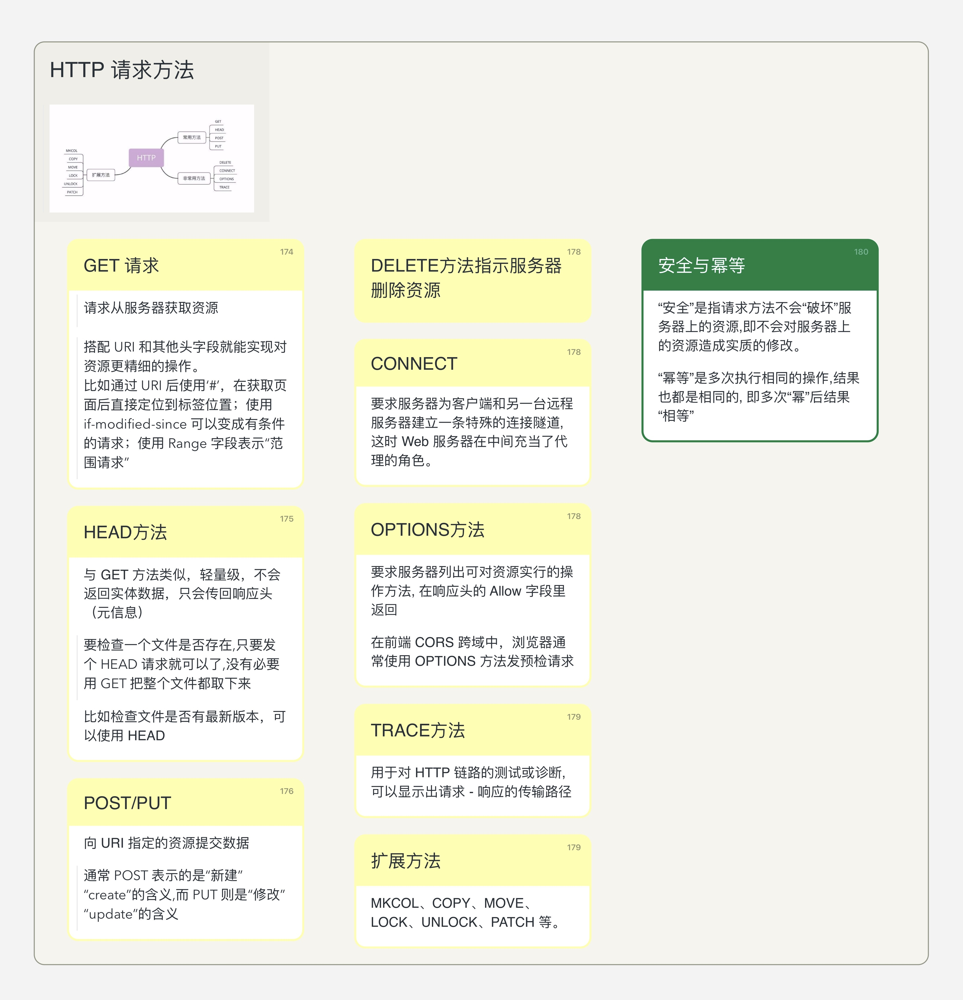
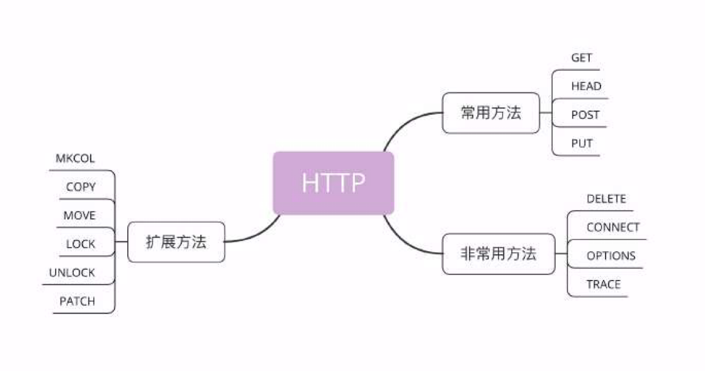

## 脑图



目前主流使用的 HTTP 协议的请求方法是比较固定的，并没有随着大版本的提升有过多改变。



按照 **常用、非常用以及扩展** 可以分成上图中的 3 类。要彻底掌握这些 request methods，我们需要从几方面问题来考虑：

1. 该 请求方法 的设计初衷是什么？
2. 在目前实践中和最初的设计有变化吗？目前通常的用途有哪些？


## 安全与幂等
首先，得理解一下 HTTP 协议中的安全和幂等的概念：
- “安全”是指请求方法不会 “破坏” 服务器上的资源,即不会对服务器上的资源造成实质的修改。
- “幂等”是多次执行相同的操作,结果也都是相同的, 即多次“幂”后结果“相等”，和数学中的概念异曲同工。

## GET 请求
GET 请求是 HTTP 协议当中最先出现的请求方法，在 HTTP/0.9 的世界当中，所有的文档都是只读的。

其设计用途是客户端请求获取服务器的资源。在具体的 RFC 7231 当中其有以下几种特性：
| 特性| 值 |
| --  | -- |
|request 是否有 body| no|
|resposne 是否有 body| yes|
|安全|yes|
|幂等|yes|
|可缓存|yes|


**在实际使用当中，搭配 URI 和其他头字段就能实现对资源更精细的操作。**
1. 比如通过 URI 后使用 `#`，在获取页面后直接定位到标签位置；
2. 结合 `if-modified-since` 头字段可以变成有条件的请求；
3. 结合 `Range` 头字段表示“范围请求” (具体可以用在请求大文件的部分时)

## HEAD 请求
可以将 HEAD 看成是 **轻量级** 的 GET 方法。它不会返回实体数据（即使包含 body，也应该被忽略掉），只会传回响应头（元信息）。

| 特性| 值 |
| --  | -- |
|request 是否有 body| no|
|resposne 是否有 body| no|
|安全|yes|
|幂等|yes|
|可缓存|yes|

**其设计的目的在于节省带宽（导致延迟的原因之一）**。

有什么实际用途呢？
1. 可以用来检查一个大文件是否存在。只要发个 HEAD 请求就可以了,没有必要用 GET 把整个文件都取下来
2. 检查文件是否有最新版本，可以使用 HEAD

## POST/PUT
两个方法都被用来向 URI 指定的资源提交数据，而 post 方法使用频率更高。

> **两者之间的区别是什么呢？**

从 HTTP 协议设计的初衷来讲， POST 表示的是 “新建 - create” 的含义，而 PUT 则是 “修改 - update” 的含义。换种说法，PUT 方法是幂等的，而 POST 不是幂等的（比如多次提交订单）。

**这里需要了解一点，HTTP 协议并不是一个强制协议。也就是说，如果客户端和服务端自己互相协商协议内容（比如乱用请求方法），也是可以的。**


### POST 方法
| 特性| 值 |
| --  | -- |
|request 是否有 body| yes|
|resposne 是否有 body| yes|
|安全|no|
|幂等|no|
|可缓存|only if freshness information is included|

我们通常有两种方式来使用 POST 方法：
1. 发送 HTML form，并返回服务器的修改结果(**这是 POST 最开始的用途，因此那时 form 是网页的重要组成部分**)。此时，body 的类型(content type) 往往通过 form 的 attribute 来决定，往往有下面三种可能：
    - `application/x-www-form-urlencoded`：从名字就可以看出来，会使用 url 编码的方式。将数据编码成 `x=y&z=k` 这种方式。你会发现，这种方式和 GET 方法添加 params 相似。**两者之间的区别是什么呢？** GET 方法直接将 params 在浏览器地址栏中显示出来；而 POST 是放在 body里面的。

    ```
    POST / HTTP/1.1
    Host: foo.com
    Content-Type: application/x-www-form-urlencoded
    Content-Length: 13

    say=Hi&to=Mom
    ```

    - `multipart/form-data`:  `application/x-www-form-urlencoded` 在处理 ASCII 字符时是没什么问题的。但是实际上在国际化后，网络数据包中充斥着大量的非 ASCII 字符，比如中文。 UTF-8 中的汉字 “中” 是 3 个字节，而 urlencode 之后变成了 9 个字节，对于带宽来讲是忍受不了的，我们更期望于在传输过程中不要无故增大 body 大小（甚至压缩是最好的），这也就是 multipart/form-data 出现的原因。
    ```
    POST /test.html HTTP/1.1 
    Host: example.org 
    Content-Type: multipart/form-data;boundary="boundary" 

    --boundary 
    Content-Disposition: form-data; name="field1" 
    Content-Type: text/plain

    value1 
    --boundary 
    Content-Disposition: form-data; name="field2"; filename="example.txt" 

    value2
    ```

    如果仔细观察的话，`multipart/form-data` 和 `multipart/byteranges` 使用方式很类似。而 RFC 7231 也专门用了 Multipart Types 来指代这两个 MIME 类型。前者一般只被用在 form data 的处理，而后者通常被用在范围请求(一些 206 partial Content 的 response 当中)。

    **有人会好奇 boundary 的含义和为什么每一段都会有对应的头字段(比如 content-type)?**

    顾名思义， boundary 就是边界的意思，用来分隔不同段之间的内容。而每一段都有对应头字段是由于 RFC 规范需要考虑很多特殊情况，它会考虑到如果传输多个内容并且内容编码方式不一样的情况，所以设计了对应的头字段。在实际使用当中，我们可以使用也可以不使用。

    - `text/palin`: 就是字面意思。


2. 第二种方式是通过 `XMLHttpRequest` 来使用 POST 请求。
> 这里需要注意的是，XMLHttpRequest 并不是 HTTP 协议定义的，而是由 WAHTWG 社区维护的。

在使用 XHR 来进行 POST 请求时， body 的类型可以是 HTTP 中规定的任意类型。正如 HTTP 1.1 规范所设计的那样，期望 POST 以统一的方式来完成以下几种功能：
- 已存在资源的注解(annotation)
- 在各种网页上发布消息（这是网页的主要功能之一）
- 注册新用户
- 向数据处理程序提供数据，比如提交表单
- 通过追加操作，扩展数据库数据

### PUT 方法
| 特性| 值 |
| --  | -- |
|request 是否有 body| yes|
|resposne 是否有 body| yes|
|安全|no|
|幂等|yes|
|可缓存|No|

除了上面我们所说的 PUT 方法是幂等的，另外区别是 PUT 方法不会出现在 HTML form 当中，并且不可缓存。

```
PUT /new.html HTTP/1.1
Host: example.com
Content-type: text/html
Content-length: 16

<p>New File</p>
```

那么对于 PUT 请求的 response 来讲，有哪些细节呢？
1. 如果目标资源不存在，并且 PUT 方法成功创建了一份，那么 response 的状态码必须是 `201(created)` 来通知客户端资源已创建。
```
HTTP/1.1 201 Created
Content-Location: /new.html
```

2. 如果资源已存在，但是通过 PUT 方法成功进行了更新，那么服务器必须返回 `200` 或者 `204(No Content)` 来表示请求成功。
```
HTTP/1.1 204 No Content
Content-Location: /existing.html
```


## DELETE方法
用来指示服务器删除资源。这在 RESTful 风格的架构中被使用很多。
| 特性| 值 |
| --  | -- |
|request 是否有 body| 可能有|
|resposne 是否有 body| 可能有|
|安全|no|
|幂等|yes|
|可缓存|no|

如果 DELETE 方法执行成功，可能有以下的状态码：
- `202(Accepted)`: 表示请求操作可能会成功执行，但是尚未开始执行
- `204(No Content)`： 表示操作已执行，但是没有进一步相关信息
- `200(ok)`: 表示操作已执行，response 中提供了相关状态信息

## CONNECT 方法

CONNECT 方法在实际的网页开发中使用很少。但是，需要注意一点的是，HTTP 并不仅仅只是一个“网页”协议，它的功能非常强大。

该方法的主要作用 - HTTP 代理（敏感原因，不能多聊），简单来讲，就是要求服务器为客户端和另一台远程服务器建立一条特殊的连接隧道,这时 Web 服务器在中间充当了代理的角色。

CONNECT 方法直接通过 TCP 进行和代理服务器的连接，如下所示：
```
CONNECT www.xxx.com:80 HTTP/1.1
Host: www.web-tinker.com:80
Proxy-Connection: Keep-Alive
Proxy-Authorization: Basic *
Content-Length: 0
```

`Proxy-Authorization` 用来验证。

具体想要将 HTTP 代理运用在实际当中，就牵扯到相关的加密等操作了，不敢多讲。

## OPTIONS 方法
| 特性| 值 |
| --  | -- |
|request 是否有 body| no|
|resposne 是否有 body| no|
|安全|yes|
|幂等|yes|
|可缓存|no|

在最开始的设计当中，OPTIONS 方法被用来要求服务器列出可对资源实行的操作方法, 并且在响应头的 Allow 字段里返回。
`curl -X OPTIONS http://example.com -i`

```
HTTP/1.1 200 OK
Allow: OPTIONS, GET, HEAD, POST
Cache-Control: max-age=604800
Date: Thu, 13 Oct 2016 11:45:00 GMT
Expires: Thu, 20 Oct 2016 11:45:00 GMT
Server: EOS (lax004/2813)
x-ec-custom-error: 1
Content-Length: 0
```

后来，随着 CORS 机制的出现，浏览器会使用 OPTIONS 方法发预检请求。具体 CORS 是如何使用 OPTIONS 方法的，会另起一篇文章再谈。


## TRACE方法 
TRACE 方法是 HTTP 协议提供的一种 debug 方式，用于对 HTTP 链路的测试或诊断,可以显示出请求 - 响应的传输路径(loop-back test)，在实际开发当中使用并不多。


## 扩展方法
常用的 HTTP 扩展方法有 MKCOL、COPY、MOVE、LOCK、UNLOCK、PATCH 等。也就是说，它不是出现在具体的 HTTP 协议内容里面的。往往是由于各大应用厂商先自己扩展，然后广泛应用到业界，IETF 看到已经成为事实约定了，就补充这些相关的方法。

### PATCH 方法
PATCH 方法是对 PUT/POST 方法的补充，用于对资源进行部分的修改，是非幂等的。[RFC5789](https://tools.ietf.org/html/rfc5789)

首先，我们需要判断一台服务器是否支持 PATCH 方法：
1. 通过字段 Allow 或 Access-Control-Allow-Methods 查看
2. 看是否出现 Accept-Patch

```
PATCH /file.txt HTTP/1.1 
Host: www.example.com
Content-Type: application/example
If-Match: "e0023aa4e"
Content-Length: 100

[description of changes]
```

```
HTTP/1.1 204 No Content
Content-Location: /file.txt
ETag: "e0023aa4f"
```