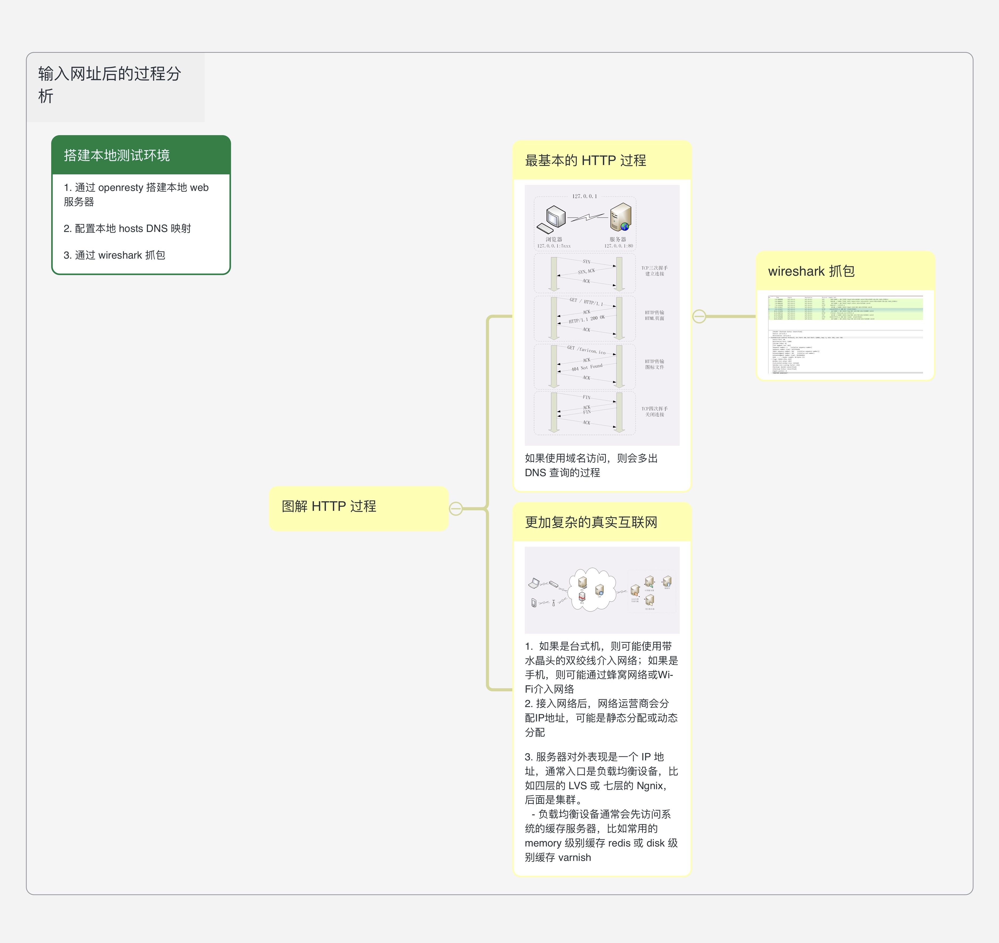
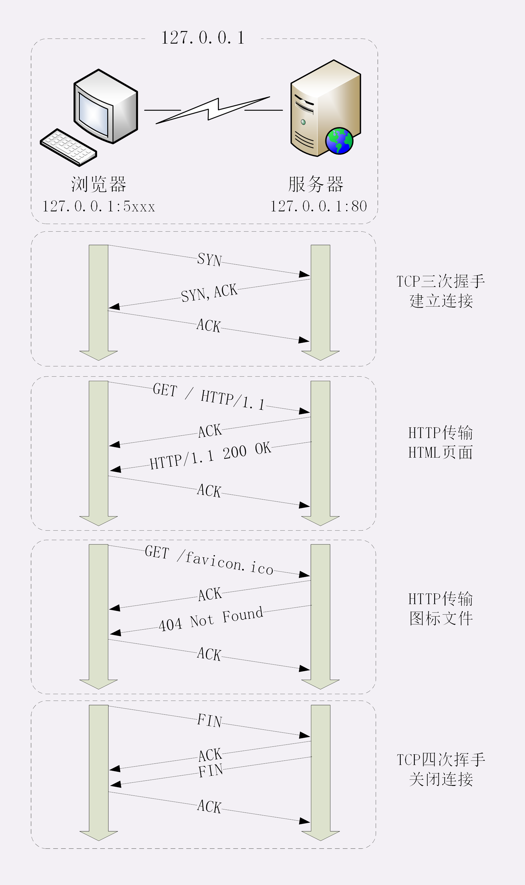
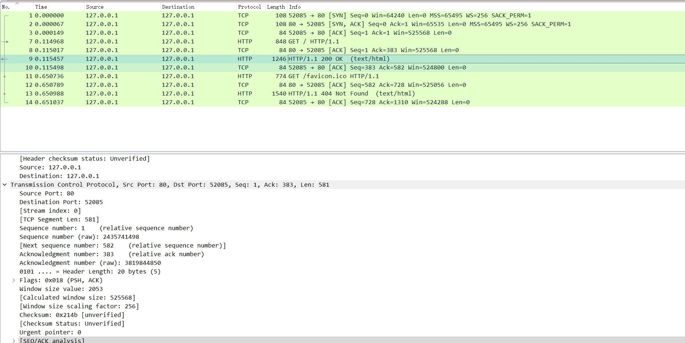

## 脑图

## 搭建本地测试环境 
1. 通过 openresty 搭建本地 web 服务器

2. 配置本地 hosts DNS 映射

3. 通过 wireshark 抓包

## 图解 HTTP 过程 

1. 最基本的 HTTP 过程（这里没有描述 DNS 查询过程，如果使用域名访问网址，那么第一步就是 DNS 查询）

**这里的 ACK 包和 SYN 包都是 TCP 层次的**

**实际 wireshark 抓包**
 

2. **在实际互联网中，联网过程更加复杂（因为各种基础设施）**
   1.  如果是台式机，则可能使用带水晶头的双绞线介入网络；如果是手机，则可能通过蜂窝网络或Wi-Fi介入网络
   2. 接入网络后，网络运营商会分配IP地址，可能是静态分配或动态分配(DHCP 过程)
   3. 服务器对外表现是一个 IP 地址，通常入口是负载均衡设备，比如四层的 LVS 或 七层的 Ngnix，后面是集群。
      - 负载均衡设备通常会先访问系统的缓存服务器，比如常用的 memory 级别缓存 redis 或 disk 级别缓存 varnish

