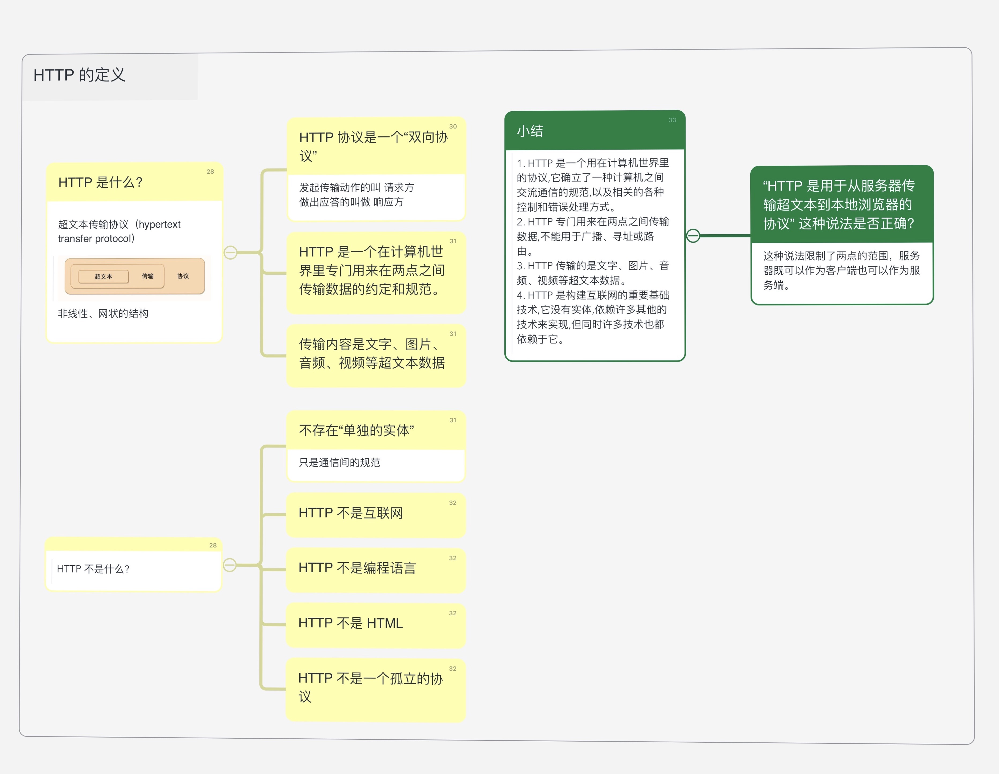
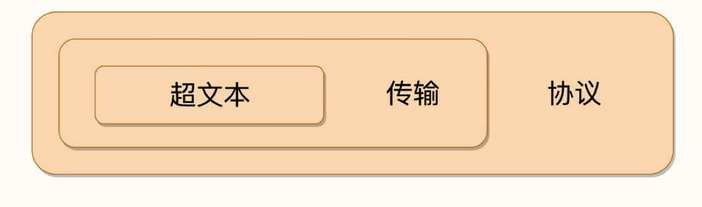

## 脑图

## HTTP 是什么? 
超文本传输协议（hypertext transfer protocol），特点是**非线性、网状的结构**。

1. HTTP 协议是一个“双向协议” ,
   - 发起传输动作的叫 请求方
   - 做出应答的叫做 响应方

2. HTTP 是一个在计算机世界里专门用来在两点之间传输数据的约定和规范。 

3. 传输内容是文字、图片、音频、视频等超文本数据 

## HTTP 不是什么? 

1. 不存在“单独的实体” 
   - 只是通信间的规范
2. HTTP 不是互联网 
3. HTTP 不是编程语言 
4. HTTP 不是 HTML 
5. HTTP 不是一个孤立的协议 

## 小结 
1. HTTP 是一个用在计算机世界里的协议,它确立了一种计算机之间交流通信的规范,以及相关的各种控制和错误处理方式。
2. HTTP 专门用来在两点之间传输数据,不能用于广播、寻址或路由。
3. HTTP 传输的是文字、图片、音频、视频等超文本数据。
4. HTTP 是构建互联网的重要基础技术,它没有实体,依赖许多其他的技术来实现,但同时许多技术也都依赖于它。

> “HTTP 是用于从服务器传输超文本到本地浏览器的协议” 这种说法是否正确？ 
- 答：这种说法限制了两点的范围，服务器既可以作为客户端也可以作为服务端。
