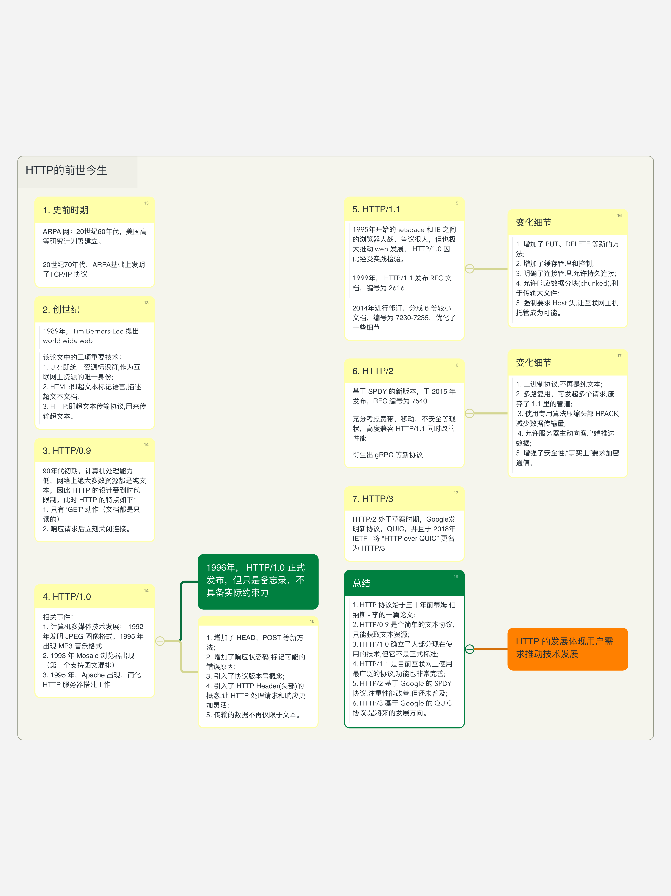

## 脑图

## 1. 史前时期 
- ARPA 网：20世纪60年代，美国高等研究计划署建立。
- 20世纪70年代，ARPA基础上发明了TCP/IP 协议

## 2. 创世纪 
1989年，Tim Berners-Lee 提出 world wide web，
该论文中的三项重要技术：
1. URI:即统一资源标识符,作为互联网上资源的唯一身份; 
2. HTML:即超文本标记语言,描述超文本文档; 
3. HTTP:即超文本传输协议,用来传输超文本。

## 3. HTTP/0.9 
90年代初期，计算机处理能力低，网络上绝大多数资源都是纯文本，因此 HTTP 的设计受到时代限制。此时 HTTP 的特点如下：
1. 只有 ‘GET’ 动作（文档都是只读的）
2. 响应请求后立刻关闭连接。

## 4. HTTP/1.0 
**相关事件：**
1. 计算机多媒体技术发展： 1992年发明 JPEG 图像格式，1995 年出现 MP3 音乐格式
2. 1993 年 Mosaic 浏览器出现（第一个支持图文混排）
3. 1995 年，Apache 出现，简化 HTTP 服务器搭建工作

1996年， HTTP/1.0 正式发布，但只是备忘录，不具备实际约束力，主要变化内容： 
1. 增加了 HEAD、POST 等新方法;
2. 增加了响应状态码,标记可能的错误原因; 
3. 引入了协议版本号概念;
4. 引入了 HTTP Header(头部)的概念,让 HTTP 处理请求和响应更加灵活; 
5. 传输的数据不再仅限于文本。

## 5. HTTP/1.1 
1995年开始的netspace 和 IE 之间的浏览器大战，争议很大，但也极大推动 web 发展， HTTP/1.0 因此经受实践检验。

1999年， HTTP/1.1 发布 RFC 文档，编号为 2616
2014年进行修订，分成 6 份较小文档，编号为 7230-7235，优化了一些细节

HTTP 1.1 的变化细节： 
1. 增加了 PUT、DELETE 等新的方法; 
2. 增加了缓存管理和控制; 
3. 明确了连接管理,允许持久连接; 
4. 允许响应数据分块(chunked),利于传输大文件; 
5. 强制要求 Host 头,让互联网主机托管成为可能。

## 6. HTTP/2 
基于 SPDY 的新版本，于 2015 年发布，RFC 编号为 7540

充分考虑宽带，移动，不安全等现状，高度兼容 HTTP/1.1 同时改善性能
衍生出 gRPC 等新协议

HTTP/2 的变化细节： 
1. 二进制协议,不再是纯文本; 
2. 多路复用，可发起多个请求,废弃了 1.1 里的管道;
3. 使用专用算法压缩头部 HPACK,减少数据传输量;
4. 允许服务器主动向客户端推送数据; 
5. 增强了安全性,“事实上”要求加密通信。

## 7. HTTP/3 
HTTP/2 处于草案时期，Google发明新协议，QUIC，并且于 2018年 IETF   将 “HTTP over QUIC” 更名为 HTTP/3

## 总结 
1. HTTP 协议始于三十年前蒂姆·伯纳斯 - 李的一篇论文; 
2. HTTP/0.9 是个简单的文本协议,只能获取文本资源; 
3. HTTP/1.0 确立了大部分现在使用的技术,但它不是正式标准; 
4. HTTP/1.1 是目前互联网上使用最广泛的协议,功能也非常完善; 
5. HTTP/2 基于 Google 的 SPDY 协议,注重性能改善,但还未普及; 
6. HTTP/3 基于 Google 的 QUIC 协议,是将来的发展方向。

> HTTP 的发展体现用户需求推动技术发展 
