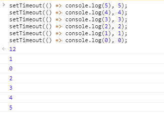
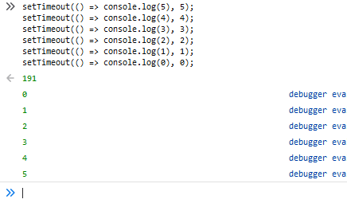

> Why's THE Design(为什么这么设计) 是一系列关于计算机领域程序设计决策的文章(偏向于前端领域)，在该系列会从不同的角度讨论这种设计的优缺点、对具体实现造成的影响。由 Draveness 的《为什么这么设计》 启发

## 正文
在前端技术圈子里面，对于 `setTimeout` 常常有一句结论，“`setTimeout` 的最小设置延迟是 4ms”。
按照 “某乎” 的方式，在回答一个问题之前得 “先看是不是”，“再看对不对或为什么”。

我们先来看第一个问题，**“是不是存在具体的规范来指定了 4ms, 还是只是业界实践的既定事实？”**

熟悉前端的知道，`setTimeout` 并不是由 ECMAScript 维护的，而是由 host environment 提供的，具体遵循的规范由 whatwg 来维护（至于为什么 ECMAScript 不直接提供 setTimeout 的功能，在 2011 年的 esdiscuss 中有了很多讨论，参与者有 Brendan Eich, kyle Simpson 等一帮前辈，后面会简单提到或另起一篇文章）。
回到 html standard，在 [8.6 Timers-2020/6/23](https://html.spec.whatwg.org/multipage/timers-and-user-prompts.html#dom-settimeout) 中对于 `setTimeout()` 和 `setInterval()` 有详细的描述，我们只看其中的 10-13 行：
>10. If timeout is less than 0, then set timeout to 0.
>11. If nesting level is greater than 5, and timeout is less than 4, then set timeout to 4.
>12. Increment nesting level by one.
>13. Let task's timer nesting level be nesting level.

从上面的规范可以看出来：
1. 如果设置的 `timeout` 小于 0，则设置为 0
2. 如果嵌套的层级超过了 5 层，并且 timeout 小于 4ms，则设置 timeout 为 4ms。

到这里，我们似乎已经找到了 4ms 的出处，并且对于 setTimeout 的最小延迟有了更加精确的定义 - **“需要同时满足嵌套层级超过 5 层，timeout 小于 4ms，才会设置 4ms”**

有人可能会好奇，“什么是 timer nesting level 呢”？（我同样很好奇），具体看下面的代码（具体浏览器源码中是如何来实现 timer nesting level 和 最小时延的，后面会通过 chromium 源码解释）：
```javascript
setTimeout(() => {
  setTimeout(() => {
    setTimeout(() => {
      setTimeout(() => {
        setTimeout(() => {
          
        }, 0)        
      }, 0)      
    }, 0)
  }, 0)
},0)
```


到这里，看似已经能够解释 `setTimeout` 关于最小时延的设计了。但正如 B 站中经常说的一句话，**“你只看到了第二层，以为我在第一层，但其实我已经到了第五层”**。

我在看到群友提出的这个问题时，第一想法除了寻找规范的出处之外，还有两个其他关注点：
1. 各大浏览器的厂商有没有按照规范实现，如果没有是为什么？
2. 4ms 这个数字究竟是如何确定的？

正如我经常思考的，**“一个貌似简单的设计结果背后一定有其背后的根源，这个根源可能来自于当时的痛点、背景和局限。我们不仅仅需要理解设计，更重要的是理解设计背后的东西-比如各大技术大拿、厂商在背后如何博弈并作出 tradeoff 的”**

我们先来看各大主流浏览器对 `setTimeout` 延迟各种边界情况的输出(需要注意的是这里不考虑由于单个 event loop 延迟导致 setTimeout 延迟增加，简化到最原始情况。具体就是不考虑单个 loop 中执行时间过长的情况，假设单个 loop 执行时长小于 ms 级别)：
1. Chrome 83.0.4103.106 和 Safari / edge



2. Firefox 65.0.1 和 IE 11



看上图我们会发现，对于 `setTimeout` 设置延迟 `0ms` 和 `1ms`，各大浏览器厂商采取了两种策略。而具体的策略是怎样的的，待我们进入到浏览器源码中来查找（在这里我们只展示 chromium 的 source code，其他 webkit 或 Firefox 自行下载查看），在 chromium 的 blink 目录下，有一个 叫做 DOMTimer.cpp 的文件，[online 地址](https://chromium.googlesource.com/chromium/blink/+/master/Source/core/frame/DOMTimer.cpp#93)，这里也是用来设置计时器延时的地方：
```C++
static const int maxIntervalForUserGestureForwarding = 1000; // One second matches Gecko.
static const int maxTimerNestingLevel = 5;
static const double oneMillisecond = 0.001;
// Chromium uses a minimum timer interval of 4ms. We'd like to go
// lower; however, there are poorly coded websites out there which do
// create CPU-spinning loops.  Using 4ms prevents the CPU from
// spinning too busily and provides a balance between CPU spinning and
// the smallest possible interval timer.
static const double minimumInterval = 0.004;

```
```c++
double intervalMilliseconds = std::max(oneMillisecond, interval * oneMillisecond);
if (intervalMilliseconds < minimumInterval && m_nestingLevel >= maxTimerNestingLevel)
    intervalMilliseconds = minimumInterval;
```
代码逻辑很清晰，设置了三个常量：
1. `maxTimerNestingLevel = 5`。也就是 HTML standard 当中提到的嵌套层级
2. `minimumInterval = 0.004`。也就是 HTML standard 当中说的最小延迟。

在第二段代码中我们会看到，首先会在 延迟时间 和 `1ms` 之间取一个最大值。换句话说，在不满足嵌套层级的情况下，最小延迟时间设置为 `1ms`。这也解释了为什么在 chrome 中测试 `setTimeout` 是上面的结果。

在 chromium 的注释中，解释了为什么要设置 `minimumInterval = 4ms`。简单来讲，本身 chromium 团队想要设置更低的延迟时间（其实他们期望达到亚毫秒级别），但是由于某些网站（比如纽约时报的网站）对 `setTimeout` 这种计时器不良的使用，设置延迟过低会导致 CPU-spinning（在后面，我们再解释什么是 CPU-spinning），因此 chromium 做了些 benchmark 测试，选定了 `4ms` 作为其 minimumInterval。


**到这里为止，从浏览器厂商角度和 HTML standard 规范角度都解释了 `4ms` 的来源和其更加精确的定义。但是会产生新的好奇点，究竟是 HTML standard 先做出的设定，还是 Chromium 这种浏览器厂商先做出的设定。了解先后顺序的意义在于了解其背后历史，规范和厂商是如何相互促进与制衡的。**

让我们先深入到操作系统的层面，windows 默认情况下的 timer resolution 是 `10-15.6ms`(这里你可以理解为 timer 的颗粒度)，也就是说最开始浏览器的 timer 依赖于操作系统层面的 timer resolution。换到 `setTimeout` 当中来讲，设定的最小延迟至少会是 `10ms`。但是从 CPU 性能来讲，处理器的速度已经从 1995 年的 500HZ 提升到 3GHZ 以上(2010年已经达到了)，而 windows 的默认 timer 却没有变化，仍然保持着原来的 `10-15.6ms`（这里你会看到浏览器厂商和操作系统厂商在不同角度下的思考）。浏览器厂商（chrome）认为默认计时器影响了网页的表达（ `10-15.6ms` 时间过于长）。对于浏览器内部来讲，如果 clock tick 很长，意味着浏览器会休眠很长的时间，从某一方面导致浏览器的性能下降。

上面的解释告诉我们一个既定事实，最开始 window 下的所有浏览器的 timer 的实现都依赖于操作系统的 timer，也就是 `10-15.6ms`。实际的测试结果可以从 Erik Kay 的视觉排序测试和 John Resign（大名鼎鼎的 JQuery 的作者，你会发现大佬对底层都有自己的理解）的快速测试方案看到，[具体 John Resign 在 2008 年的文章](https://johnresig.com/blog/accuracy-of-javascript-time/)。

chrome 对于 `10-15.6ms` 的 timer 非常在意。我们知道，chrome 目的是高性能的现代浏览器，具体到 timer resolution，其希望量级达到亚毫米级别(小于 1ms)。因此，chrome 团队希望改变浏览器对于操作系统 timer 的依赖，其在 windows 和 linux/unix 系统下采用了不同的方案来达到其目的。linux/unix 有专门的 API 可以修改系统默认的 timer resolution，而在 windows 下就显得有点麻烦，最后 chromium 团队选取了和 Flash 和 Quicktime 同样的 API 来替代系统默认的 timer resolution。

在修改了 OS 默认的 timer resolution之后，chrome 的性能有了很大的提升。具体到 chrome 1.0 beta 版本，timer resolution 设置的是 `1ms`（已经比较接近其团队期望）。可能有人会奇怪，既然追求低延迟，为什么不直接设置为 `0ms` 呢？

其原因在于如果浏览器允许 `0ms`，会导致 JavaScript 引擎过度循环，也就是说如果浏览器架构是单进程的，那么可能网站很容易无响应。因为浏览器本身也是建立在 event loop 之上的，如果速度很慢的 JavaScript engine 通过 0ms timer 不断安排唤醒系统，那么 event loop 就会被阻塞。那么此时用户会面对什么情况呢？同时遇到 CPU spinning 和基本挂起的浏览器，想想就让人崩溃。如果一个浏览器经常让用户体验到这种情况，绝对没人愿意用的，毕竟很少有人愿意受虐。这也是为什么 chrome 1.0 beta 设置的是 `1ms`。

看起来结果都非常不错，但是随后部分团队有 bug 报告（具体指的是两个，一个是前面说的纽约时报的网站 bug，另外一个就是英特尔团队发现的 chrome 不正常的电量消耗）。其发现 timer 导致 CPU spining，而 CPU spinning 的后果是计算机没有办法进入睡眠模式（低功耗模式），也就是耗电非常的快。因此，chrome 团队不得不解决现实问题（另外是由于当时 chrome 市场份额也没有如今这么大，所以不敢过于托大）。当时 chrome 团队的方案是对 timer 设置了很多的限制。后来，经过 chrome 团队的一些实验，发现将 `1ms` 提升到 `4ms`，在大部分机器上好像没有了 CPU spinning 和过于耗电的问题。在这种 tradeoff 的情况下达到了 chrome 团队的目标，更加精确的计时器，并且也没有产生更多的问题。

说句题外话，其实在最开始，chrome 团队是有和 windows 团队进行过沟通的，希望 windows 能够提供动态调整硬件 clock tick interval 的功能来匹配上层应用程序的需求，但是沟通的结果并不是那么的好。这个可以从 Microsoft 曾今的一个演讲中理解到为什么其不愿意做出这样的改变，在演讲中，他们希望未来的 OS 能够为上层应用程序进行强制的较低唤醒速率（100ms）来减少很多行为不当的程序。也就是 chrome 团队的期望和 windows 团队的期望是有冲突的。到这里，我们就会理解到不同团队对同一个事物不同的考虑。

随着 Chrome 团队对于 timer 的调整之后（性能提高很多），其他主流浏览器比如（Safari、opera、firefox、IE）都采用了 `4ms` 的设定，并且不同浏览器会进行不同条件的计时器节流（也就是最开始我们不同浏览器测试会不同结果的原因）。随后 HTML standard 才进行了相关规范的设定。

其实，timer resolution 并不是一个经常被讨论的主题（因为需要很多基础知识，又偏向于底层），但实际上 timer resolution 一直在不断地发展。

正如 Nicholas C.Zakas 在他的一篇文章提到，“We’re getting closer to the point of having per-millisecond control of the browser. When someone figures out how to manage timers without CPU interrupts, we’re likely to see timer resolution drop again. Until then, keep 4ms in mind, but remember that you still won’t always get that.”


## 总结
到这里，可以理解到, `setTimeout` 的 `4ms` 是如何被设定出来的。对于该方法的最小延迟我们可以有更加精确的定义。

1. 不同浏览器的最低时延会不一致，比如 chrome 的最低时延是 `1ms`。而如果 timer 嵌套层级很多，那么最低时延是 `4ms`。具体嵌套层级的阈值不同浏览器也不一致，HTML Standard 当中是 `>5`，chrome 当中是 `>=5`。

另外，我们也理解了在前面提到的两个问题：
1. 各大浏览器的厂商有没有按照规范实现，如果没有是为什么？
2. 4ms 这个数字究竟是如何确定的？

各大浏览器厂商没有完全按照规范实现，是由于其各自有各自的 benchmark，然后不同浏览器厂商做出了不同的设定。另外，对于这种影响不大的变量，HTML standard 提供了相应的灵活变动。我们也理解了 `4ms` 产生的背景以及背后浏览器厂商和操作系统厂商的不同考虑，他们各自做出的方案决策和 tradeoff。

----
> 我是 BY，一个有趣的人，以后会带来更多的原创文章。
> 
> 本文章遵循 MIT 协议，转载请联系作者。
> 
> 有兴趣可以关注公众号（点击下方链接）或者 Star GitHub repo.

[公众号，更多文章](https://www.bruceyj.com/front-end-interview-summary/info/)