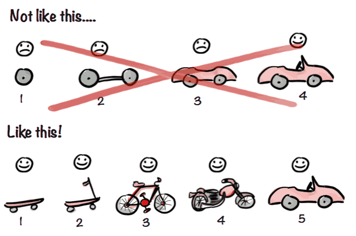

> Why's THE Design(为什么这么设计) 是一系列关于计算机领域程序设计决策的文章(偏向于前端领域)，在该系列会从不同的角度讨论这种设计的优缺点、对具体实现造成的影响。由 Draveness 的《为什么这么设计》 启发

## 正文
在阅读本文之前，需要大家先忘掉类似于 `$.ajax()` 和 `axios` 这类的库方法或库，回归到最原始的 `XMLHttpRequest`，然后再去思考新设计的 `fetch API`。因此阅读本文之前，你需要一些简单的前置知识：`XMLHttpRequest`(后面以 `XHR` 简称) 和 `fetch API` 。

首先，我们给两个概念下一个定义。`XHR` 和 `fetch API` 都是浏览器给上层使用者暴露出来的 API（类似于操作系统暴露系统 API 给浏览器这类应用一样）。这两套暴露的 API 给上层使用者提供了部分操作 http 包的能力。换句话说，这两者都是建立在 http 协议上的，我们可以将其当成具有部分功能的 http 客户端。

`XHR` 出现时间很早，最开始在 Microsoft Exchange Server 2000 的 Outlook Web Access 中引入，随后在 1999 年加入到 IE5 中，最后所有主流的浏览器都引入了该特性。也就是说，`XHR` 已经 21 岁高龄了（一种技术能存活如此之久，足够证明其经典）。而 `XHR` 变得人尽皆知则是由于 AJAX 架构的出现（在这里需要提到的是，Ajax 更多的被认为是一种 Web 应用架构，其最早出现在 Jesse James Carrett 于 2005年 发表的一篇 《Ajax: A New Approach to Web Applications》），各种著名应用都使用了 AJAX（比如 Google 的 Gmail）。不管是谁促进了谁，都足以证明 `XHR` 解决了当时很大的痛点问题，减少网络延迟或损耗，提高用户体验，并增强了 JavaScript 在浏览器上操作 HTTP 的能力。

用技术术语来讲，`XHR` 在当时很好的解决了客户端和服务器端的异步通信。我们想象下当时的状况，Web 体系增长很快，但web 应用的功能仍然是相对简单的，更多是对信息的展示，因此 `XHR` 设计者无需考虑过多的架构设计（仔细想象一下，当时没有硬需求，而且过度设计同样是个问题）。

以现代软件工程的角度来看，`XHR` 的整个设计非常混乱，将 request、response 和事件监听混在一个对象里，并且需要通过实例化才能够发送请求（后面我们通过实际代码来演示）。这带来的问题是在实际使用过程中配置和调用方式没有组织和可维护性（注意，这在 web 应用比较简单的时候不构成问题）。用架构的术语来讲，**XHR 不符合关注点分离原则（SOC）**，SOC 原则期望在设计系统时候能够将系统元素分离开来，尽量保持各个元素的职责单一（比如 TCP/IP 协议簇的分层、经典 MVC 架构都是 SOC 原则的经典体现）。

我们来看一下最原始的 `XHR` 的使用：
```javascript
let xhr = new XMLHttpRequest();
xhr.open('GET', url);
xhr.responseType = 'json';
xhr.onload = function() {
  console.log(xhr.response);
}
xhr.onerror = function() {
  console.log('error');
}

xhr.send();
```
从上面代码可以很明显的看出，http request 、http response 和事件监听都处于同一个 `xhr` 实例里面。整个代码组织缺少语义化，并且可能陷入回调地狱的窘境。如果没有各种包装库的实现（这也同样是 `fetch` API 出现后难以推广的原因之一，因为库封装的很好），手写 `xhr` 绝对是个痛苦的事情。

按照 jake archibald(Google chrome 成员，个人比较喜欢的一个技术专家 ) 的话来讲：
> XHR was an ugly baby and time has not been kind to it. It's 16 now. In a few years it'll be old enough to drink, and it's enough of a pain in the arse when it's sober

从近二十年的历史来看，Web 绝对是世界的中心（你看 JavaScript 设计得这么潦草的语言仍然占据很重要地位就可以侧面理解这句话的含义了）。Web 的发展代表着用户群体增多，也就意味着各种需求的增多（比如由文本传递到各种多媒体信息传递），各种技术方案、标准不断被引入到 Web 体系中（比如著名的 WHATWG 组织和 ECMA International 组织），`XHR` 显然到了该改变的时候，而改变往往有两种大方向：
1. 在原有基础上革新，但是会受到旧方案的约束（也就是我们常说的技术债，比如 Vue 3 在设计最初如何和 Vue2 的设计进行兼容权衡的），具体到 `XHR` 中有 `XMLHttpRequest2` 的方案发布（提供了操作二进制数据的能力）。到现在为止，`XHR` standard 仍然有少量的更新。
2. 重新设计一套东西（具体到本文就是 `fetch API`）。好处在于没有历史的束缚，而问题在于如何让社区来接受这一套新东西（尤其是在旧方案仍然满足大部分需求的时候）

标准编著者在设计方案时除了需要考虑使用者的方便，还要着眼于未来趋势和是否与现有其他议案有冲突。从各类相关产品（这里我将各种设计称为产品的目的是想从另外的角度思考问题）的时间线上来看：
1. Fetch API 第一个 commit 出现在 2011 年，正式标准化并由浏览器厂商实现则是到了 2015 年左右；
2. jQuery1.5（提供新版的 `$.ajax()`） 出现在 2011 年
3. axios 第一个版本出现在 2014 年。

你会发现，这几个时间线是很接近的，如果你再联想到 JavaScript，当时 JavaScript 世界的最重大事件莫过于 ES2015 被一步步标准化（这也意味着 Promise 被正式引入标准，尽管 `Promise` 的理念早已经在程序世界家喻户晓），因此上面的几个产品不约而同地使用了 `Promise`的方式来设计各自上层的 API（这也侧面说明了回调这种异步写法不太符合程序员线性顺序处理思维）。

我们们来看看 `fetch API` 在设计时主要考虑点在哪里：
1. 使用最新的 Promise 语法结构，对上层用户编程更加友好
2. 整个设计更加底层，这意味着在实际使用过程当中能够进行更多的弹性设计
3. 关注点分离，request / response / header 分开，这也意味着能够更加灵活的使用这些 API（比如 request 结合 service worker 来使用，具体看下面的代码）：
```javascript
self.addEventListener('fetch', function (event) {
  if (event.request.url === new URL('/', location).href) {
    event.respondWith(
      new Response('<h1>Hello!</h1>', {
        headers: {'Content-Type', 'text/html'}
      })
    )
  }
})
```
在上面的代码中， `event.request` 是一个 `Request`。这意味着可以直接在客户端实现 `response`，而不是让浏览器去请求网络，这样可以结合 `cache` 实现某些灵活地功能，这是 `XHR` 不能实现的。

具体 `fetch API` 使用方式如下：
```javascript
fetch(url)
  .then((r) => r.json())
  .then((data) => console.log(data))
  .catch((e) => console.log('error'))
```
代码组织比最开始的 `XHR` 更加清爽了很多，如果使用 `async/await` 语法则更加简洁。

一项新技术方案的出现，一定会引起业界的讨论，甚至是争议。而很明显，`fetch API` 尽管有非常先进的设计理念，但仍然带来了不少的争议（尤其是 `fetch API` 很难实现某些 `XHR` 的功能时），这类争议被我分为两类：
1. 第一类是误解，我会简单描述几个
2. 第二类是缺少特性，导致某些用户需求实现非常不方便

第一个误解是（来自于一个 JavaScript 社区成员），“**作为平台方，不应该在 `XHR` 基础上添加 high level features，而是应该提供更加 low level 的 primitives**”。

很明显，上面的话陷入了一个误区，“一个设计良好的、简洁的 API 就是 high level的”。如果仔细看过规范的，你会发现， XHR 目前是建立在 fetch 的基础上的，有规范为证(在 XHR 的 `send()` 上)：
> Fetch req. Handle the tasks queued on the networking task source per below.

也就是说，`fetch` API 实际上更加低阶，也就会给上层开发者（指的普通前端开发者）。

第二个误解是（也是社区经常抱怨的），认为**规范需要提供一个更加完善的东西，而不是一个半成品**。

说实话个人认为这是属于开发者的“双标”。当我们作为开发者时，我们对于自己产品的要求是迭代式开发；而当我们作为消费者使用第三方技术或标准时，我们的反应是 “how dare you present me with such incomplete imperfection”，这不是妥妥的双标又是什么呢？迭代发布意味着规范方能够从实际使用中获得反馈进行改进，并且可以指导未来的设计（如果你有看过 CSS 特性发布历史的话你可以理解这句话的含义-具体指的 CSS 各种前缀的滥用，导致尾大不掉）。jake archibald 的图片很好的体现了这一点：


第三个误解是，认为 `fetch API` 对于某些 http 错误码不会 reject（比如 `400`、`500`等）。但是我支持规范方，因为 `fetch API` 作为一个更 low-level 的 API，不管是错误码还是正确码都表示 http 客户端有接受到服务器的 response，而网络错误这类才真正代表着异常。


**第一类争议在经过解释后往往会消失掉，而真正麻烦的是第二类 - 缺少方便实现旧方案功能的特性**（注意这里指的是方便实现，而不是各种 hack 实现），具体到 `fetch API` 有以下几个（不全，但是也能基本描述本文所想讲的东西了）：
1. 缺少 request aborting。具体指向两种需求：如何中断一个请求？如何超时中断一个请求？这里我将超时中断单独列出来，是因为 `XMLHttpRequest` 单独提供了属性用来处理超时中断。
2. progress events，缺乏方便获取请求传输进度的能力。我们知道在异步请求一个较大文件时，展示文件下载进度是一个非常友好的功能，而 `XHR` 提供了 `onprogress` 事件来帮助我们来实现该功能，具体代码如下：
```javascript
const xhr = new XMLHttpRequest();
xhr.open('GET', '/foo');
xhr.addEventListener('progress', (event) => {
    const { lengthComputable, loaded, total } = event;
    if (lengthComputable) {
        console.log(`Downloaded ${loaded} of ${total} (${(loaded / total * 100).toFixed(2)}%)`);
    } else {
        console.log(`Downloaded ${loaded}`);
    }
});
xhr.send();
```


首先看 request aborting 功能，在 `XHR` 中，中断一个请求可以直接调用 `XHR` 实例上的 `abort()` 方法，并且可以使用事件监听（`onabort` 事件），监听请求中断，作出相应的响应。
对于超时中断，`XHR` 实例提供了 `timeout` 属性来帮助我们方便的实现功能，同时 `XHR` 还提供了 `ontimeout` 事件（这里就不聊具体代码如何写了，Google 一下就行）

在最开始的 `fetch API` 并没有提供上面的功能（**这里你可以先思考一个问题，为什么这么简单的 API 实现，在 `fetch API` 中就成了非常激烈的讨论？**），具体的讨论总共经历了漫长的两年之久，堪称 `fetch API` 讨论最激烈的特性了，其主要分为以下几个阶段(在这里我不过多描述争论的细节，只解释几个方案的 tradeoff，细节可以看我给出的链接)：
1. 最初的讨论 [whatwg/issue 27](https://github.com/whatwg/fetch/issues/27), 这个 issue 讨论的目的是如何提供给上层开发者一个方便的方法来终止 `fetch`。
2. cancelable promise 方案由于安全原因被否，具体细节在 [tc39/proposal-cancelable-promises#4](https://github.com/tc39/proposal-cancelable-promises/issues/4)。(题外话，cancelable promises 规范提出者 domenic 和 chrome 团队产生激烈争论，由于 chrome 团队强烈反对导致该方案被废弃)
3. 其他方案另开一贴继续讨论（由此可以看出讨论之激烈） [whatwg/issue 447](https://github.com/whatwg/fetch/issues/447)
4. whatwg 最终给出的标准 [whatwg/dom spec#dom-abort-controller](https://dom.spec.whatwg.org/#dom-abortcontroller-abortcontroller)


在最开始的讨论中，主要有两种方案：
1. 使用 `cancelable promise` 方案（由 jake archibald 提出），具体使用如下：
```javascript
var requestPromise = fetch(url);
var jsonPromise = requestPromise.then(r => r.clone().json());
var textPromise = requestPromise.then(r => r.text());
textPromise.abort();
```
这种方案你咋眼一看，是不是非常的完美，也比较符合原有 `XHR` 的写法（需要注意的是这里的 promise 是特别封装的 `CancellablePromise`）。

但是这种方案却受到另一方的强烈反对，主要代表是 getify（《you don't know js》 作者，个人认为其水平很高，但是容易夹带私货）。它反对的点主要是更加深层次的设计，其认为该方案是 **action at a distance**(这里的 **action at a distance** 指的是一种 **anti-pattern**，通常在现代程序设计中非常不推荐使用，因为其会带来很多不可控性，详细信息 wiki 里面有介绍)，并且认为这类做法在最开始 `promise` 引入 ES6 时已经有了很多的讨论。简单点讲，如果引入 `abort()` 会带来 `promise` 内部 observer 的设计矛盾（观察者，这里有牵扯到 promise 在 js engine 中如何被实现的，具体另外写一篇讨论），并且对于 `async/await` 的设计也会带来问题。

到这里，你是不是已经能体会到上面简单的特性引入究竟是怎么带来深层次设计问题的。

另外需要提到一点的是，规范在设计一个新的 API，也需要考虑是否会影响到的方案，因为各个方案参与者并不一样（比如对于 `streams API` 是否有影响）

在讨论过程中，两方都无法说服对方，直到后来第一种方案出现可能的安全问题，才被直接否决。但是 `abort` 的需求仍然是存在的，最终第二种方案 `controller + signal` 被确定下来（具体讨论看下面的链接 3）。

正如我在 《为什么 setTimeout 的最小延迟是 4ms》 中一直在讲的观点是，“**对于同一个需求，不同参与方的思考角度不一样，会带来不同的方案，也就会产生很多不同的 tradeoff。而如何思考、权衡，则是架构师的必备技能**”

尽管该方案的讨论时长过于的长，我们最终还是有了落地的方案（尽管很多人还是不能接受，但有时候有了总比原地踏步要强些），具体代码如下所示：
```javascript
const controller = new AbortController();
const signal = controller.signal;

setTimeout(() => controller.abort(), 5000);

fetch(url, { signal }).then(response => {
  return response.text();
}).then(text => {
  console.log(text);
});
```
上面的代码就是结合 `controller + setTimeout` 实现了超时中断的功能。


**但是，不幸的是 progress events 并没有很多的进展。最开始提的几个方案都被否决了，并且到笔者写作时仍然处于停滞当中。个人认为主要原因还是规范方精力有限，而该特性又不是优先级特别高。**

但是，作为上层应用者我们仍然可以结合 `streams API` 和 `service worker` 来实现上述需求（提一句，`streams API` 是非常优秀的功能，给了前端开发者更多操作底层网络数据的能力）。在这里，就不具体阐述实现方案了，给出我个人认为实现很好的：
[fetch progress indicators](https://github.com/AnthumChris/fetch-progress-indicators)

## 总结
在正文部分，我们详细描述了 `XHR` 的设计问题和 `fetch API` 的设计理念，并且分析了这样设计的优缺点。但是我仍然需要提到的是，这并不是 `fetch API` 的全部，无法在一篇文章里面讲完所有的细节。

**诚然，对于上层开发者来讲，理解这些设计理念和背后的各种方案、tradeoff，非常有助于开阔我们的视野，以及更加深入理解设计背后所涉及到的 computer science 概念和优秀实践。但是，我们仍然需要依托于现实世界的业务需求，毕竟需求往往是更加接近自己的。**

**换句话说，我们需要考虑实际业务情况来考虑使用旧的 `XHR`, 还是新的 `fetch API`（看起来是废话，但是确是你需要的）**。

我举几个你可以权衡的点：
1. 兼容性是否对你及其重要。因为仍然有很多的应用要兼容低版本的浏览器（就像前段时间，尤雨溪在 twitter 发起的“是否仍然需要兼容 IE11” 投票结果一样，仍然有25% 左右的支持工作中仍然会涉及到 IE11），如果你想要在低版本里面使用 `fetch API`, 那么需要 polyfill（使用 `XHR` polyfill）。
2. 应用中是否希望结合使用 `streams API` 和 `service worker`。如果这两个特性对于你的应用特别重要，那么我推荐你使用 `fetch API`。

**下面回答最后一个问题，除了兼容性，还有什么遏制了 `fetch API` 替代了 `XHR`?**

那是因为各种优秀的库（`XHR` 封装）基本能够满足上层应用者大部分的功能需求，并且也没有特别大的缺点，那么为什么还要冒着风险使用新的 `fetch API` 呢？这是不是也体现了你已经默默做了技术选择的 tradeoff 呢？


## reference
1. https://developers.google.com/web/updates/2017/09/abortable-fetch
2. https://developer.mozilla.org/en-US/docs/Web/API/AbortController
3. https://github.com/github/fetch
4. https://github.com/whatwg/fetch/issues/20
5. https://github.com/AnthumChris/fetch-progress-indicators
6. https://jakearchibald.com/2015/thats-so-fetch/
7. https://developers.google.com/web/updates/2015/03/introduction-to-fetch
8. https://developer.mozilla.org/en-US/docs/Web/API/Fetch_API

----
> 我是 BY，一个有趣的人，以后会带来更多的原创文章。
> 
> 本文章遵循 MIT 协议，转载请联系作者。
> 
> 有兴趣可以关注公众号（点击下方链接）或者 Star GitHub repo.

[公众号，更多文章](https://www.bruceyj.com/front-end-interview-summary/info/)