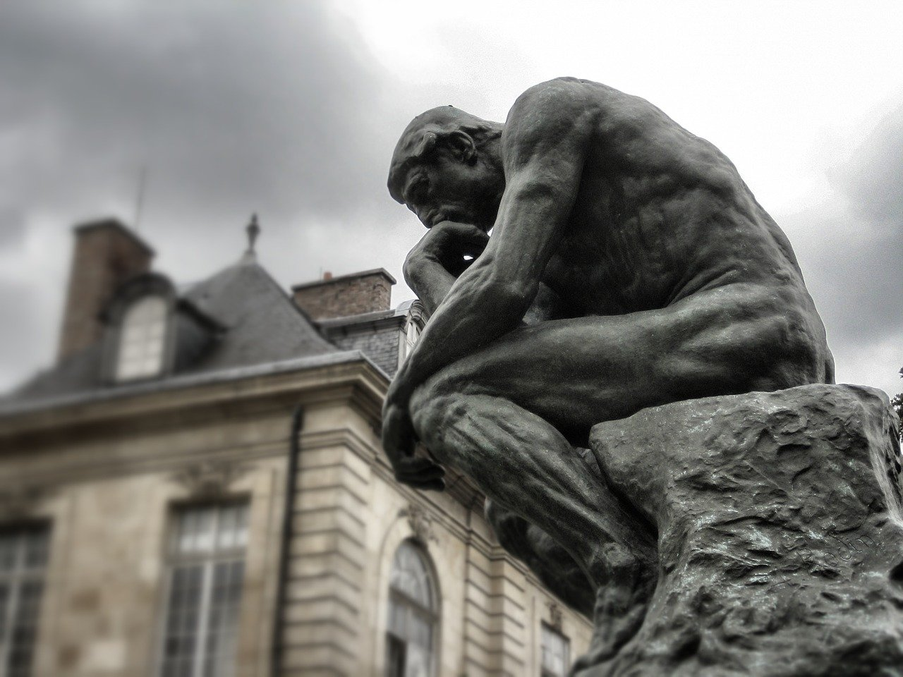
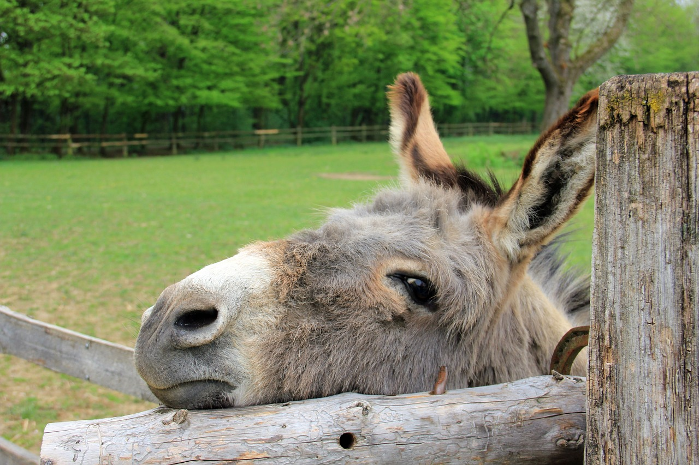
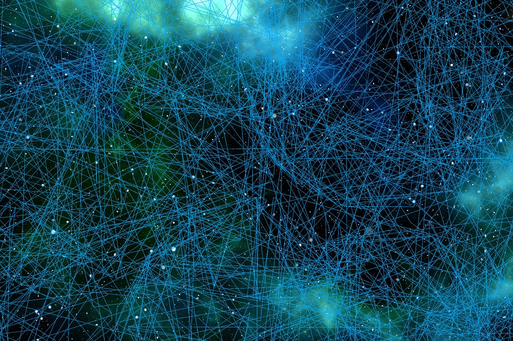
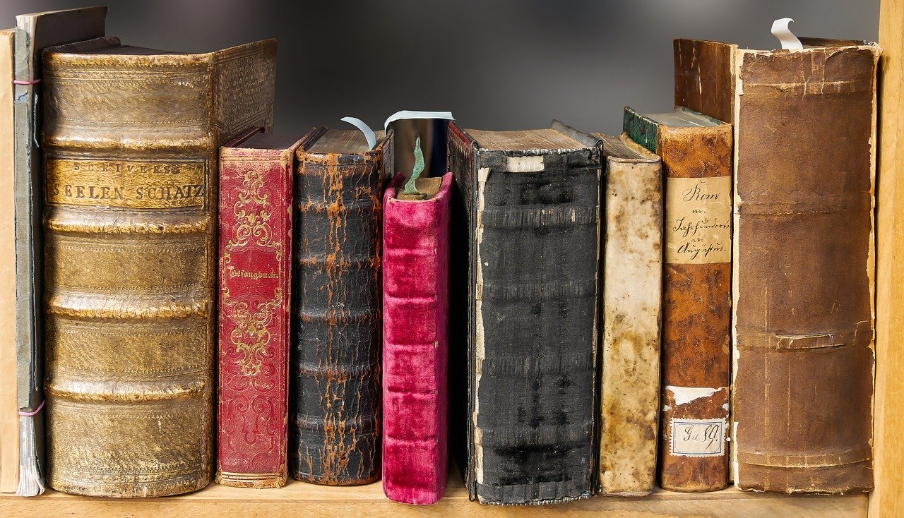

# 论思考

## 导言
庚子年，庚辰月，丙申日，天晴 - 世界读书日。

开始本篇之前，我先询问几个问题：
1. 你是否发现自己变得越来越不耐烦，越来越难以忍受“枯燥”的东西？
3. 你是否有发现时间越来越碎片化了？
4. 你什么时候开始变得焦虑？
5. 你是否渴望能够将时间花在成长，却转头迎向了各种娱乐？
6. 你是否发现出现在你周围的信息越来越一样？

如果你同样也有这些问题，可以试着往下读读看，可能有所得也不一定。

### 信息
互联网的出现，降低了信息传递的成本。智能手机出现、移动互联网发展，获取信息更是变成了 “随手即可得”，以至于大家高呼，“免费的信息时代，便捷的信息时代”。但软件工程告诉我们，一项新技术的引入在带来便利的同时也会引入新的问题。而爆炸式的、免费的信息使得**筛选信息**（信息的良莠不齐）成为我们新的问题，甚至导致我们成为“饿死在干草堆之间的驴子”。

### 大脑
对于人类大脑来讲，能够处理的信息是有限的，这也就意味着如果我们的大脑一直被阻塞处理一些无效信息时，有意义的活动就会被搁置下来。而当我们习惯了快餐式阅读，压缩包式的“干货”，抖音、快手之类的娱乐，就很难激发自己的思考。另外这种快餐式的信息，具有低投入、高刺激的特点，我们在习惯这些信息的同时，我们的兴奋阈值会越来越高，而对专业知识这种“枯燥”的东西就没什么兴趣了（这些涉及到脑神经科学的奖励机制、多巴胺、内啡肽、成瘾机制等等）。

另外一个大脑的弱点是 - 对于大部分人来讲，他们只接受自己认可的东西，却对事情真正是什么样子并不在意，而这些所谓的“认可”的信息往往具有以下特点：
- 符合自己原有的价值观
- 在某些时候能够增加自己的优越感或者能够安慰自己（知乎的各种帖子比比皆是）
- 能够攻击自己的敌人，就是所谓的“屁股论”

这种缺少思考的方式加剧了信息的同质化。大数据、人工智能、推荐系统的进步，同样加快了这种现象，而之前的大数据“杀熟”事件就是必然会发生的。

### 信息与知识，知识与思考
薛定谔在《生命是什么》中提到，“自然万物都趋向于从有序到无序，即熵值增加。而生命需要通过不断抵消其生活中产生的正熵，使自己维持在一个稳定而低的熵水平。”，也就是所谓的“生命以负熵为生”。

随着信息在不断增加，大脑会越来越混乱，系统会越来越无序。因此，我们需要提取信息为知识，并且对这些知识进行思考。思考就是在对抗熵增。

总结来讲，我们就是将信息甄别，把知识归类，把大脑从不断增加的混乱中解放出来，将无序转变为有序。

> 信息不等于知识，尽管知识生于信息。记忆不等于思考，尽管思考源于记忆。

> 知识太少，犹如坐井观天而不自知。思考太少，犹如作茧自缚难以自拔。

### 如何更好地思考

1. 低头阅读：有选择性地多读“好书”

这里的书不仅仅是传统意义上的出版书籍，还有很多互联网上优秀的资料。尤其对于计算机专业来讲，“一手的”、“优秀的”资料数不胜数。我们需要和《how to read a book》里面中提到的一样，在阅读过程中和作者进行思想的碰撞。

这里提一下社会中读书的一个误区，有些人读书过度吹捧自己读书的量，而不是读书后的产出，好似数字对于他来讲更重要，就像和别人炫耀自己有多能吃苦一样。但是只有产出才是真正的思考。

2. 仰望星空：欣赏宇宙的伟大，思考自我的渺小

有时候，知识的增多，会增长我们的傲慢。而仰望星空，会使我们更加谦虚，也就更能够沉下心来思考。相比于亘古长存的宇宙星空来讲，人类短短的几十年又算什么呢。

3. 学会质疑，保持中立和客观

对于新信息的输入，要拒绝下意识、直觉性的反应。保持中立和客观(Objective)，分析事情本身，并注意作者的局限性。不要因为作者是权威就盲从，不要因为作者是新人就忽视。

### 总结
不动脑子，是大脑最喜欢的事。保持思考，重新进行审视，你会发现深藏在自己心底的偏见。

> 学而不思则罔，思而不学则殆

