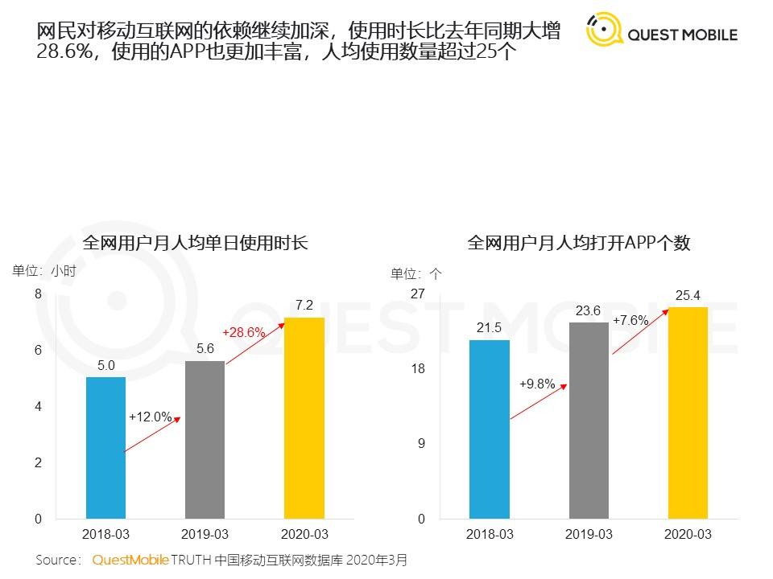
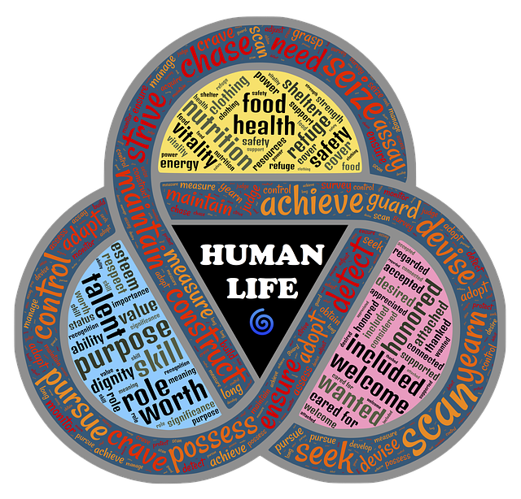
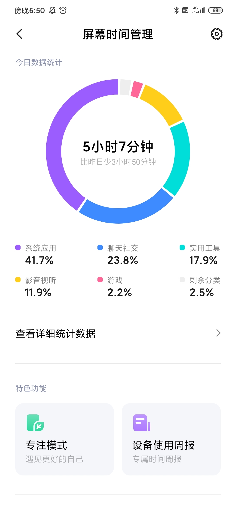
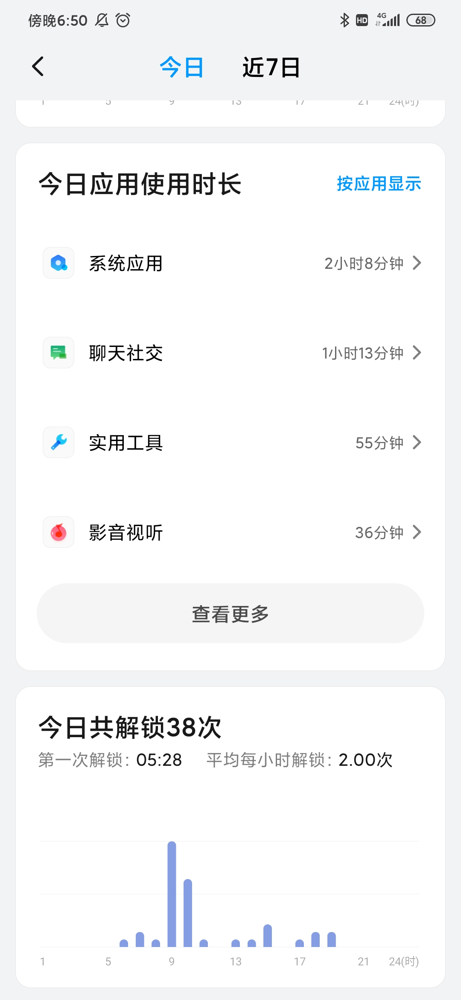
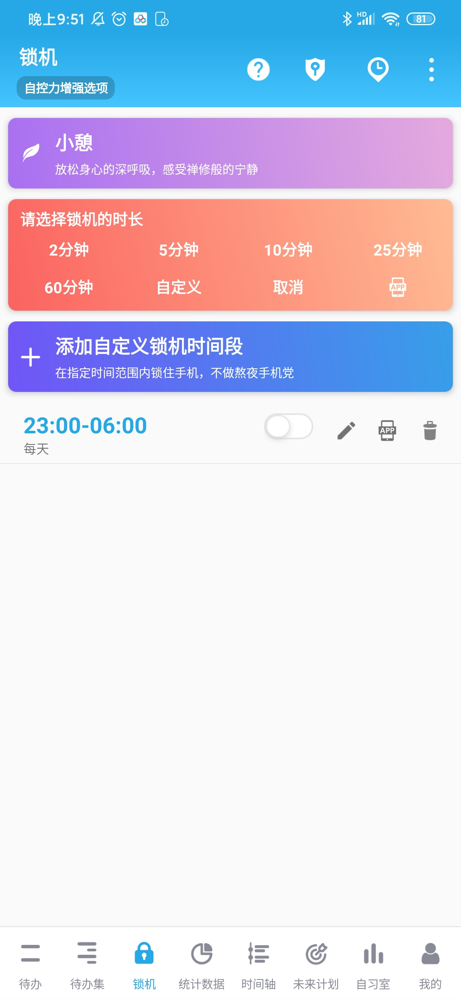
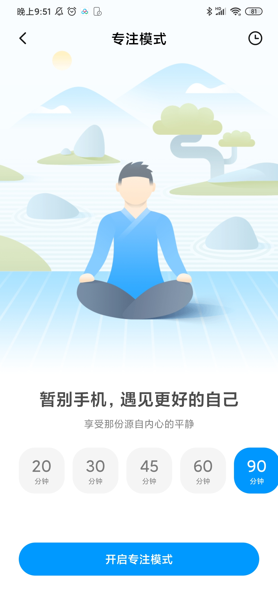

**文本更新于 2020年05月 1日 22:13:42**
## 谈 “逃离” 手机的二三法
本文会从以下几个重点来阐述观点：
1. 为什么我们需要“逃离”手机？换句话说，手机带来了哪些负面问题？
2. 手机是如何侵入我们的日常生活的？我们的大脑内部究竟发生了什么？
3. 如何“逃离”手机？

### 为什么 “逃离” 手机
先从几个数据谈起：
1. 2020年3月的 questMobile 报告显示，中国每日人均使用手机时长已经增长到 7.2 小时（从 19 年的 5.6小时）
2. 2019年4月北大白皮书显示 95 后每日人均使用手机时长在 8.33 小时，其中网络社交接近 2 小时
3. 手机 APP MAU（月活跃用户人数） 排名前列的为，微信、QQ、支付宝、淘宝、爱奇艺、腾讯视频、百度、抖音、微博、快手等

从以上数据来看，我们每日都会花费大量时间在手机上面（尤其是年轻人群），并且达到了**过度使用**的红线。而这种过度使用肯定会带来各种问题（比如成瘾）。如果你仔细观察上面排名前列的 APP 会发现，这些 APP 基本都带有娱乐性质，具体可以分为下面几类：
1. 短视频类（比如 ticktok、快手等）
2. 社交类（比如微信、微博、QQ等）
3. 游戏类（比如王者荣耀等）
4. 长视频类（比如爱奇艺。腾讯视频等）

在这里，我们暂且不谈手机成瘾所带来的社会学影响，只分析个人可能产生的问题：
1. 最明显的是这些娱乐性质的 APP 占据了我们日常的大量时间，并且将**时间碎片化**，压缩其他事情处理时间。（你可以用手机统计软件统计下你每天手机解锁了多少次，每天使用了多久时间，可能数据会吓你一跳）
2. 加剧**注意力缺陷**问题。智能手机的持续嗡嗡声或哔哔声会分散注意力，使我们无法专注于重要任务，减慢工作速度并打断那些对创造力和解决问题至关重要的安静时刻。
3. 带来**信息超载**问题，进一步降低思考能力
4. 加剧**焦虑**、**压力**，不断检查和响应手机的这种需求可能导致更高的压力水平，甚至导致倦怠。
5. 带来**孤独**和**沮丧**。 似乎在线会短暂让寂寞、沮丧、无聊之类的情绪消失，但实际情况是我们会感到更糟。 2014年的一项研究发现，高社交媒体使用率与抑郁和焦虑之间存在相关性。 用户，尤其是青少年，倾向于在社交媒体上与同龄人相比，表现不佳，从而增加了孤独感和沮丧感。
6. 过多关注于**虚拟关系**（虚拟形象和现实形象的差异），并且注意力转移到**短期联系**，而不是建立长期的关系。
7. 导致诸如 cybersex addiction 和 Online compulsion 的现象发生
8. 扰乱睡眠，从而严重影响整体心理健康，影响记忆力、清晰思考的能力，并降低认知和学习技能
9. 更容易产生负面人格

上述的问题基本都是普遍的。**那么为什么我们会花费如此多的时间在手机的娱乐 APP 上面呢？有人会说是对平日紧张学习、工作的一种放松，那么为什么我们会认为玩手机是一种放松方式呢？**

原因很简单，一切都是大脑告诉你的。

### 大脑的奖励机制

奖励机制是大脑最重要的机制之一，其形成的目的是帮助物种提高生存适应能力。因为大多数物种的生存取决于最大限度地接触有益刺激和尽量减少接触有害刺激，而奖励机制能够通过联想学习、诱导行为、触发积极有效的情绪来提高生存和繁殖的可能性。总结来讲其主要有三个功能：
1. **产生联想学习（associative learning）**
2. **影响决策和诱导行为**（通过刺激，比如多巴胺的大量产生）
3. **产生正向情绪，比如快乐**（pleasure）

在这里，我先替多巴胺正个名。很多人会简单的将成瘾归咎于多巴胺的产生，而这很明显是一种浅显的科学认知。多巴胺大多数情况是有益的，它是一种脑内分泌物，属于神经递质的一种(用来传递信息)，其和大脑的很多机制有关（比如导致帕金森的直接原因是多巴胺的缺失），而牵扯到奖励机制的是其中的中脑边缘系统通道（mesolimbic system)。

回归到奖励机制，其可以简单的分为**内在奖励**和**外在奖励**，内在奖励是无条件的奖励，而外在奖励是有条件的奖励。内在奖励本身会产生**愉悦感**（比如食物），外在奖励并不一定会产生愉悦感，其往往是和内在奖励相结合才能够让我们产生愉悦感（比如金钱、看喜欢的球队获得胜利）。

也就是说，我们不能将奖励机制直接等价于快乐，而是需要将其拆分开来，具体用词汇表示就是 **wanting（渴望）** 和 **liking(快乐)**（来源 robinson and berridge 1993年的 incentive-sensitizaiton theory）。我们上面讲的多巴胺的大量分泌带来的只有渴望，它就像是你面前的红旗一样，不断告诉你，快过来，来了你就会快乐。但是当你真正做了是否会得到快乐它并不会管。生活中的例子很多，比如我们吃泡面最香的时刻永远是吃第一口之前，而吃完第一口你是否会快乐是不确定的（因为我们曾经在吃完泡面后很快乐，所以大脑记住了这种联结）。**而对手机的过度使用同样也是大脑奖励机制导致的**。

**那么为什么这些娱乐应用会触发奖励机制？**

首先你需要知道，你面对各种应用 APP 时，不仅仅面对的 APP 本身，而是 APP 背后无数的项目经理、设计师和工程师，这些人每天的工作就是想着如何让你在他们的 APP 上面停留的更久一些。至于为什么他们希望这么做就是经济学方面的原因了，这里我们暂且不谈。

那么，他们具体是通过什么手段来触发大脑奖励机制的呢？
1. 定期的、容易的正向反馈（但是真正产生的愉悦感是不确定的）。
    - 我们需要注意 **定期的**、**容易的** 这两个形容词。定期表示当我们建立过 APP 和 愉悦感的联结之后，不断重复的加强这条回路。**容易** 表示我们重复这些行为的可能会更高。但是实际在长时间使用过后，我们的愉悦感是在不断减少的（边际递减效应），并且越来越不确定性。而我们在重复时产生的多巴胺并没有太多减少，也就是说，渴望却不能快乐，更加**强迫性地**促使着我们加大重复的“剂量”。
2. 利用人类的好奇心机制。比如通过“诱人的”标题吸引你点击
3. 利用信息负载。通过大量信息充斥大脑，降低思考能力

## 如何“逃离”手机？
在心理学上将成瘾分为两种，behavior addict 和 drug addict。很明显，手机过度使用已经属于行为成瘾（behavior addict）。在这里我们不去深入研究行为成瘾内部的细节（因为不同行为的成瘾的内部原理是不同的），而只和大家分享下该如何避免这种问题的持续发生。

> 以彼之道，还之彼身。既然手机成瘾问题是由大脑奖励机制带来的，那么我们可以同样利用其来解决。

初期，由于我们对于手机的依赖性已经过于的强，因此需要强力的物理手段，也就是强制的隔离，而具体强制的隔离又分为相对的和绝对的。
- 绝对的手段就是直接不用智能手机，买一个几百块的老人机只能接电话就可以了（如下图所示）。

- 相对手段就是利用对应的软件来控制使用时长。
  1. 统计手机的使用时长、各种软件的占比。通过数据可以减少大脑的自我欺骗和自利归因，能够更加真实展现自己。
    
    
  2. 使用软件的锁屏功能，比如我最开始用的番茄 todo，这款软件的好处在于我可以使用白名单里面的软件，其他软件在设定时间内都不能使用。但是这款软件存在一个问题，手机一重启就gg了。第二种是使用手机自带的专注模式，只要设定了时间，只能在该时间段内打紧急电话（重启都无法取消）。
    
    

另外，我们同样可以利用精神方面的手段。
1. 意识到手机问题负面效果大于正面效果。不断提醒自己。但是如果只靠自己提醒自己的效果一般（自我欺骗和自利归因），因为一旦我们将娱乐和满足感建立起通路之后，通路就很难消失了（类比于吸烟的人戒烟多年闻到烟味也会有反应）。因此我们需要和其他手段结合。具体可以分为两个方向：
    - 建立更多的通路（建立更多的有意义的刺激）。具体的手段因人而异，因为每个人对于不同事物的刺激度是不一样的。但是我们需要尽量将其往有意义的事情上面靠，比如运动（产生内啡肽，有镇静作用）、现实社交、读书等。加强这些事情的正向反馈。
    - 设立一个触发点，触发点的作用是每次想要使用这些娱乐 APP，就立刻将注意力放到其他事情上面。因为大脑在处理一些重要、复杂事情时是单线程的，而不能并发。

> 最后一句话，技术是中立的，我们要小心的是背后使用技术的人。希望大家能够合理使用手机，走向更加健康的生活。

