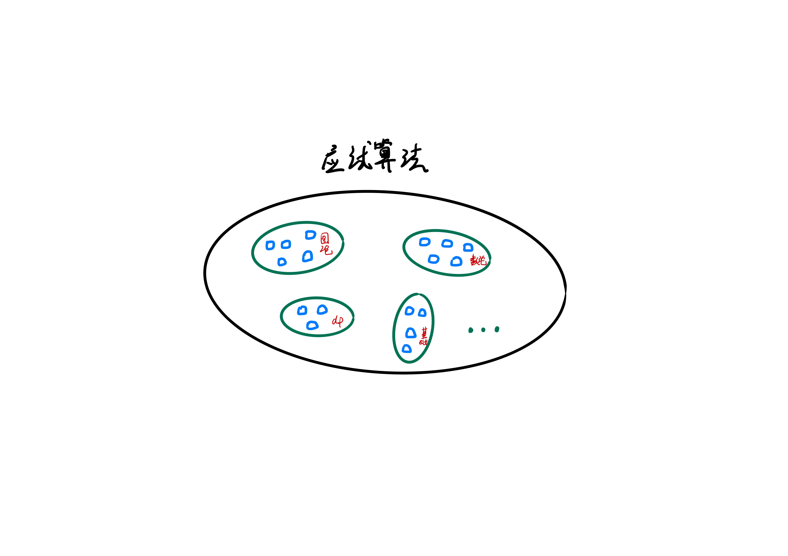

## 前言
> 在我看来，大部分面试的算法题从来都不是难在思维，而是缺乏系统的教学。它不像数学属于普及的基础教育，算法题目的大部分知识、技巧往往都局限于 competitive programming 当中 (比如各种 OI 竞赛、 ACM 竞赛等)，这些都是大部分计算机行业从业者接触不到的。它就像一个大群体中一个半封闭的小群体一样，系统的知识就在那里，只是我们很少会主动走进去。因此，我期望将这些知识给带出来，就引申出了本系列文章和视频。

动态规划不是指的某种具体算法（比如 dijkstra 单源最短路），而是属于一种经典的思考方式，在算法竞赛和面试/笔试中其一向是宠儿。追溯其本源，是由著名数学家 R.Bellman 等人在研究 **多阶段决策过程** 的优化问题而创立的，当前属于 **运筹学** 的分支之一。

而回归到算法问题当中，动态规划受宠的原因之一就是它不存在统一的处理方法，而需要我们根据具体的问题性质加上一些技巧结合来处理。这样能够让企业/竞赛方更加真实的考察应试者的思维能力。不过这点变化仍然挡不住经历过高考洗礼的我们，毕竟应试、刷题已经融入到大部分同学的血液里了。

在实际做题过程中，通常会遇到以下几个问题：
1. 阅读完题目后，无法想出具体的思路，比如无法将题意和动态规划思路联系起来。
2. 有了思路，无法写出具体代码或者迷失在各种边界细节当中

对于问题 1，我们可以和另外一个常见现象联系起来：每次看完别人题解后总会有恍然大悟之感（尤其对于已经刷了小几百道题目的同学），但是下次题意一变化，却又不会做了。这种现象非常类似于“老师一讲就懂，自己一做就不会”。该现象的本质原因如下：**题解** 或者 **老师的讲解** 属于在多种知识点之间建立了明确的连接，学生只需理解知识点与知识点之间的跳跃即可。而当自己去做的时候，则需要我们先在非常繁杂的知识点海洋当中根据题意线索抽丝剥茧，寻找到初始考察的知识点，然后再根据个人经验（前期系统学习加上个人总结）寻找到整道题目的知识脉络来得到答案。

那么对于问题 1，我们是否能够解决或者能否通过某种**刻意地训练**来改善呢？

> 在这里，我们暂且不把范围扩大到**更广义地知识学习**，就将范围约束在应试算法领域当中。

1. 攻克问题 1 的第一步就是，分别单独理解**应试算法**领域中的所有知识点，比如图论中的**单源最短路**。而由于**应试算法**的范围限定较多，考察也更多偏向于实现而非证明，所以这块内容难度并不会很大（相比于数学等纯粹学科来讲）
2. 第二步，通过每个知识点的经典例题加深知识点理解。这块在基础竞赛教育中已经非常系统了。
3. 第三步，也是最难的一步。我们知道在规模为 $n$ 的点之间建立两两关联，就已经达到了 $O(n^2)$ 级别的计算量，更何况还存在更加复杂的关系。很少有人能够完全覆盖所有的知识点关联（题目也在每年不断扩展中）。在此时，我们应该停下脚步思考下我们学习算法的目的究竟是什么？**只是为了应对面试**？**为了挑战自己的极限**？目的不同你所花的精力也应该有所侧重，毕竟算法只是多个知识领域中的一个而已。而本课程的基调主要在于前者，稍微带点后者。因此，类似于**后缀数组**、**后缀自动机**这类较偏、较进阶的知识点我们就不会讲了。 

回归到 **动态规划**，我不想一下子给大家抛出太多的概念性术语，类似于的概念我们会在总结的时候再讲解。但是，提前把名称给出来还是有必要的。

动态规划中常用的术语有如下几个：
- 阶段
- 状态
- 状态转移方程
- 无后效性
- 决策
- 重叠子问题
- 最优子结构性质

