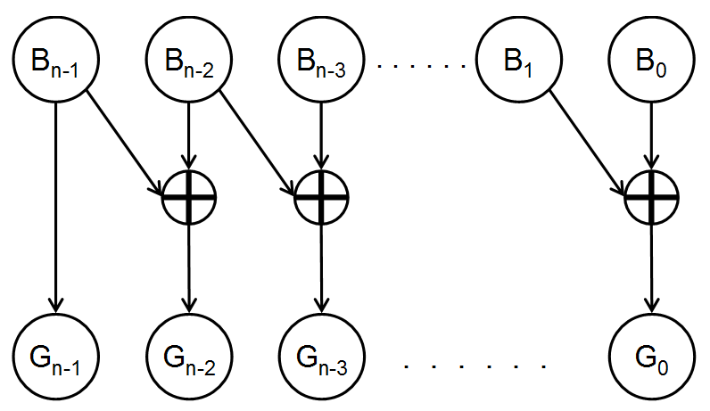

## 龟速乘
[64 位整数乘法](https://www.acwing.com/problem/content/92/)

求 $(a*b)\%p$, $a,b,p \in [1, 10^{18}]$

龟速乘和快速幂的思想是一致的，其核心思想是**任何一个数都可以用二进制表示**，快速幂可以将时间复杂度降低到 $log(n)$ 的级别。

对于大精度的乘法，如果直接相乘会导致溢出（python除外），因此我们可以将乘法变为加法。
$b = C_i*2^{r_i} + C_{i-1}*2^{r_{i-1}} + ... + C_0*2^{0}$, $C_i$ 为二进制表示的每位系数, 为 0 或 1。

因此 $a*b = C_i*2^{r_i}*a + C_{i-1}*2^{r_{i-1}}*a + ... + C_0*2^{0}*a$。因此就将时间复杂度降低到 $log(n)$ 级别，并且不会产生溢出的情况。

> 这里牵扯到模运算的分配律，$(a+b) \% p = (a \%p + b\%p)\%p$

```python
if __name__ == "__main__":
    a, b, p = int(input()), int(input()), int(input())

    ans = 0

    while b:
        if b & 1: ans = (ans + a) % p

        a = (a+a)%p
        b>>=1

    print(ans)
```


## 不使用 加减乘除 来计算整数相加
https://www.acwing.com/problem/content/description/81/

1. 异或又名不进位加法
2. 加法具有交换律

$a+b = (a 异或 b) + (a\&b<<1)$

> 负数的问题由补码解决


## 格雷码
> 格雷码：一组编码，任意相邻两个编码只有一位二进制不同
。又因为**最大码**和**最小码**之间也仅有一位不同，又被称为**循环码**或**反射码**

1. 普通二进制码 -> n 位格雷码

假设普通二进制码为 $B_{n-1}B_{n-2}...B_{0}$，对应的格雷码为 $G_{n-1}G_{n-2}...G_{0}$。

$$
\begin{cases}
G_{n-1} = B_{n-1} \\
G_i =  B_i \oplus B_{i+1}, i \in [0, n-2]
\end{cases}
$$



2. 格雷码 -> 不同二进制码
$$
\begin{cases}
B_{n-1} = G_{n-1} \\
B_i =  G_i \oplus B_{i+1}, i \in [0, n-2]
\end{cases}
$$


常见应用：求 n 位数的所有的格雷码

1. 方法 1：

按照上述的变换公式我们可以在 $O(n*2^n)$ 求出所有的格雷码。
具体就是从 $[0, 2^n-1]$ 依次枚举每个数，然后对每个数进行变换即可。

通常变化有两种方式：
- 按照公式一位位计算， $O(n)$
- 直接 $x \oplus (x>>1)$, 此处右移符号为逻辑右移， $O(1)$

1. 方法 2：

设 $n$ 阶格雷码为 $G(n)$，则 $G(n+1)$ 阶的格雷码可以以下面方式构造而成：
- 给 $G(n)$ 阶格雷码每个元素二进制形式前面添加 0，得到 $G'(n)$（转换成10进制，相当于没有变化）   
- 将 $G(n)$ 集合倒序为 $R(n)$。此时 $R(0) = G(n-1), ... ,R(i) = G(n-i-1)$。如果直接将 $R(n)$ 接到 $G(n)$ 后面会导致 $G(n-1) = G(n) = R(0)$，因此，我们将 $R(n)$ 中所有元素二进制前面添加 1，得到 $R'(n)$
  
$G(n+1)$ 就是 $G'(n) \cup R'(n)$。


时间复杂度为 $2^0 + 2^1 + ... +2^{n-1} = 2^n$ 级别。

```python
def grayCode(self, n: int) -> List[int]:
    ans = [0]
    head = 1

    for i in range(n):
        for j in range(len(ans)-1, -1, -1):
            ans.append(ans[j]+head)
        
        head <<= 1
    
    return ans
```

[leetcode 1238. 循环码排列
](https://leetcode-cn.com/problems/circular-permutation-in-binary-representation/)

两种方法：
1. 按照构造方法 2，按照递推法求出所有原 gray 码，然后循环转置就行。
2. 按照构造方法 1，直接按照 $x \oplus (x>>1)$ 方式依次求出所有的格雷码。而 $G[0] = 0$,对于任意 $G[i] \oplus start$ 不会改变 gray 码的性质，因此代码更加简短，并且降低常系数。$x \oplus (x>>1) \oplus start$


## 题目
[acwing 998. 起床困难综合症](https://www.acwing.com/problem/content/1000/)

> 位运算的特点之一就是在二进制表示下不进位

题目分析：

题目要求在 $[0, m]$ 范围内选择一个整数 $x$，使得其经过 n 次位运算后的结果 $ans$ 最大。

由于上述的位运算特点，参与位运算的各位(bit) 之间是互相独立的。

对于任意的 $k \in [0, 30)$ 之间，ans 的第 $k$ 位是多少只与 $x$ 的第 $k$ 位有关。因此，我们希望 ans 最大，也就是要求在满足题目要求下，高位尽量为 1。（贪心策略）

$x$ 的第 k 位为 1，当且仅当：
1. 已经填好的更高位的值加上 $1<<k$ 以后不能超过 $m$
2. 用每个参数的第 $k$ 位参与运算。使运算后的值为 1（如果不为 1，说明填 0 更好）

因此，如果不满足上述条件，表示第 k 位填 1，要么会超过 m 的范围，要么不如填 0 更优。


## 基础题
1. 异或：
https://leetcode-cn.com/problems/single-number/

2. 在通过 dfs 枚举数组子集时，如果数组大小比较小，我们可以通过一个整数来表示子集，$1$ 表示该元素存在子集中；$0$ 表示不在子集中

