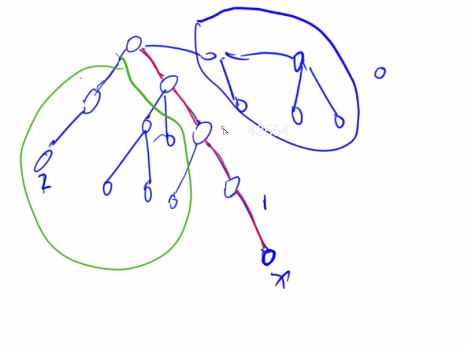

## 3. 多源汇最短路
1. floyd 算法
可以用来解决的问题有：
   1. 求多源汇最短路问题
   2. 传递闭包
   3. 找最小环
   4. 恰好经过 k 条边的最短路，倍增思想


floyd 算法又称 “插点法”，算法逻辑很简单，重要的是如何去证明它：
1. $d[i][j] = inf, d[i][i] = 0$
2. 三重循环枚举 n 个顶点，通过 $d[i][j] = min(d[i][j], d[i][k] + d[k][j])$ 进行更新


其思想是动态规划的思想。

1. 状态表示， $dp[k][i][j]$
   - 集合：所有从 i 出发，最终走到 j，且中间只经过结点编号不超过 k 的所有路径
   - 属性：路径长度的最小值
2. 状态计算：
   - 所有包含结点 k 的路径：我们通过 k 将路径 [i, j] 分成 [i, k] 和 [k, j]。两段只能含有 [1, k-1] 结点，因此：dp[k-1][i][k] + dp[k-1][k][j]
   - 所有不包含结点 k 的路径： $dp[k-1][i][j]$(只用编号为 [1, k-1] 的结点)


通过滚动数组进行优化，即得到 floyd 算法。


### 应用 1 - [acwing 1125. 牛的旅行](https://www.acwing.com/problem/content/description/1127/)

题目分析：
1. 题目说的是对称邻接矩阵，因此是无向图
2. 对于牧场的直径为牧场中任意两点最短距离的最大值。也就是说，我们需要求出所有的两点间的最短距离。
3. 只添加一条边后,假设为 (i, j)，求新生成的连通区域的最大直径。只有可能有三种情况：
   - 在原左边的连通区域中
   - 在原右边的连通区域中
   - 经过 (i, j) 的新连通区域的最短路。也就是，从 i 点出发，在左边区域中的最短路 + 从 j 点出发，在右边区域中的最短路+ dist(i, j) （证明反证法）

而节点数只有 150，因此我们得出我们的算法：
1. 通过 floyd 算法求出任意两点间的距离，设为 $dist(i, j)$
2. 枚举所有可能的连通两点的 dist，求出每个点到其他点的最短路中的最大值，记为 $d[i]$, $r1 = max(d[i])$
3. 枚举所有不连通的两点(i, j)，$r2 = min(d[i] + dist(i, j) + d[j])$
4. 答案是 $max(r1, r2)$


**传递闭包**：
从数学上讲，传递闭包是在集合 X 上求包含关系 $R$ 的最小关系传递。

从关系图上讲。如果两个点能够间接相连（存在一条路径），那么我们对这两个点进行连一条边，这叫做原图的传递闭包。

**通过传递性推导出尽量多的元素之间的关系的问题叫做传递闭包问题**，可以直接通过 floyd 算法思路直接解决，证明方式同样使用动态规划来解决。

```
for k in [1, n]:
   for i in [1, n]:
      for j in [1, n]:
         if e[i][k] and e[k][j]:
            e[i][j] = 1
```

最后得到的 $E$ 就是传递闭包的关系矩阵, 时间复杂度是 $O(n^3)$

[acwing 343. 排序](https://www.acwing.com/problem/content/345/)

题目分析：
求出所有变量的传递闭包：
1. 如果存在 $g[i][i] = 1$, 则存在矛盾
2. 如果有 $g[i][j] = g[j][i] = 0$, 表示 (i, j) 的关系无法确定
3. 存在解

算法步骤如下：
1. 遍历所有的边：
   - 每加入一条边，求一次传递闭包，并判断是否是有解或矛盾

时间复杂度为 $O(m*n^3)$

方法 2：
由于我们是动态添加边的，比如在添加边 $(i, j)$ 的时候，我们可以不用做 floyd 算法，而是直接：
1. 将和 i 有关系的点与和 j 有关系的点关联即可。
2. 将和 i 有关系的点与 j 关联；将和 j 有关系的与 i 关联

这样，我们将时间复杂度降低到 $O(m*n^2)$


[acwing 344. 观光之旅](https://www.acwing.com/problem/content/346/)

题目分析：
题目要求无向图中的最小环，并且输出对应的方案。其中点只有 $100$, 边只有 $10^4$ 级别。

在这里我们可以利用动态规划集合的思想，枚举所有的环，这里集合的划分方式和floyd的划分方式类似：以环中编号最大的结点进行划分：
1. 编号最大是 1 的环
2. ...
3. 编号最大是 n 的环

如何求编号最大是 k 的环？
我们枚举点 k 相邻的可能的点 $i, j \in [1, k)$。那么环的长度为：$d(i, j) + w(j, k) + w(k, i)$。而 $d(i, j)$ 表示最大编号不超过 k-1 的最短路径长度。而这正是 floyd 算法的中间过程。

那么我们该如何记录 path 呢？

因为 $d(i, j)$ 是由 $d(i, k_1) , d(k_1, j)$ 转移过来的，并且中间不会产生重复点（因为边权都为正，如果有重复点，那么一定有多余的环，去掉该环，距离更小），那么我们可以在转移的时候记录 $k_1$，然后递归处理 $d(i, k_1)$ 和 $d(k_1, j)$.

这样我们就求出了最小环和最小环的方案。


## 4. 差分约束
**概念**：差分约束系统是一种特殊的 **n 元一次不等式组**。包含 $n$ 个变量 $x_1, x_2, ..., x_n$ 以及 $m$ 个约束条件，每个约束条件有其中的两个变量做差构成：$x_i - x_j \leq c_k$。

求解：求一组解 $x_1 = a_1, x_2 = a_2, ... , x_n = a_n$，使得上面所有的约束条件得到满足，否则判断出无解。

$x_i - x_j \leq c_k => x_i \leq x_j + c_k$, 同**单源最短路**当中的松弛三角不等式非常类似 $dist[y] \leq dist[x] + c$。因此，我们可以将每个变量 $x$ 看作图中的一个节点，对于每个约束条件 $x_i \leq x_j + c_k$，从节点 $j$ 向节点 $i$ 连一条长度为 $c_k$ 的有向边。

我们注意到， ${a_1, a_2, a_3, ..., a_n}$ 是一组解，那么对于任意的常数 $d$，则 $a_1+d, a_2+d, ..., a_n+d$ 同样也是满足约束的一组解（做差后 d 可以直接被消掉）。

具体步骤：
1. 先将每个不等式 $x_i \leq x_j + c_k$ 转换成一条边
2. 找一个**超级源点**，使得该源点一定可以遍历到所有的边（如果一个点能够走到所有的其他点，表示该点一定能够走到所有的边，因为每个边都是由点发起的）
3. 从源点求一遍单源最短路（最长路）
   - 如果存在负环（最长路则为正环），则原不等式组一定无解
   - 如果没有负环（正环），则 $dist[i]$ 就是原不等式组的一个可行解

**如何求最大值或最小值（指每个变量的最值）？**

答：上面的分析，我们可以看出来，我们求出的变量值是相对关系的。那么为什么会出现最值呢？

这意味着一定约束中一定存在下面两种情况：
- $x_i \leq c_j , x_i \leq c_{j+1}$，这种就是求满足所有条件的最大值（上界）
- $x_i \geq c_j, x_i \geq c_{j+1}$, 这种就是求满足所有条件的最小值（下界）

问题：如何转换上面的不等式？

转换为 $x_i \leq 0 + c_j$。建立一个超级源点 0，然后建立 $0 -> i$，长度为 $c_j$ 的边即可。

举例：求 $x_i$ 的最大值。所有从 $x_i$ 出发构成的不等式为 $x_i \leq x_j + c_1 \leq x_k + c_2 + c_1 \leq .... \leq c_1 + c_2 + ... c+k$。这样会计算出一个上界。最终 $x_i$ 的最大值就是**这些上界中的最小值**。

结论：如果求 $x_i$ 的最小值，应该求最长路；如果求最大值，求最短路。

如果求最长路（其实还是求的最短路，边权都取负即可），我们可以将不等式转换成 $x_j \geq x_i + c_k$。

### 应用
1. [acwing 1169. 糖果](https://www.acwing.com/problem/content/1171/)


题目分析：
1. $x = 1$ ，则 $a = b => a \leq b , a \geq b$
2. $x = 2$, 则 $a < b => a \leq b-1$
3. $x = 3$, 则 $a \geq b$
4. $x = 4$, 则 $a > b => b \leq a-1$
5. $x = 5$, 则 $a \leq b$
6. 因为要求每个小朋友都得有糖果，那么 $a \geq 1$

题目要求我们求每个变量的最小值，因此，这里采用最长路径。


2. [acwing 362. 区间](https://www.acwing.com/problem/content/364/)

题目分析：
要想快速知道一个范围内的整数个数。可以通过 **值域的前缀和思想**来在 $O(1)$ 范围内求解。

1. $s[b] - s[b-1] \leq 1$
2. $s[b] \geq s[b-1]$
3. $s[b] - s[a-1] \geq c$

求 $s[50001]$ 的最小值。

根据条件一，我们可以知道 **点 0** 可以成为源点（其可以到达任意其他点）


解法二：
1. 贪心直接做 $O(n^2)$
2. 贪心+线段树(或者树状数组) $O(nlogn)$
   
https://www.acwing.com/solution/content/6528/


3. [acwing 1170. 排队布局](https://www.acwing.com/problem/content/1172/)

题目分析：

已知，编号的顺序就是奶牛排队的顺序。假设每头奶牛的位置为 $x_i$。那么我们会得到：
1. $x_{i+1} \geq x_i$
2. 部分 $x_j - x_i \leq L$
3. 部分 $x_j - x_i \geq D$

需要求：
1. 是否存在一组解满足上面的不等式。
2. 如果存在一组解，那么 $x_n - x_1$ 是否是无穷的
3. 否则，输出 $max(x_n - x_1)$

解决问题一，只需要转换成图，并且求图中是否存在负环即可。如果存在负环，则无解。

那么如何解决问题 2 和 3 呢？

也就是说 $x_n - x_1$ 求最大。
- 如果固定 $x_1$，则我们期望求 $x_n$ 所有上界的最小值，求最短路
- 如果固定 $x_n$，则我们期望求 $x_1$ 所有下界的最大值，求最长路

这里，我们固定 $x_1$求 $1->n$ 的最短路径。


如何寻找源点？
1. 根据条件一，我们可以知道 $n$ 是一个可以遍历所有点的点，因此可以成为源点
   - 判断负环解决，问题 1
   - 求最长路，解决问题 2
2. 我们可以建立虚拟源点，假设所有的变量都是非负的，也就是可以建立 0 到所有点的边
   - 判断负环解决，问题 1
   - 同样求最短路，解决问题 2
  
两种方式都可以。方式 2 更加简单一点。

这里，python 需要注意：如果初始化 $dist[i] = float("inf")$，那么 $float("inf") = float("inf") - 10000$ 等式仍然是成立的，因此在某些情况就不会被松弛。也就会出现判断负环出错的情况。

注意，这只会出现在我们把两个问题通过一次spfa解决。如果分为两次 spfa，则不会出现该问题。因为我们判断负环时，会初始化所有$dist[i]$ 为一个常数。

如何解决，类似于 C++ 中即可：
`INF = 0x3f3f3f3f` 即可。


4. [acwing 393. 雇佣收银员](https://www.acwing.com/problem/content/395/)

题目分析：
1. 设每个时间段的选择人员数量为 $x_i$，那么在第 i 个小时共有 $[i-7, i]$ 整个范围内上岗人数之和, 设为 s, 并且满足 $s \geq r_i$

2. 我们期望 $x_0 + x_1 + ... + x_23$ 最小

如果直接使用 $x_i$ 的来构成不等式，我们将得到多个不等式，且每个不等式中有多个变量。很难解决。

这里，我们可以通过前缀和来范围内的求和，将每个不等式的变量数降到 $\leq 2$。

由于数组是循环数组，我们需要分情况讨论：(这里由于使用前缀和，我们将下标 0 空出来，从下标 1 开始计算)
1. $x \geq 8, s[i] - s[i-8] \geq r[i] => s[i] \geq s[i-8] + r[i]$
2. $x \in [1, 7], s[i] + s[24] - s[16+i] \geq r[i] => s[i] \geq s[16+i] - s[24] + r[i]$
3. $s[i] - s[i-1] \geq 0 => s[i] \geq s[i-1]$
4. $s[i] - s[i-1] \leq nums[i] => s[i-1] \geq s[i] - nums[i]$

求 $s[24]$ 的最小值。也就是求所有下界的最大值，通过**最长路来求**.

对于**差分约束系统来讲，不等式 2 有三个变量，不符合求解**。在这里，我们的解决方案是直接从小到大枚举每一种可能的 $s[24]$ 值：
判断是否有解，如果有解，则该值就是答案

并且该值域也是满足单调性的，可以直接二分解决，降低算法常系数(注意，这里的值域为确定的人员个数，而不是数据范围，否则不满足单调性了)。


## 5. 最小生成树

1. prim 算法
算法过程如下：
1. 任取一个点为起点，设为 s，并将其加入已标记集合，设为 c。未标记点的集合设为 c1.
2. 从在 c1 中找到一个点，该点到集合 c 的距离最小，并将其加入到 c。
3. 重复步骤 2 共 n-1 次，得到了最小生成树

证明过程很简单，反证法即可：
如果步骤 2 取的最短距离两个点为 x, y。如果取得距离不是最小的（并且形成了最小生成树），那么我们在最后一定会有另外一条路径保证点 x 和 y 联通，那么这条路径和边 (x, y) 构成一条环，并且环上所有的边都大于等于 (x, y)。那么我们断开仍以一条边，那么整条环上的顶点仍然保持联通，并且不会增加最小生成树的代价。也就和我们的假设矛盾。

整个算法过程和 dijkstra 算法很像。因此，我们同样可以通过 heap 来优化整个 prim 算法，那么时间复杂度为 $O(mlogm)$，复杂度和 kruskal 算法相似，但是代码比它复杂。

4. kruskal 算法
   1. 排序所有的边
   2. 遍历所有的边:
      - 如果边上的两个顶点 x, y 如果不连通，则将该边加入到最小生成树
      - 否则，不加入

证明过程同上。

**上面的两个算法是应用在无向图当中的。**


1. 朱流算法（有向图）


> n 个点， m 条无向边，边权可正可负。求连接所有顶点的最短路径和？

上面的问题无法通过最小生成树算法来解决。


**最小生成树的理论基础**：
1. 任意一棵最小生成树，一定**可以**包含无向图中权值最小的边（可以是因为权值最小的边可能不止一个）
2. 给定一个无向图 G = (V, E), n = |V|, m = |E|。从 E 中选出 k < n-1 条边构成 G 的一个生成森林。若再从剩余的 m - k 条边中选 n-1-k 条边添加到生成森林中，使其称为 G 的生成树，并且使选出的边的权值之和最小。则该生成树一定**可以**包含 m-k 条边中连接生成森林的两个不连通结点的权值最小的边。

prim 算法和 kruskal 算法都是对定理 2 的简单应用。


### 题目应用
1. [acwing 1142. 繁忙的都市](https://www.acwing.com/problem/content/1144/)

题目分析：
1. 没有重边，无向图，要求选取一些边，将所有顶点连通起来，并且边数最少

分析得出，要让所有顶点都联通起来，至少需要 n-1 条边，也就是形成一棵树。

2. 要求该树中的权值最大值尽量的小

本身最小生成树的两个算法求的是权值之和最小的数，那么该思路是否能够求权值最大值最小的情况呢？

答：同样可以。证明和 kruskal 算法的证明一样。
1. 假设没有选择当前可选择的最小边，那么一定会选择比当前的最小边权值更大的边，并且能够和最小边形成一个环，随意断开一条边，再加上最小边，那么最终的结果一定不会比之前更大。因此就可以证明了。

2. [acwing 1143.联络员](https://www.acwing.com/problem/content/description/1145/)

本题使用了 **最小生成树** 的第二个基本定理。也就说去除一些固定的边，再剩下的边中求最小代价生成一棵树，仍然可以使用 kruskal 的算法求取。具体证明过程同上。

3. [AcWing 1144. 连接格点](https://www.acwing.com/problem/content/1146/)
本题和第二题思路是一样的，只是在预处理数据时候稍微复杂一点。
- 映射矩阵中的所有点到整数，共有 nm 个点
- 由于边长固定为 1 或 2，因此我们可以将纵向边先加入，然后再统一加入横向边

时间复杂度为 $O(nm)$，统计边的复杂度。


4. [AcWing 1146. 新的开始](https://www.acwing.com/problem/content/1148/)
题目分析：
本题是经典的虚拟源点+最小生成树的题目。虚拟源点技巧在图论中是经常被使用的技巧之一。

假设存在一个虚拟源点，其向所有矿井连一条边，边权代价为在该矿井上建立发电站的代价 $v_i$。求整个图的最小生成树。

5. [acwing 1145. 北极通讯网络](https://www.acwing.com/problem/content/1147/)

题目分析：

在基本定理当中，我们证明过最小生成树算法只做一部分，也能保证答案的正确性（贪心），无论是在任何一个部分。

存在 $n$ 个顶点，我们期望连接这 $n$ 个点， 形成一棵树。去掉树上最大的 $k-1$ 条边，保证剩下的 $n-k$ 条边中的最大值最小。也就是求加入到最小生成树当中的第 $n-k$ 条边的权值。

这里，使用 kruskal 算法（不能直接使用 prim 算法）

6. [acwing 346. 走廊泼水节](https://www.acwing.com/problem/content/348/)

题目分析：

要求我们扩展一棵树成一个完全图，保证初始的树是新生成的图的唯一最小生成树。

我们观察 kruskal 算法：
1. 排序所有的边
2. 遍历每条边 (x, y, w):
   - 如果 x 和 y 在同一集合中，跳过
   - 否则，合并，且当前边是最小生成树当中的边

在合并两个连通块时，连通块中的其他点如何处理？

设 $s_x$ 表示 $x$ 在的连通块， $s_y$ 表示 $y$ 所在的连通块。因为我们不能破坏最小生成树，因此，$s_x$ 取出一点 A 和 $s_y$ 中取出一点 B. $distance(A, B) > w$ ，也就是最小为 $w+1$。

设 $s_x$ 中有 $p$ 个点，$s_y$ 中有 $q$ 个点，那么在 kruskal 步骤 2 当中需要添加的边权之和为 $(p*q-1)*(w+1)$ 

7. [acwing 1148. 秘密的牛奶运输](https://www.acwing.com/problem/content/1150/)

题目分析：

本题求严格次小生成树。

根据定理：对于一张无向图，如果存在最小生成树和（严格）次小生成树，那么对于任何一棵最小生成树，都存在一棵（严格）最小生成树，使得这两棵树只有一条边不同。（该定理的证明也很简单，反证法即可）

我们可以枚举每一条非树边，每条非树边都会和树边形成一个环。我们只要断开环中的一条树边，就可以得到一个生成树，要使该生成树的权值之和尽量小：那么我们要断开环中较大的边。

这里要注意，因为我们要求严格次小生成树，因此要求环中树边的最大值和次大值。如果最大值和非树边相等，我们不能断开这条边，只能断开次大边。

那么该如何求任意两点的最大值和最小值呢？

我们可以在求出最小生成树之后，dfs 每个点即可，这样可以在 $O(n^2)$ 求出任意两点间的最大值和次大值。

### 次小生成树
定义：给定一个带权图 G，把图中所有的生成树按照权值从小到达排序，第二小的称为次小生成树

方法 1：先求最小生成树，在枚举删去最小生成树中的边求解。时间复杂度 $O(mlogm + nm)$

方法 2：先求最小生成树，然后依次枚举非树边，然后将该边加入到书中，同时从树中去掉一条边，使得最终的图仍然是一棵树，则一定可以求出次小生成树。

时间复杂度：$O(mlogm+n^2+(m-n))$, 如果使用**树上差分**，可以降低时间复杂度。

定理：次小生成树一定在最小生成树的邻集当中。
设 T 是图 G 的一棵生成树，对于非树边 a 和树边 b，插入边 a，删除 b，记为（+a, -b），如果操作后，仍然是一棵生成树，那么称该操作是一次可行变换。
我们称一次可行变换得到的新的生成树集合称为 T 的邻集。


## 6. 求负环
特别容易和 **01分数规划** 结合。

求负环的常用方法，一般都基于 spfa 算法。
1. 统计每个点入队的次数，如果某个点入队 n 次，则说明存在负环
2. 统计当前每个点的最短路中包含的边数，如果某个点的最短路所包含的边数大于等于 n，则也说明存在负环

对于方法 1：如何证明？
类似于 bellman ford 算法：如果循环次数达到 n 次，说明存在一条边数为 n 的最短路，而总共只有 n 个点，说明这条最短路存在相同的点，也就存在环。如果该环是正的，那么说明去掉该环会得到一个更小的最短路，和答案矛盾，因此是负环。

而对应到 spfa 算法中来，如果一个点被入队了 n 次，说明其对应的边进行了松弛了 n 次，完全等价于 bellman ford 算法的证明。 

对于方法 2： 如何证明？
对于 spfa 算法，如果每个边被松弛一次，说明该边的终点对应的最短路等于起点加一。如果该点的边数大于等于 n，则说明存在一条最短路的点个数大于 n，存在环，并且为负环。

一般推荐使用第二种方法。
方法 1 的问题：
1. 如果本身只有一个负环，那么我们需要遍历 $n(n-1) + 1 = O(n^2)$
2. 负环可能不在由起点发起的路径上
   - 对于该问题，一种做法是建立虚拟源点，然后由虚拟源点发起到所有点的边，边权为 0。求新图上的负环
     - 为什么在求负环时无需将 dist 都初始化为 正无穷 呢？因为如果存在负环，那么一定存在某些点，其 $dist[i]= -inf$。因此，在 spfa 算法中无论我们设置初始值为多少，我们一定会减少到 -inf，因此一定会超过 n 次。所以不会出现问题。

在实际的运行过程中， spfa 算法很容易接近 $O(nm)$。因此一个常用的 trick 做法时：
如果所有点的入队次数超过一个数（比如 2n） 时，我们就认为图中有很大可能是存在负环的。


**MLE 技巧优化**：
1. 在入队点数达到一定次数时，比如 2n，直接退出表示有环
2. 用 stack 替代 queue

### 题目
1. [acwing 904. 虫洞](https://www.acwing.com/problem/content/906/)

题目分析：
**求从图中的某个点出发，形成一条路径，是否能够走回到源点。并且路径和为负。** => **求图中是否存在负环** => **spfa 算法**


#### 01 分数规划
形如 $\frac{\sum f_i}{\sum t_i}$ 求最大值。一般可以通过二分求解。

我们二分值域，假设中间值为 mid.
- 如果存在一种情况使得 $\frac{\sum f_i}{\sum t_i} > mid$, 表示所有最大值一定是在 $[mid, r]$ 之间。
- 不过不存在，则答案一定在 $[l, mid]$ 范围内。


$\sum f_i > mid * \sum t_i => \sum(f_i - mid*t_i) > 0$ 也就是等价于图中是否存在正环，边权为 $f_i - mid*t_i$

求正环同样可以通过
[acwing 361. 观光奶牛](https://www.acwing.com/problem/content/363/)

题目分析：
本题可以通过 **01 分数规划**转换成求正环或负环问题。可以通过 spfa 求解。


[acwing 1165. 单词环](https://www.acwing.com/problem/content/1167/)

同样是 01 分数规划 问题，我们将值域进行二分：
求 $\sum mid - c_i < 0$，也就是求是否存在负环。

这里，如果单词与单词之间建立边，可能会达到 $O(n^2)$ 级别。如果我们直接将单词当作边，可以只需要 $O(n)$ 空间（邻接表），$O(26^4)$(邻接矩阵)


## 7. LCA 问题 - 最近公共祖先
在有根树当中，求任意两个点的最近公共祖先（为了一般化，我们将结点自己也称为它的祖先）

通常解决方法：
1. 向上标记法 - 最坏时间复杂度为 $O(n)$, n 是结点个数。具体算法：从 a 点往父节点进行遍历，并标记；从 b 点往上进行遍历，并标记；第一个重叠的结点就是答案。
2. 倍增法 - 预处理-$fa[i][j]$ 表示从 $i$ 开始，向上走 $2^j$ 步所能走到的结点。$j \in [0, logn]$. $depth[i]$ 表示深度，$depth[root] = 1$。

哨兵结点: 如果从 i 开始跳 $2^j$ 步可能会跳过根节点，那么 $f[i][j] = depth[0] = 0$


预处理 - 递推法。
- $j = 0$, $f(i, j)$ 是 i 的父节点
- $j > 0$, $f(i, j) = f(f(i, j-1), j-1)$

具体步骤：
1. bfs 预处理两个数组（预处理时间复杂度 $O(nlogn)$）
2. 先将两个点跳到同一层（2 的幂次跳）
3. 让两个点同时往上跳，一直跳到它们最近公共祖先的下一层（2 的幂次跳）
   - 为什么不直接跳到同一个结点？方便判断。因为如果跳到同一个结点，只能表明这个结点时两个点的公共祖先，不一定是最近公共祖先

查询时间复杂度 $O(logn)$

3. 离线做法 - tarjan 做法，时间复杂度 $O(n+m)$

将点分为 三大类：
- 第 0 类：还未被搜索的点，统称为第 0 类
- 第 1 类：正在搜索的分支
- 第 2 类：已经遍历过，且回溯过的点（并查集的合并在这里）





4. 方法 4：基于 RMQ 的做法（也可以通过线段树来做）

 dfs 的递归会带来结点被多次访问，而也就变成求区间的最值问题。

### 题目
1. [acwing 1172. 祖孙询问](https://www.acwing.com/problem/content/1174/)

题目分析：

本题的数据范围告诉我们可以通过倍增法解决。


### 次小生成树
定理：对于一张无向图，如果存在最小生成树和（严格）次小生成树，那么对于任何一棵最小生成树，都存在一棵（严格）最小生成树，使得这两棵树只有一条边不同。

## 8. 有向图的强连通分量


## 9. 二分图


