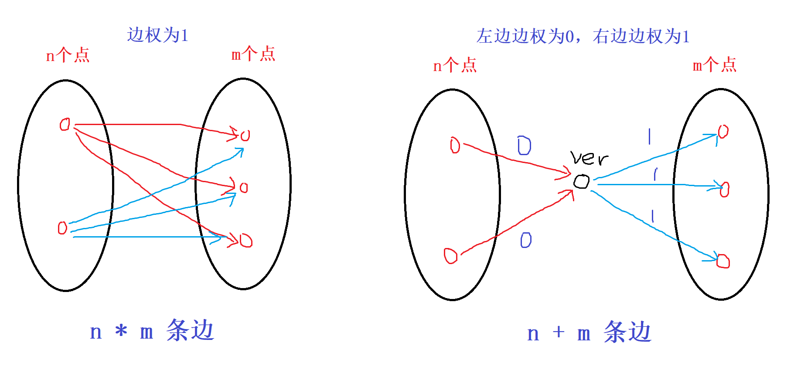

## 3. 多源汇最短路
1. floyd 算法
可以用来解决的问题有：
   1. 求多源汇最短路问题
   2. 传递闭包
   3. 找最小环
   4. 恰好经过 k 条边的最短路，倍增思想


floyd 算法又称 “插点法”，算法逻辑很简单，重要的是如何去证明它：
1. $d[i][j] = inf, d[i][i] = 0$
2. 三重循环枚举 n 个顶点，通过 $d[i][j] = min(d[i][j], d[i][k] + d[k][j])$ 进行更新


其思想是动态规划的思想。

1. 状态表示， $dp[k][i][j]$
   - 集合：所有从 i 出发，最终走到 j，且中间只经过结点编号不超过 k 的所有路径
   - 属性：路径长度的最小值
2. 状态计算：
   - 所有包含结点 k 的路径：我们通过 k 将路径 [i, j] 分成 [i, k] 和 [k, j]。两段只能含有 [1, k-1] 结点，因此：dp[k-1][i][k] + dp[k-1][k][j]
   - 所有不包含结点 k 的路径： $dp[k-1][i][j]$(只用编号为 [1, k-1] 的结点)


通过滚动数组进行优化，即得到 floyd 算法。


### 应用 1 - [acwing 1125. 牛的旅行](https://www.acwing.com/problem/content/description/1127/)

题目分析：
1. 题目说的是对称邻接矩阵，因此是无向图
2. 对于牧场的直径为牧场中任意两点最短距离的最大值。也就是说，我们需要求出所有的两点间的最短距离。
3. 只添加一条边后,假设为 (i, j)，求新生成的连通区域的最大直径。只有可能有三种情况：
   - 在原左边的连通区域中
   - 在原右边的连通区域中
   - 经过 (i, j) 的新连通区域的最短路。也就是，从 i 点出发，在左边区域中的最短路 + 从 j 点出发，在右边区域中的最短路+ dist(i, j) （证明反证法）

而节点数只有 150，因此我们得出我们的算法：
1. 通过 floyd 算法求出任意两点间的距离，设为 $dist(i, j)$
2. 枚举所有可能的连通两点的 dist，求出每个点到其他点的最短路中的最大值，记为 $d[i]$, $r1 = max(d[i])$
3. 枚举所有不连通的两点(i, j)，$r2 = min(d[i] + dist(i, j) + d[j])$
4. 答案是 $max(r1, r2)$


传递闭包：
如果两个点能够间接相连，那么我们对这两个点进行连一条边，这叫做原图的传递闭包。

可以直接通过 floyd 算法思路直接解决，证明方式同样使用动态规划来解决。


## 4. 差分约束
**概念**：差分约束系统是一种特殊的 **n 元一次不等式组**。包含 $n$ 个变量 $x_1, x_2, ..., x_n$ 以及 $m$ 个约束条件，每个约束条件有其中的两个变量做差构成：$x_i - x_j \leq c_k$。

求解：求一组解 $x_1 = a_1, x_2 = a_2, ... , x_n = a_n$，使得上面所有的约束条件得到满足，否则判断出无解。

$x_i - x_j \leq c_k => x_i \leq x_j + c_k$, 同**单源最短路**当中的松弛三角不等式非常类似 $dist[y] \leq dist[x] + c$。因此，我们可以将每个变量 $x$ 看作图中的一个节点，对于每个约束条件 $x_i \leq x_j + c_k$，从节点 $j$ 向节点 $i$ 连一条长度为 $c_k$ 的有向边。

我们注意到， ${a_1, a_2, a_3, ..., a_n}$ 是一组解，那么对于任意的常数 $d$，则 $a_1+d, a_2+d, ..., a_n+d$ 同样也是满足约束的一组解（做差后 d 可以直接被消掉）。

具体步骤：
1. 先将每个不等式 $x_i \leq x_j + c_k$ 转换成一条边
2. 找一个**超级源点**，使得该源点一定可以遍历到所有的边（如果一个点能够走到所有的其他点，表示该点一定能够走到所有的边，因为每个边都是由点发起的）
3. 从源点求一遍单源最短路（最长路）
   - 如果存在负环（最长路则为正环），则原不等式组一定无解
   - 如果没有负环（正环），则 $dist[i]$ 就是原不等式组的一个可行解

**如何求最大值或最小值（指每个变量的最值）？**

答：上面的分析，我们可以看出来，我们求出的变量值是相对关系的。那么为什么会出现最值呢？

这意味着一定约束中一定存在下面两种情况：
- $x_i \leq c_j , x_i \leq c_{j+1}$，这种就是求满足所有条件的最大值（上界）
- $x_i \geq c_j, x_i \geq c_{j+1}$, 这种就是求满足所有条件的最小值（下界）

问题：如何转换上面的不等式？

转换为 $x_i \leq 0 + c_j$。建立一个超级源点 0，然后建立 $0 -> i$，长度为 $c_j$ 的边即可。

举例：求 $x_i$ 的最大值。所有从 $x_i$ 出发构成的不等式为 $x_i \leq x_j + c_1 \leq x_k + c_2 + c_1 \leq .... \leq c_1 + c_2 + ... c+k$。这样会计算出一个上界。最终 $x_i$ 的最大值就是**这些上界中的最小值**。

结论：如果求 $x_i$ 的最小值，应该求最长路；如果求最大值，求最短路。

如果求最长路（其实还是求的最短路，边权都取负即可），我们可以将不等式转换成 $x_j \geq x_i + c_k$。

### 应用
1. [acwing 1169. 糖果](https://www.acwing.com/problem/content/1171/)


题目分析：
1. $x = 1$ ，则 $a = b => a \leq b , a \geq b$
2. $x = 2$, 则 $a < b => a \leq b-1$
3. $x = 3$, 则 $a \geq b$
4. $x = 4$, 则 $a > b => b \leq a-1$
5. $x = 5$, 则 $a \leq b$
6. 因为要求每个小朋友都得有糖果，那么 $a \geq 1$

题目要求我们求每个变量的最小值，因此，这里采用最长路径。


2. [acwing 362. 区间](https://www.acwing.com/problem/content/364/)

题目分析：
要想快速知道一个范围内的整数个数。可以通过 **值域的前缀和思想**来在 $O(1)$ 范围内求解。

1. $s[b] - s[b-1] \leq 1$
2. $s[b] \geq s[b-1]$
3. $s[b] - s[a-1] \geq c$

求 $s[50001]$ 的最小值。

根据条件一，我们可以知道 **点 0** 可以成为源点（其可以到达任意其他点）


解法二：
1. 贪心直接做 $O(n^2)$
2. 贪心+线段树(或者树状数组) $O(nlogn)$
   
https://www.acwing.com/solution/content/6528/


## 5. 最小生成树

1. prim 算法
算法过程如下：
1. 任取一个点为起点，设为 s，并将其加入已标记集合，设为 c。未标记点的集合设为 c1.
2. 从在 c1 中找到一个点，该点到集合 c 的距离最小，并将其加入到 c。
3. 重复步骤 2 共 n-1 次，得到了最小生成树

证明过程很简单，反证法即可：
如果步骤 2 取的最短距离两个点为 x, y。如果取得距离不是最小的（并且形成了最小生成树），那么我们在最后一定会有另外一条路径保证点 x 和 y 联通，那么这条路径和边 (x, y) 构成一条环，并且环上所有的边都大于等于 (x, y)。那么我们断开仍以一条边，那么整条环上的顶点仍然保持联通，并且不会增加最小生成树的代价。也就和我们的假设矛盾。

整个算法过程和 dijkstra 算法很像。因此，我们同样可以通过 heap 来优化整个 prim 算法，那么时间复杂度为 $O(mlogm)$，复杂度和 kruskal 算法相似，但是代码比它复杂。

4. kruskal 算法
   1. 排序所有的边
   2. 遍历所有的边:
      - 如果边上的两个顶点 x, y 如果不连通，则将该边加入到最小生成树
      - 否则，不加入

证明过程同上。

**上面的两个算法是应用在无向图当中的。**


1. 朱流算法（有向图）


> n 个点， m 条无向边，边权可正可负。求连接所有顶点的最短路径和？

上面的问题无法通过最小生成树算法来解决。


**最小生成树的理论基础**：
1. 任意一棵最小生成树，一定**可以**包含无向图中权值最小的边（可以是因为权值最小的边可能不止一个）
2. 给定一个无向图 G = (V, E), n = |V|, m = |E|。从 E 中选出 k < n-1 条边构成 G 的一个生成森林。若再从剩余的 m - k 条边中选 n-1-k 条边添加到生成森林中，使其称为 G 的生成树，并且使选出的边的权值之和最小。则该生成树一定**可以**包含 m-k 条边中连接生成森林的两个不连通结点的权值最小的边。

prim 算法和 kruskal 算法都是对定理 2 的简单应用。


### 题目应用
1. [acwing 1142. 繁忙的都市](https://www.acwing.com/problem/content/1144/)

题目分析：
1. 没有重边，无向图，要求选取一些边，将所有顶点连通起来，并且边数最少

分析得出，要让所有顶点都联通起来，至少需要 n-1 条边，也就是形成一棵树。

2. 要求该树中的权值最大值尽量的小

本身最小生成树的两个算法求的是权值之和最小的数，那么该思路是否能够求权值最大值最小的情况呢？

答：同样可以。证明和 kruskal 算法的证明一样。
1. 假设没有选择当前可选择的最小边，那么一定会选择比当前的最小边权值更大的边，并且能够和最小边形成一个环，随意断开一条边，再加上最小边，那么最终的结果一定不会比之前更大。因此就可以证明了。

2. [acwing 1143.联络员](https://www.acwing.com/problem/content/description/1145/)

本题使用了 **最小生成树** 的第二个基本定理。也就说去除一些固定的边，再剩下的边中求最小代价生成一棵树，仍然可以使用 kruskal 的算法求取。具体证明过程同上。

3. [AcWing 1144. 连接格点](https://www.acwing.com/problem/content/1146/)
本题和第二题思路是一样的，只是在预处理数据时候稍微复杂一点。
- 映射矩阵中的所有点到整数，共有 nm 个点
- 由于边长固定为 1 或 2，因此我们可以将纵向边先加入，然后再统一加入横向边

时间复杂度为 $O(nm)$，统计边的复杂度。


4. [AcWing 1146. 新的开始](https://www.acwing.com/problem/content/1148/)
题目分析：
本题是经典的虚拟源点+最小生成树的题目。虚拟源点技巧在图论中是经常被使用的技巧之一。

假设存在一个虚拟源点，其向所有矿井连一条边，边权代价为在该矿井上建立发电站的代价 $v_i$。求整个图的最小生成树。


## 6. 求负环
特别容易和 **01分数规划** 结合。

求负环的常用方法，一般都基于 spfa 算法。
1. 统计每个点入队的次数，如果某个点入队 n 次，则说明存在负环
2. 统计当前每个点的最短路中包含的边数，如果某个点的最短路所包含的边数大于等于 n，则也说明存在负环

对于方法 1：如何证明？
类似于 bellman ford 算法：如果循环次数达到 n 次，说明存在一条边数为 n 的最短路，而总共只有 n 个点，说明这条最短路存在相同的点，也就存在环。如果该环是正的，那么说明去掉该环会得到一个更小的最短路，和答案矛盾，因此是负环。

而对应到 spfa 算法中来，如果一个点被入队了 n 次，说明其对应的边进行了松弛了 n 次，完全等价于 bellman ford 算法的证明。 

对于方法 2： 如何证明？
对于 spfa 算法，如果每个边被松弛一次，说明该边的终点对应的最短路等于起点加一。如果该点的边数大于等于 n，则说明存在一条最短路的点个数大于 n，存在环，并且为负环。

一般推荐使用第二种方法。
方法 1 的问题：
1. 如果本身只有一个负环，那么我们需要遍历 $n(n-1) + 1 = O(n^2)$
2. 负环可能不在由起点发起的路径上
   - 对于该问题，一种做法是建立虚拟源点，然后由虚拟源点发起到所有点的边，边权为 0。求新图上的负环
     - 为什么在求负环时无需将 dist 都初始化为 正无穷 呢？因为如果存在负环，那么一定存在某些点，其 $dist[i]= -inf$。因此，在 spfa 算法中无论我们设置初始值为多少，我们一定会减少到 -inf，因此一定会超过 n 次。所以不会出现问题。

在实际的运行过程中， spfa 算法很容易接近 $O(nm)$。因此一个常用的 trick 做法时：
如果所有点的入队次数超过一个数（比如 2n） 时，我们就认为图中有很大可能是存在负环的。


**MLE 技巧优化**：
1. 在入队点数达到一定次数时，比如 2n，直接退出表示有环
2. 用 stack 替代 queue

### 题目
1. [acwing 904. 虫洞](https://www.acwing.com/problem/content/906/)

题目分析：
**求从图中的某个点出发，形成一条路径，是否能够走回到源点。并且路径和为负。** => **求图中是否存在负环** => **spfa 算法**


#### 01 分数规划
形如 $\frac{\sum f_i}{\sum t_i}$ 求最大值。一般可以通过二分求解。

我们二分值域，假设中间值为 mid.
- 如果存在一种情况使得 $\frac{\sum f_i}{\sum t_i} > mid$, 表示所有最大值一定是在 $[mid, r]$ 之间。
- 不过不存在，则答案一定在 $[l, mid]$ 范围内。


$\sum f_i > mid * \sum t_i => \sum(f_i - mid*t_i) > 0$ 也就是等价于图中是否存在正环，边权为 $f_i - mid*t_i$

求正环同样可以通过
[acwing 361. 观光奶牛](https://www.acwing.com/problem/content/363/)

题目分析：
本题可以通过 **01 分数规划**转换成求正环或负环问题。可以通过 spfa 求解。


## 7. LCA 问题 - 最近公共祖先
在有根树当中，求任意两个点的最近公共祖先（为了一般化，我们将结点自己也称为它的祖先）

通常解决方法：
1. 向上标记法 - 最坏时间复杂度为 $O(n)$, n 是结点个数。具体算法：从 a 点往父节点进行遍历，并标记；从 b 点往上进行遍历，并标记；第一个重叠的结点就是答案。
2. 倍增法 - $fa[i][j]$ 表示从 $i$ 开始，向上走 $2^j$ 步所能走到的结点。$j \in [0, logn]$. $depth[i]$ 表示深度，$depth[root] = 1$。

哨兵结点: 如果从 i 开始跳 $2^j$ 步可能会跳过根节点，那么 $f[i][j] = depth[0] = 0$


预处理 - 递推法。
- $j = 0$, $f(i, j)$ 是 i 的父节点
- $j > 0$, $f(i, j) = f(f(i, j-1), j-1)$

具体步骤：
1. 预处理两个数组（预处理时间复杂度 $O(nlogn)$）
2. 先将两个点跳到同一层（2 的幂次跳）
3. 让两个点同时往上跳，一直跳到它们最近公共祖先的下一层（2 的幂次跳）
   - 为什么不直接跳到同一个结点？方便判断。因为如果跳到同一个结点，只能表明这个结点时两个点的公共祖先，不一定是最近公共祖先

查询时间复杂度 $O(logn)$

3. 离线做法 - tarjan 做法，时间复杂度 $O(n+m)$

将点分为 三大类：
- 第 0 类：还未被搜索的点，统称为第 0 类
- 第 1 类：正在搜索的分支
- 第 2 类：已经遍历过，且回溯过的点（并查集的合并在这里）


4. 方法 4：基于 RMQ 的做法（也可以通过线段树来做）

 dfs 的递归会带来结点被多次访问，而也就变成求区间的最值问题。

### 次小生成树
定理：对于一张无向图，如果存在最小生成树和（严格）次小生成树，那么对于任何一棵最小生成树，都存在一棵（严格）最小生成树，使得这两棵树只有一条边不同。

## 8. 有向图的强连通分量


## 9. 二分图


## 10. 拓扑排序与关键路径
1. 针对于 **有向图** 
2. 有向无环图，也叫**拓扑图**

具体算法过程(bfs):
1. 将所有入度为 0 的点入队
2. 取出队头结点，设为 t:
3. 对于 t 的所有出边，设结点 为 j，将 j 的入度减一，如果入度变为 0，则入队
4. 重复 2-3 直到队列为空。拓扑顺序就是结点出队的顺序

> 如何保证拓扑排序是字典序？

非常好解决，只需要将队列改成优先队列即可。


### 题目
1. [acwing 1191. 家谱树](https://www.acwing.com/problem/content/1193/)

题目分析：
题目要求：每个孩子比长辈后面输出，也就是相当于长辈和孩子之间有一条边，求整个图的拓扑序。


----
差分约束 求最长路 ：
1. 边权无限制 spfa O(nm)
2. 边权非负， tarjan O(n+m)
3. 边权 > 0， 拓扑排序
----

[acwing 1192. 奖金](https://www.acwing.com/problem/content/1194/)

题目分析：
都是形如 $a > b => a \geq b+1$ 的不等式，求所有变量的最小可能值。可以想到是**差分约束系统问题**。求最小值，表示我们要求 **最长路径**，也就是下界的最大值。

通常做法是：spfa 求解。本题也可以。

但是本题的边权都是正的（虚拟节点的 0 边不算），我们可以通过拓扑排序来求解。时间复杂度会更加稳定，线性解决问题。

1. 执行拓扑排序，看是否存在正环，如果存在正环，表示无解
2. 初始化， $dist[i] = 100$, 按照拓扑序依次更新 dist，得到最后的答案。


[acwing 164. 可达性统计](https://www.acwing.com/problem/content/166/)
题目分析：
1. 图是 DAG，存在拓扑序
2. 求每个点能够到达的后置节点的数量

要求 **每个节点能够到达的节点个数**，也就是求：
每个点的每条出边的对应节点能够到达点数的并集 + 自身。
对于每条出边 `(i, j)`， $f[i] = 1 + f[j_1] \cup f[j_2]...$

因为题目中存在拓扑序：因此后面的状态不会依赖前面的状态（无后效性），因此我们可以直接通过递推（dp）来依次倒序遍历拓扑序即可。

如何求并集呢？
1. 可以用 set
2. 可以用位运算

如果用位运算，因为节点的数量达到 $3*10^4$，如果直接使用整数表示的话，在某些语言中会溢出。因此可以直接使用 C++ 当中的 bitset 这样可以将时间有华为 $N*(N+M)/ 32$，需要的空间 $N^2/8$ 个字节。

在 python 中，可以直接使用位运算或者用 set 即可。


题目衍生：如果不是无环图怎么处理？

可以通过 tarjan 将图转换成无环图（强连通分量），然后按照拓扑序来求


[acwing 456. 车站分级](https://www.acwing.com/problem/content/description/458/)
题目分析：
1. 每条线路上，没有停靠的点的等级一定严格小于停靠的点。停靠的点之间关系不明确，未停靠点之间的关系也不明确。
2. 假设每个点的等级皆为变量，那么我们求这 n 个变量的值最少可以有几种

因此，我们得到一串如 $x_i > x_j => x_i \geq x_j + 1$ 的不等式。 

很容易想到 **差分约束系统**：
而答案就是 **所有点出发的最长路当中的最大值**。

如何求最长路呢？
1. 直接通过 spfa 求解
2. 由于本题题目说明，m 条路线不会产生冲突，因此图中不会存在环。也就是 DAG，并且图中的所有边都是正权，可以直接通过 **拓扑排序** 求解，递推（正序、倒序皆可）求解（dp 与 图论）

问题 1：$m, n 是 10^3 级别$。那么最坏情况下会建立 $500*500*1000 = 2.5*10^8$ 条边，邻接矩阵和邻接表都会出现内存或时间超时。



我们可以通过虚拟节点的方式来有效降低边的数量。左边为未停靠的点，连接一条边权为 0 的边，右边连接边权为 1 的边，那么我们的边数就变为 $O((n+m)*1000) = O(10^6)$ 级别。

算法过程：
1. 建立图
2. 拓扑排序
3. 按照正序遍历所有的点，计算最大值


## 求最长路径问题
最长路径问题是 NP 难问题。

1. 对于 DAG 图，我们可以通过拓扑排序在 $O(n+m)$ 内解决问题。
2. 一般问题，通过将边权都乘以 -1，通过 spfa 算法求最短路径长度即可。将所得到情况最后取反即可（这里无法通过 dijkstra 算法，无法处理负权问题）(有解需要不能存在正环)
3. 对于 spfa 算法，可以直接通过 $dist[j] > dist[i] + c$ 这种三角不等式直接求解最长路，无需反转边权。


## 11. 欧拉路径与欧拉回路
> 欧拉路径: 如果图 G 中的一条路径包括图中每条边恰好一次，则该路径被称为欧拉路径

> 欧拉回路：如果一个回路是欧拉路径，那么该路径被称为欧拉回路

1. 对于无向图，所有边都是连通的：
   - 存在欧拉路径的充分必要条件：度数为奇数的点为 0 个或 2 个
   - 存在欧拉回路的充分必要条件：度数为奇数的点只能为 0 个

2. 对于有向图，所有边都是连通的：
   - 存在欧拉路径的充分必要条件：要么所有点的出度等于入度；要么只有两个点的入度不等于出度，并且其中一个点的入度等于出度加一，另一个点的入度等于出度减一
   - 存在欧拉回路的充分必要条件：所有点的出度均等于入度


问题 1：如何记录欧拉回路（路径）？

hierholzers 算法和 fluery 算法

算法过程：(递归过程就是一笔画过程)
1. 选择任一顶点为起点，遍历所有邻边
2. dfs，访问相邻顶点，并将经过的边都删除
3. 如果当前顶点没有相邻边，则将顶点入栈
4. 栈中的顶点倒序输出，就是从起点出发的欧拉回路

```
# 邻接矩阵版本

dfs(cur): 
   for i in 所有顶点:
      if edge[cur][i] 存在边：
         删掉边 # 比如度数减一
         dfs(i)
   
   q.push(cur)
```
**并且得到的顶点顺序也是最小字典序**

如果要想要直接输出边：只需要将压栈动作放到 for 循环里面即可。

**为什么要删边？**

> 防止时间复杂度过高，因为是以边为标记。如果不删掉，对于某些情况，时间复杂度会达到 $O(m^2)$，比如**某个点有 m 条自环**。


### 应用
1. [acwing 1123. 铲雪车](https://www.acwing.com/problem/content/1125/)

题目分析：
1. 每条道路都是双向边
2. 起点一定能够遍历所有的边

因此我们可以得出两点：
1. 所有边是连通的
2. 所有点的入度等于出度

因此，此图中存在一条欧拉回路。能够一次性遍历所有的边。题目要求最短时间，也就是求遍历完所有边的最短时间，也就是所有边的长度即可，无需建图。

**注意四舍五入的精度问题，计算机浮点数存储的问题**

2. [acwing 1184. 欧拉回路](https://www.acwing.com/problem/content/1186/)

本题需要输出欧拉路径或回路（并且是按照边的编号输出）。由于 test case 比较多，需要做语言上的优化

3. [acwing 1124. 骑马修栅栏](https://www.acwing.com/problem/content/1126/)

4. [acwing 1185. 单词游戏](https://www.acwing.com/problem/content/1187/)

题目分析：

因为单词数量达到 $10^5$ 级别，如果根据末尾字母和每个单词的首字母相连，那么最坏情况边的数量能够达到 $10^{10}$。比如每个单词的首尾字母都相同。

那么，我们可以采用另外一种建边技巧。直接将每个单词当做一条边，顶点为首尾字母。那么就只会有 $10^5$ 条边。

题目问是否能够将所有单词根据题目的性质排列成一行。也就是等价于：
我们是否能够从某个点出发，遍历完所有边，也就是求所建的图中是否存在欧拉路径。

本图是一个有向图，由于判断是否存在欧拉路径，只需要判断入度和出度即可，因此我们无需建立边。直接遍历即可。