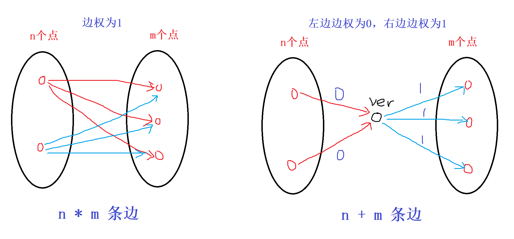

## 10. 拓扑排序与关键路径
1. 针对于 **有向图** 
2. 有向无环图，也叫**拓扑图**

具体算法过程(bfs):
1. 将所有入度为 0 的点入队
2. 取出队头结点，设为 t:
3. 对于 t 的所有出边，设结点 为 j，将 j 的入度减一，如果入度变为 0，则入队
4. 重复 2-3 直到队列为空。拓扑顺序就是结点出队的顺序

> 如何保证拓扑排序是字典序？

非常好解决，只需要将队列改成优先队列即可。


### 题目
1. [1639. 拓扑顺序](https://www.acwing.com/problem/content/description/1641/)

本题考查拓扑排序的基本定义。

朴素做法：

对于给定的序列，枚举所有的顺序点对 $(i, j), i < j$，来看是否存在一条边 $j -> i$。如果存在，说明不是拓扑排序。

因此，提前用哈希表建立所有边的集合，然后枚举所有的点对即可。时间复杂度为 $O(kn^2+m)$, 数量级在 $10^8$ 级别。很勉强。
```python


if __name__ == "__main__":
    n , m = map(int, input().split())
    d = {}
    
    for i in range(m):
        a, b = map(int, input().split())
        d[(b, a)] = True
    
    k = int(input())
    
    for t in range(k):
        a = list(map(int, input().split()))
        flag = True
        for i in range(n):
            for j in range(i+1, n):
                if (a[i], a[j]) in d:
                    flag = False
                    break
            
            if not flag: break
        
        if not flag: print(t, end=" ")
    
```

直接从拓扑排序的算法的入度角度去思考：

> 如果序列是拓扑序，那么按照该序列从前到后的顺序来依次处理入度。处理的逻辑就是将该点出发的所有边的另一端的入度减 1。如果枚举到的点的入度不为 0，则说明不是拓扑序。

时间复杂度为 $O(k(n+m))$， $10^6$ 级别。


1. [acwing 1191. 家谱树](https://www.acwing.com/problem/content/1193/)

题目分析：
题目要求：每个孩子比长辈后面输出，也就是相当于长辈和孩子之间有一条边，求整个图的拓扑序。


----
差分约束 求最长路 ：
1. 边权无限制 spfa O(nm)
2. 边权非负， tarjan O(n+m)
3. 边权 > 0， 拓扑排序
----

[acwing 1192. 奖金](https://www.acwing.com/problem/content/1194/)

题目分析：
都是形如 $a > b => a \geq b+1$ 的不等式，求所有变量的最小可能值。可以想到是**差分约束系统问题**。求最小值，表示我们要求 **最长路径**，也就是下界的最大值。

通常做法是：spfa 求解。本题也可以。

但是本题的边权都是正的（虚拟节点的 0 边不算），我们可以通过拓扑排序来求解。时间复杂度会更加稳定，线性解决问题。

1. 执行拓扑排序，看是否存在正环，如果存在正环，表示无解
2. 初始化， $dist[i] = 100$, 按照拓扑序依次更新 dist，得到最后的答案。


[acwing 164. 可达性统计](https://www.acwing.com/problem/content/166/)
题目分析：
1. 图是 DAG，存在拓扑序
2. 求每个点能够到达的后置节点的数量

要求 **每个节点能够到达的节点个数**，也就是求：
每个点的每条出边的对应节点能够到达点数的并集 + 自身。
对于每条出边 `(i, j)`， $f[i] = 1 + f[j_1] \cup f[j_2]...$

因为题目中存在拓扑序：因此后面的状态不会依赖前面的状态（无后效性），因此我们可以直接通过递推（dp）来依次倒序遍历拓扑序即可。

如何求并集呢？
1. 可以用 set
2. 可以用位运算

如果用位运算，因为节点的数量达到 $3*10^4$，如果直接使用整数表示的话，在某些语言中会溢出。因此可以直接使用 C++ 当中的 bitset 这样可以将时间有华为 $N*(N+M)/ 32$，需要的空间 $N^2/8$ 个字节。

在 python 中，可以直接使用位运算或者用 set 即可。


题目衍生：如果不是无环图怎么处理？

可以通过 tarjan 将图转换成无环图（强连通分量），然后按照拓扑序来求


[acwing 456. 车站分级](https://www.acwing.com/problem/content/description/458/)
题目分析：
1. 每条线路上，没有停靠的点的等级一定严格小于停靠的点。停靠的点之间关系不明确，未停靠点之间的关系也不明确。
2. 假设每个点的等级皆为变量，那么我们求这 n 个变量的值最少可以有几种

因此，我们得到一串如 $x_i > x_j => x_i \geq x_j + 1$ 的不等式。 

很容易想到 **差分约束系统**：
而答案就是 **所有点出发的最长路当中的最大值**。

如何求最长路呢？
1. 直接通过 spfa 求解
2. 由于本题题目说明，m 条路线不会产生冲突，因此图中不会存在环。也就是 DAG，并且图中的所有边都是正权，可以直接通过 **拓扑排序** 求解，递推（正序、倒序皆可）求解（dp 与 图论）

问题 1：$m, n 是 10^3 级别$。那么最坏情况下会建立 $500*500*1000 = 2.5*10^8$ 条边，邻接矩阵和邻接表都会出现内存或时间超时。



我们可以通过虚拟节点的方式来有效降低边的数量。左边为未停靠的点，连接一条边权为 0 的边，右边连接边权为 1 的边，那么我们的边数就变为 $O((n+m)*1000) = O(10^6)$ 级别。

算法过程：
1. 建立图
2. 拓扑排序
3. 按照正序遍历所有的点，计算最大值


### 求最长路径问题
最长路径问题是 NP 难问题。

1. 对于 DAG 图，我们可以通过拓扑排序在 $O(n+m)$ 内解决问题。
2. 一般问题，通过将边权都乘以 -1，通过 spfa 算法求最短路径长度即可。将所得到情况最后取反即可（这里无法通过 dijkstra 算法，无法处理负权问题）(有解需要不能存在正环)
3. 对于 spfa 算法，可以直接通过 $dist[j] > dist[i] + c$ 这种三角不等式直接求解最长路，无需反转边权。