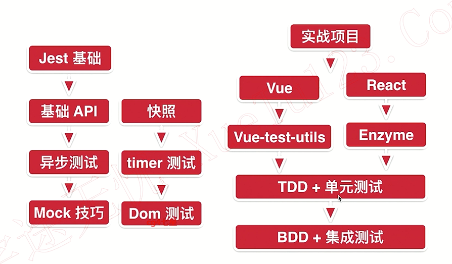

## 序言
前端工程化

前端自动化测试

系统复杂性不断增加

> TODO: 学完后重新回顾序言视频，更高维度总结知识点

## 自动化测试背景与原理
1. 减少 bug，避免线上 bug 产生
    - 常用措施：灰度/code review / 测试 等
    - 前端： TS/Flow/Eslint/StyleLint 编码层面提高代码可维护性

## Jest
1. 性能
2. 功能
3. 易用性

帮助我们完成单元测试（模块）和集成测试

