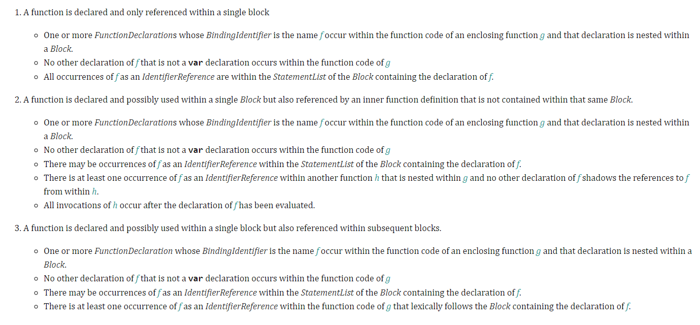
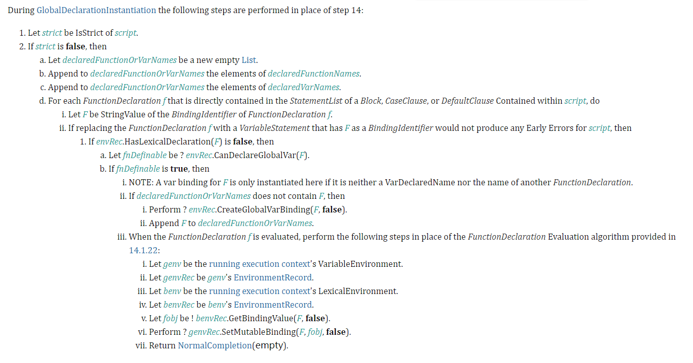

 
 
 
首先看一道题：
```javascript
a = 10;
function a(){};

function b(){};
b = 10;

{
  c = 10;
  
  function c(){};

  function d(){};
  d = 10;
}

console.log(a);
console.log(b);
console.log(c);
console.log(d);
```

这段代码在不同的浏览器中会输出不同的结果。
1. chrome 80.0.3987.122 和 firefox 65.0.1 中输出 `10, 10, 10, function d`
2. 在 IE 12 和 edge 中输出 `10, 10, function c, function d`

**那么为什么会输出这样的结果呢？**

这段代码的含义其实在 ES 2015 以及以后的版本中有相关的描述：
[B.3.3 Block-Level Function Declarations Web Legacy Compatibility Semantics](http://www.ecma-international.org/ecma-262/10.0/index.html#sec-block-level-function-declarations-web-legacy-compatibility-semantics)

我们知道，在 ES5以及之前， ECMAScript 没有定义 block-level function 这种语法： function declaration 作为 block statement 中的一个元素出现。但是当时很多 browser-hosted ECMAScript implementation 将其作为一种扩展进行了各自的支持，而这带来的结果是不同的实现中相同语法的语义却不同。

这种情况出现在浏览器混战时期是很正常的，但是对于开发者来讲就很痛苦了，**最好的方式就是尽量少的使用，甚至不去使用它。**

我们知道，从 ES 2015 开始，ECMAScript 中引入了 block-level scope。这个时候，block-level function declaration的概念就不可避免地被用到。而之前那种混乱的同种语法不同语义的情况需要整合。ECMAScript 列举了三种情况，如下图所示：


1. 首先对于 case 1，这种情况完全符合规范中的 block level function declarartion 的语义，因此可以正常使用。
2. 对于 case 2 和 3,这需要在已有的规范中增加额外的算法步骤。而增加的额外步骤主要针对三块：
    - FunctionDeclarationInstantiation
    - GlobalDeclarationInstantiation
    - EvalDeclarationInstantiation

而开头的代码就属于 GlobalDeclarationInstatiation，具体的额外步骤如下：


规范讲的很清楚，这也是我为什么觉得edge 和 IE 的答案更加正确的原因。

我们将上述步骤用 JS 代码表示：
```javascript
function enclosing(…) {
    …
    {
         …
         function compat(…) { … }
         …
    }
    …
}

// 等价于
function enclosing(…) {
    var compat₀ = undefined; // function-scoped
    …
    {
         let compat₁ = function compat(…) { … }; // block-scoped
         …
         compat₀ = compat₁;
         …
    }
    …
}
```
[上述代码来自于 stackoverflow](https://stackoverflow.com/questions/31419897/what-are-the-precise-semantics-of-block-level-functions-in-es6)

代码中 `compat₀, compat₁` 在 JS 层面等价于 `compat`。

### 总结
1. 首先我们应该避免 block-level function 的写法
2. 如果遇到这类面试题时，直接套用上面的简化代码即可，无需细抠规范的细节或者浏览器的实现细节。另外讲述自己的观点，而答案具体是什么却不那么重要了。

最后猜测一下为什么答案会不同：应该和浏览器对于 undeclared variable 和 block-level function 处理先后问题所致。有兴趣去看 V8 代码。

**最后看衍生的一题：**
```javascript
console.log(c);
if(false) {
  function c(){}
}
console.log(c);

console.log(d);
if(true) {
  function d(){}
}
console.log(d);

```
