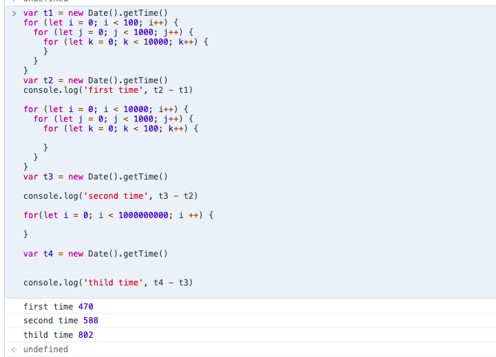

# 题目
[题目链接](https://github.com/Advanced-Frontend/Daily-Interview-Question/issues/235)
> 为什么 for 循环的嵌套顺序会影响性能？

如下图：



我们可以分别从语言层面讲和计算机底层（硬件）来讲：

1. 语言层面：
先比较代码 1 和 代码 2。

对于代码 1：

循环层级 | 比较次数 | 自增次数 | 生成 environment record 次（let declaration）
-| -| -|-|
i | 100 | 100 | 100
j | `100*1000` | `100*1000` | `100*1000`
k | `100*1000*10000` | `100*1000*10000` | `100*1000*10000`

对于代码 2：

循环层级 | 比较次数 | 自增次数| 生成 environment record 次（let declaration）
-| -| -|-|
i | 10000 | 10000 | 10000
j | `10000*1000` | `10000*1000` | `10000*1000`
k | `100*1000*10000` | `100*1000*10000` | `10000*1000*100`


也就是说，代码 1 在 循环的第一层和第二层，比较次数、自增次数和产生新 environment record 次数比代码 2 少很多。


2. 底层层面
  
在计算机系统设计过程中，提高处理器的指令执行速度是基本任务之一。而主要的措施就是指令级的并行性。流水线技术是常用的方法之一。具体的流水线技术细节暂且不谈。处理器在引入流水线工作机制以后，增加了分支目标缓冲器(Branch Target Buffer)。

在流水线工作模式下，如果遇到分支结构，就可以利用分支目标缓冲器预测并读取指令的目标地址。
具体到代码中：
```javascript
for(let i = 0; i < 10; i++) {
  // 第一次没有分支预测，最后退出循环时预测失败 1 次，预测成功 9998 次。上述过程重复 10 次
  for(let j = 0; j < 10000; j++) {
    a[i][j]++;
  }
}

for(let i = 0; i < 10000; i++) {
  // 下面每次循环预测成功 8 次，退出循环预测失败 1 次。上述过程重复 10000 次。
  for(let j = 0; j < 10; j++) {
    a[i][j]++;
  }
}
```

因此大循环放在内层，可以增加分支预测的准确度。